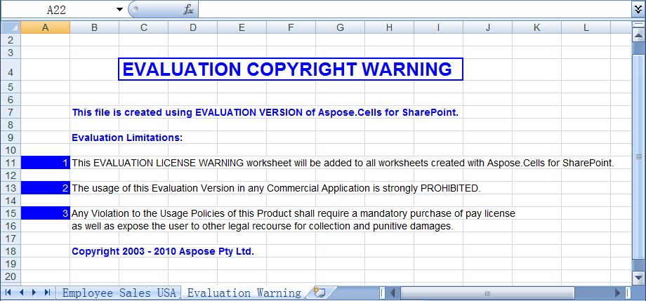

{}

The evaluation version of Aspose.Cells for SharePoint has no time limit, and free technical support is available for evaluation users, too.

{} {}

The download for both evaluation and full versions of Aspose.Cells for SharePoint is the same. Simply download Aspose.Cells for SharePoint from the [download page](https://downloads.aspose.com/cells/sharepoint) and [install it](/cells/sharepoint/install-aspose-cells-for-sharepoint/). Aspose.Cells works in evaluation mode by default.

{}

### **Evaluation Version Limitations**

Evaluation mode adds an evaluation warning to any exported documents. When you have purchased a license, simply [install the license](/cells/sharepoint/installing-aspose-cells-for-sharepoint-license/) and it will work in licensed mode.

**In evaluation mode, Aspose.Cells for SharePoint injects an Evaluation Warning** 

