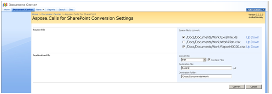

{} 

To make the conversion process as flexible as possible, Aspose.Cells for SharePoints allows you to set options that define how the converted file will be treated.

{} 
### **Options**
The following options are available during conversion:
#### **Concatenate Files**
Select **Combine Files** to combine files that were originally in different formats into one, single document. 

This option is available when you select a folder, or several individual files, for conversion. Move documents in the list up or down to set the order in which you want the documents to be combined.

**Combining files** 

#### **Convert Files in Subfolders**
Select **Convert files in subfolders** to recursively convert all of the documents and subfolders in a selected folder. 

The existing subfolder structure is created in the destination folder.

{} 

This option is only available under SharePoint 2007. In SharePoint 2010, subfolders are processed by default. To process only files in a root folder in SharePoint 2010, select the individual files instead of the folder, and don't select any subfolders.

{} 
#### **Overwrite Existing Files in the Destination Folder**
If the destination folder already contains files with the same name as the ones you want to convert, you have two options. Select to overwrite existing files to replace already existing files with freshly converted ones. Clear the option to skip processing files of the same name.
