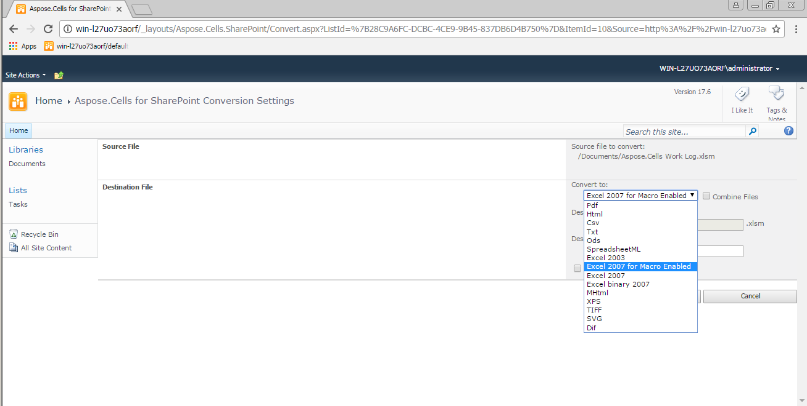

{}

With Aspose.Cells for SharePoint you can convert documents between many popular office document formats from a SharePoint document library. Most of the conversions are done with high fidelity and precision.

{}

## **Supported Input Formats**

Aspose.Cells for SharePoint supports the following input formats:

- XLS – Microsoft Excel 97~2003
- XLSX – Office Open XML
- XLSM, XLTX, XLTM – Office Open XML
- CSV – Comma Separated Values Worksheet Document
- ODS – OpenDocument
- XML – Microsoft Excel SpreadsheetML

To generate documents, Aspose.Cells for SharePoint relies on a built-in version of [Aspose.Cells for .NET](https://products.aspose.com/cells/net/), the market leading spreadsheet-processing component from Aspose. Microsoft Excel is not used to generate documents.

## **Supported Output Formats**

The full list of output formats supported by Aspose.Cells for SharePoint is:

- PDF – Adobe Portable Document
- XLS – Microsoft Excel 97 - 2003
- XLSX – Office Open XML
- XLSM – Office Open XML for macros enabled
- TXT – Plain Text
- XML – Microsoft Excel SpreadsheetML
- ODS – OpenDocument
- CSV – Comma Separated Values
- XLSB – Microsoft Excel Binary 2007
- MHTML – Multipurpose Internet Mail Extension HTML
- XPS – XML Paper Specification
- TIFF – Tagged Image File Format
- SVG – Scalable Vector Graphics
- DIF – Drawing Interchange Format

**The supported conversion formats available for a file are listed** 

