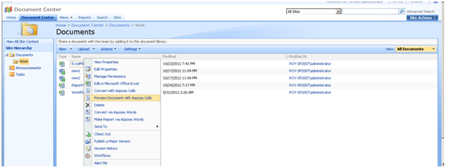
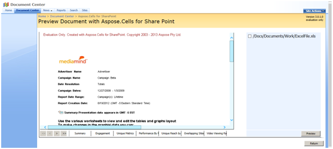

Aspose.Cells for SharePoint supports previewing documents directly from SharePoint. The following formats support preview:

- XLS – Microsoft Excel 97‑2003
- XLSX – Office Open XML
- XLSM, XLTX, XLTM – Office Open XML
- XML – Microsoft Excel SpreadsheetML

**Selecting a document to preview** 

**Document preview from within a SharePoint library** 

