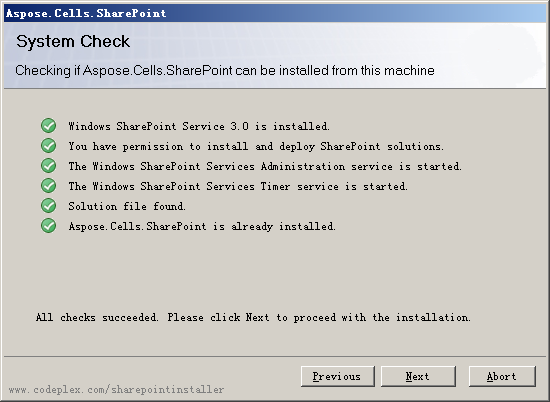
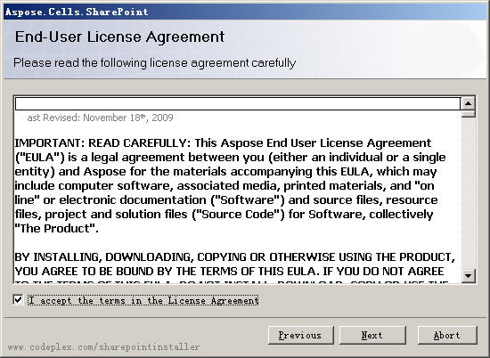
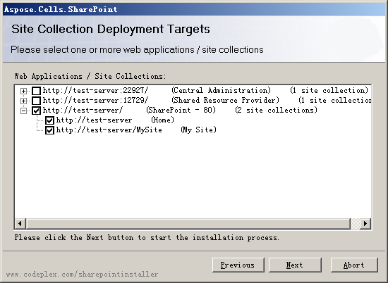
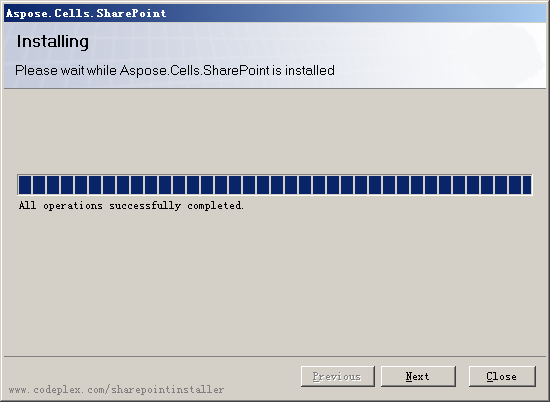
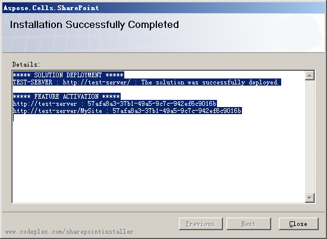

{} 

Aspose.Cells for SharePoint is downloadable as the Aspose.Cells.SharePoint.zip archive. 

{} 
### **Archive Contents**
The Aspose.Cells.SharePoint.zip archive contains:

- Aspose.Cells.SharePoint.wsp – SharePoint solution file. Aspose.Cells for SharePoint is packaged as a SharePoint solution to facilitate deployment/retraction and feature activation/deactivation across the server farm.
- Aspose_LicenseAgreement.rtf – End user license agreement
- Aspose.Cells for SharePoint.pdf – User documentation
- Aspose.Cells for SharePoint Documentation.chm – User documentation with Public API reference
- setup.exe – Setup program
- setup.exe.config – Setup configuration file

The setup program checks the following conditions before proceeding with installation:

- WSS 3.0, MOSS 2007 or SharePoint 2010 is installed.
- The user has permission to install SharePoint solutions.
- SharePoint database is online.
- WSS Administration service is started.
- WSS Timer service is started.

WSS Administration service and Timer service are needed because some setup actions rely on a timer job to propagate to all servers in the server farm. 
#### **To install Aspose.Cells for SharePoint**
1. Unpack Aspose.Cells.SharePoint.zip to the local drive of the MOSS 7.0 or WSS 3.0 server.
1. Run setup.exe and follow the instructions on the screen.

The setup program performs the following actions:

1. Check installation prerequisites. Setup will not continue if any check fails. 

   **System check** 

2. Display End User License Agreement. The user must accept the agreement in order to proceed. 

   **The EULA** 

3. Display deployment target selection dialog. The user selects web applications and site collections where the feature shall be activated. See the figure below. 

   **Deployment targets** 

4. Deploy the feature to the server farm. 

   **Running installation** 

5. Activate the feature for the selected site collections and configure their parent web applications.
6. Display a list of web applications and site collections where the feature has been deployed and activated. 

   **Installation complete** 

