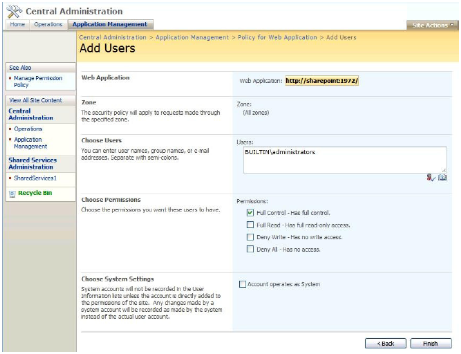

{} 

SharePoint does not, by default, grant full permissions to manage personal sites to portal administrators. That is why activation and deactivation on a personal site collection might fail when it is performed by portal administrators. This includes activation and deactivation during setup.

{} 
### **Granting Permission to Personal Sites**
When this issue occurs during installation, an UnauthorizedAccessException at Microsoft.SharePoint.SPFeature.Activate() is logged to the SharePoint trace log. When deactivation fails as a part of uninstallation, an UnauthorizedAccessException is displayed on the last setup screen for the failed deactivation.

To prevent this issue, grant portal administrators the permission to manage My Site Web application:

1. Go to **SharePoint Central Administration** and select the **Application Management** tab.  
2. Choose **Policy for Web Application** under the **Application Security** group.  
3. Make sure you select the correct Web Application for your “My Site” in the **Web Application** list on the right.  
4. Select **Add Users** in the upper left.  
5. Choose **All Zones** by default on the **Add Users** screen and click **Next**.  
6. Add the appropriate user(s) or Active Directory group that you want to have control over your “My Site” Web Application.  
7. Select the level of control.  

   **Adding users and setting the control level** 

   

8. Click **Finish**.
