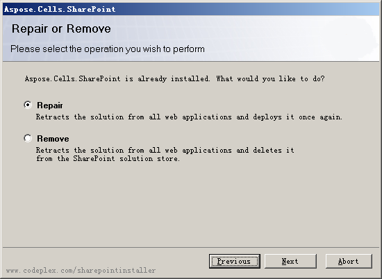

{} 

To uninstall Aspose.Cells for SharePoint, run the setup program. If Aspose.Cells for SharePoint is already installed, the setup program suggests removing or repairing it.

{} 
### **Uninstallation**
During removal, the setup program deactivates Aspose.Cells for SharePoint for all site collections and retracts the solution from the server farm. 

**Uninstalling Aspose.Cells** 

{} 

Please note that running the **Repair** option does not re-activate Aspose.Cells for SharePoint on site collections. Instead, the feature must be activated manually after re-deployment with the **Repair** option.

Uninstalling using the **Remove** option and then re-installing may be more convenient as it allows you to select target web applications and site collections during installation. 

{}
