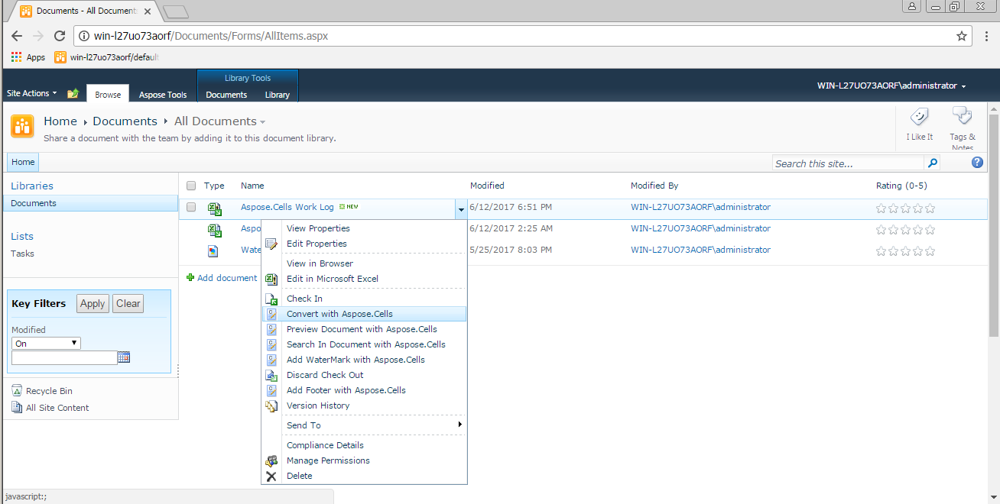

{} 

### **Welcome to the Aspose.Cells for SharePoint Documentation!**
Aspose.Cells for SharePoint is a flexible solution supporting spreadsheet conversion that makes it possible to convert Microsoft Excel documents within the Microsoft SharePoint applications.

{} 

You may convert multiple document formats, such as:

- PDF - Portable Document Format
- XLS - MS Excel 97–2003
- XLSX - Office Open XML
- XLSM - Office Open XML for macros-enabled
- TXT - Plain Text
- XML - Microsoft Excel SpreadsheetML
- ODS - OpenDocument Spreadsheet
- CSV - Comma Separated Values
- XLSB - Excel Binary 2007
- MHTML - Multipurpose Internet Mail Extensions (HTML)
- XPS - XML Paper Specification
- TIFF - Tagged Image File Format
- SVG - Scalable Vector Graphics
- DIF - Drawing Interchange Format

Aspose.Cells for SharePoint is designed to be used with the following products:

- Windows SharePoint Services 3.0 (WSS)
- Microsoft Office SharePoint Server 2007 (MOSS) Standard
- Microsoft Office SharePoint Server 2007 (MOSS) Enterprise
- Microsoft Office SharePoint Server 2010 (MOSS) Standard
- Microsoft Office SharePoint Server 2010 (MOSS) Enterprise
- Microsoft Office SharePoint Server 2013 (MOSS) Standard
- Microsoft Office SharePoint Server 2013 (MOSS) Enterprise
- Microsoft Office SharePoint Server 2016 (MOSS) Standard
- Microsoft Office SharePoint Server 2016 (MOSS) Enterprise

There are no additional system requirements beyond the products above.

This documentation describes the [features](/cells/sharepoint/features/), [installation](/cells/sharepoint/install-aspose-cells-for-sharepoint/), [evaluation](/cells/sharepoint/evaluate-aspose-cells/), [licensing](/cells/sharepoint/license-aspose-cells-for-sharepoint/), **common use cases**, and **settings** of Aspose.Cells for SharePoint.

**Use Aspose.Cells for SharePoint from SharePoint’s document library to convert documents**

****
