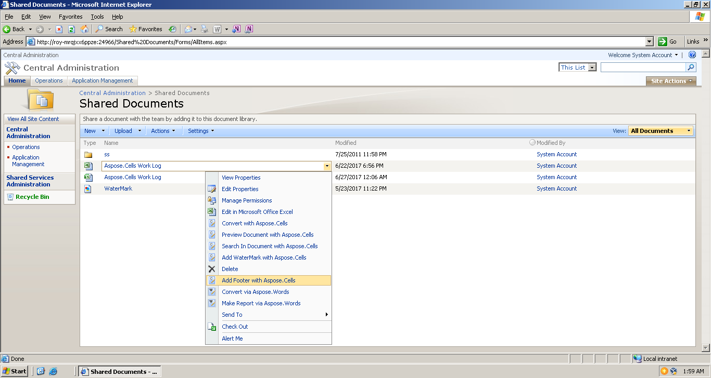
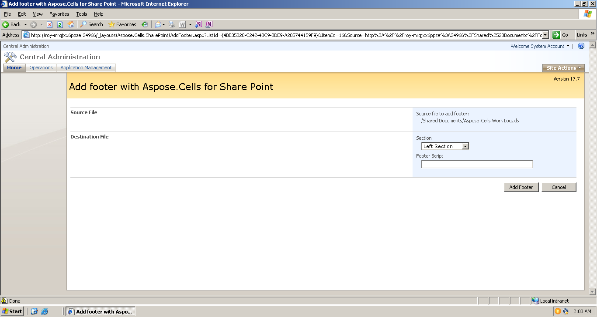

If you want to add footer in an Excel file, please choose “Add Footer with Aspose.Cells” option in the document’s Edit Control Block (ECB).

The following options are available during the add footer setup:

**Section**

Add footer position: Left Section, Center Section, Right Section.

**Footer Script**

It represents Footer formatting script. Script commands: Command | Description| &P Current page number| &N Page count|&D Current date| &T Current time &A Sheet name &F File name without path &"<FontName>" Font name, for example: &"Arial" &"<FontName>, <FontStyle>" Font name and font style, for example: &"Arial,Bold" &<FontSize> Font size. If this command is followed by a plain number to be printed in the header, it will be separated from the font height with a space character. &G Image script For example: "&Arial,Bold&8Footer Note".
