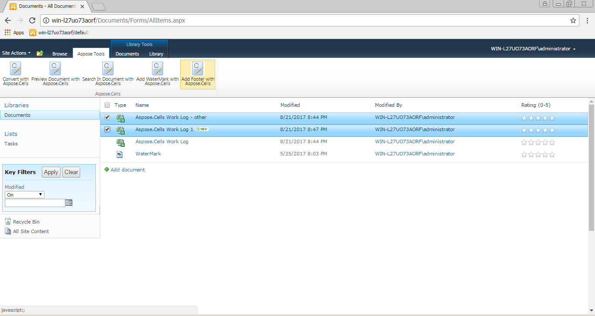
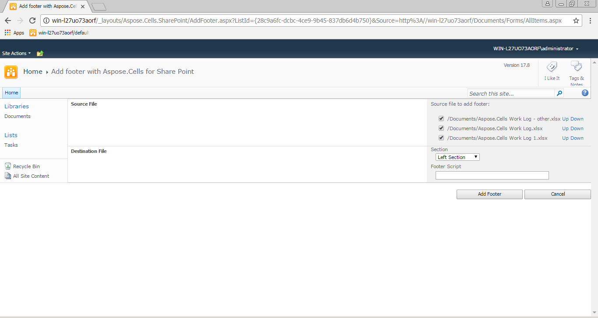

If you want to add a footer to multiple Excel files, please choose the “Add Footer with Aspose.Cells” option in the ribbon bar.

Get all Excel files from the data source folder and create a file list table.

Select the file(s) that need a footer, and click **Add Footer** button to add a footer to the selected files.

The following options are available during footer setup:

**Section**

Add footer position: Left Section, Center Section and Right Section.

**Footer Script**

It represents the footer formatting script. Script commands: Command | Description | &P – current page number | &N – page count | &D – current date | &T – current time | &A – sheet name | &F – file name without path | &"<FontName>" – font name (for example: &"Arial") | &"<FontName>,<FontStyle>" – font name and font style (for example: &"Arial,Bold") | &<FontSize> – font size. If this command is followed by a plain number to be printed in the header, it will be separated from the font height with a space character. &G – image script. For example: "&Arial,Bold&8Footer Note".
