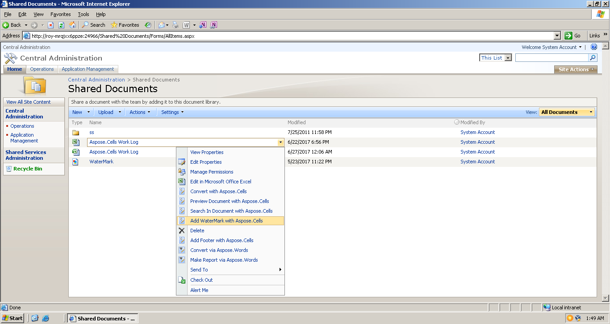
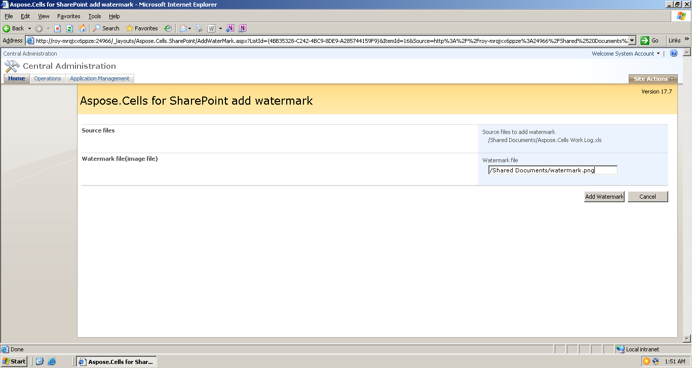

If you want to add watermark in an Excel file, please choose “Add WaterMark with Aspose.Cells” option in the document’s Edit Control Block (ECB).

The following options are available during the add watermark setup:

**Watermark file**

The file must be an image file.
