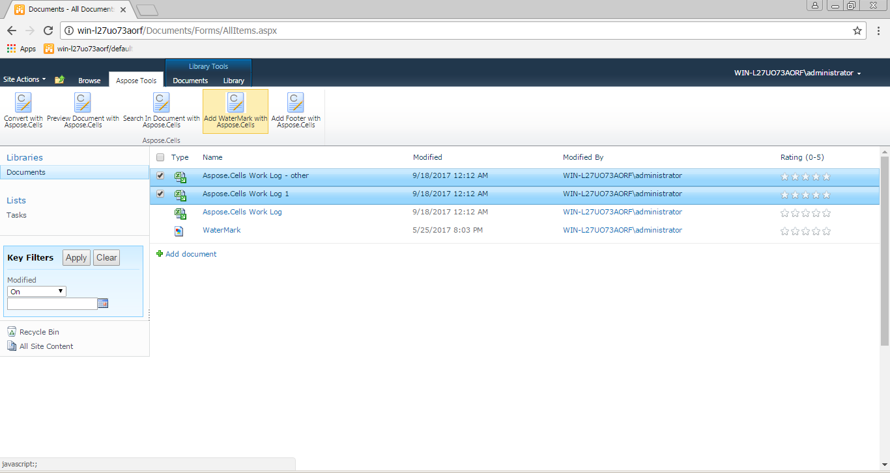
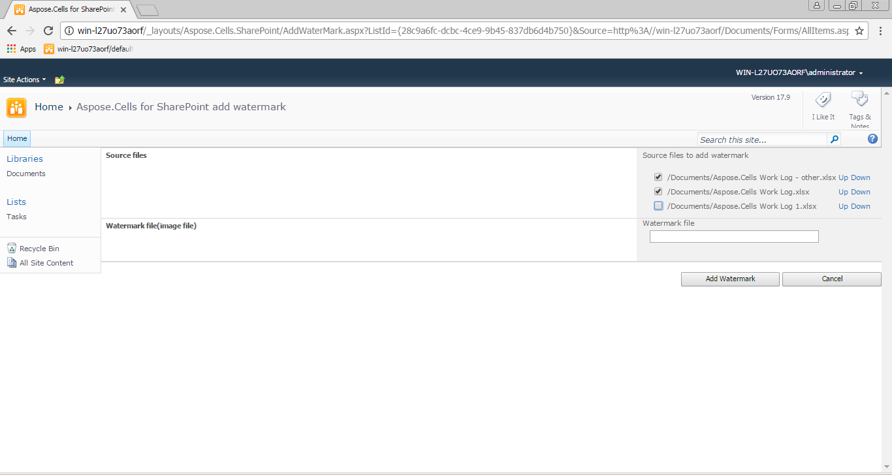

---  
title: Add Watermark to Multiple Documents  
type: docs  
weight: 90  
url: /sharepoint/add-watermark-to-multiple-documents/  
ai_search_scope: cells_sharepoint  
ai_search_endpoint: "https://docsearch.api.aspose.cloud/ask"
---  

If you want to add a watermark to multiple Excel files, please choose the “Add Watermark with Aspose.Cells” option in the Ribbon bar.  

  

Get all Excel files from the data source folder and create a file list table.  

Select the files that need a watermark, and click **Add Watermark** button to add a watermark to the selected files.  

  

The following options are available during the add watermark setup:  

**Watermark file (Image file):**
