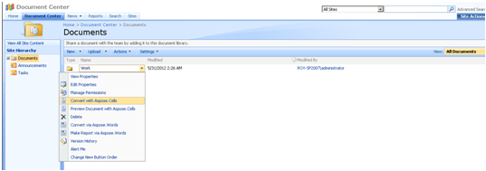
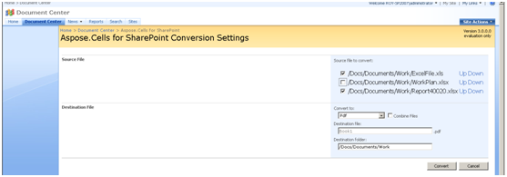
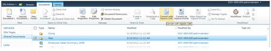

To convert all files in a folder:

1. Select **Convert with Aspose.Cells** from the ECB of your desired folder while staying in the parent.

To convert multiple files:

1. Select several files in the library and choose **Convert with Aspose.Cells**.

   **Convert all files in the sub‑folder** 

2. Select the file item in the document list and move it up or down to change the conversion order. 

   **Changing the conversion order** 

### **Using Server Ribbon Button under SharePoint 2010**
Under SharePoint 2010, the server ribbon button is available instead of the custom‑action menu used with SharePoint 2007 / WSS 3. 

**Converting documents with Aspose.Cells for SharePoint on SharePoint 2010** 

