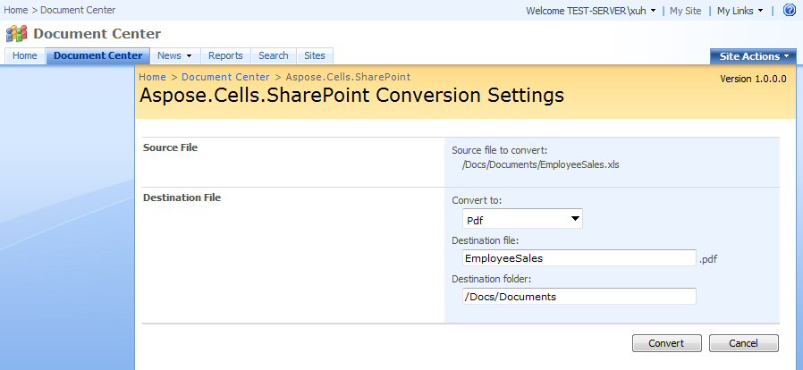

{} 

One of the most common tasks that users use Aspose.Cells for is converting individual files. 

{} 
### **Converting Individual Files**
To convert a particular document in a document library: 

1. Select **Convert with Aspose.Cells.SharePoint** in the document's Edit Control Block (ECB). 

   **Selecting “Convert via Aspose.Cells” item in the document’s ECB** 

The conversion settings screen is displayed. Here, you can fine-tune the conversion:

1. Select the destination file format from the **Convert to** list.
1. Enter the output file's name into the **Destination file** field.
   By default, Aspose.Cells for SharePoint pre-populates this field with the name of the source file. 
   The extension is added automatically according to the selected format.
1. Start the conversion by clicking **Convert**.
   (Or go back to the library, discarding your settings, by clicking **Cancel**.)

**Conversion Settings screen for one file conversion** 

