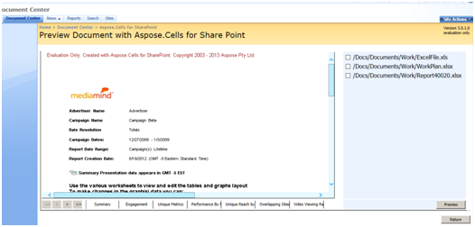

You may preview multiple Excel documents in the document library. 

To preview all the files in a folder: 

1. Select **Preview Document with Aspose.Cells** in the ECB for your desired folder while staying in the parent.

To preview multiple files from within a folder:

1. Select multiple files.
1. With the files still selected, select **Preview Document with Aspose.Cells**.

**Document preview from within SharePoint** 

When you're previewing several documents, the data area shows the first document in the list. The documents list shows all the previewed documents. To view another document:

1. Select a document in the list.
1. Click **Preview**.
