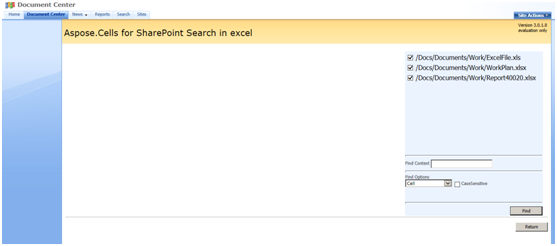

To search all the files in a folder:

1. Select **Search in Document with Aspose.Cells** in the ECB of the desired folder while staying in the parent.

To search several files at once:

1. Select multiple files.
1. With the files still selected, select **Search Document with Aspose.Cells**.

**Searching documents** 

The following options are available:

- **Find Options**: Focus your search by searching in cells, for formulas, or finding formulas that contains a specific expression.
- **CaseSensitive**: When the case-sensitive option is selected, the search matches characters exactly, including lower- and upper-case letters.
