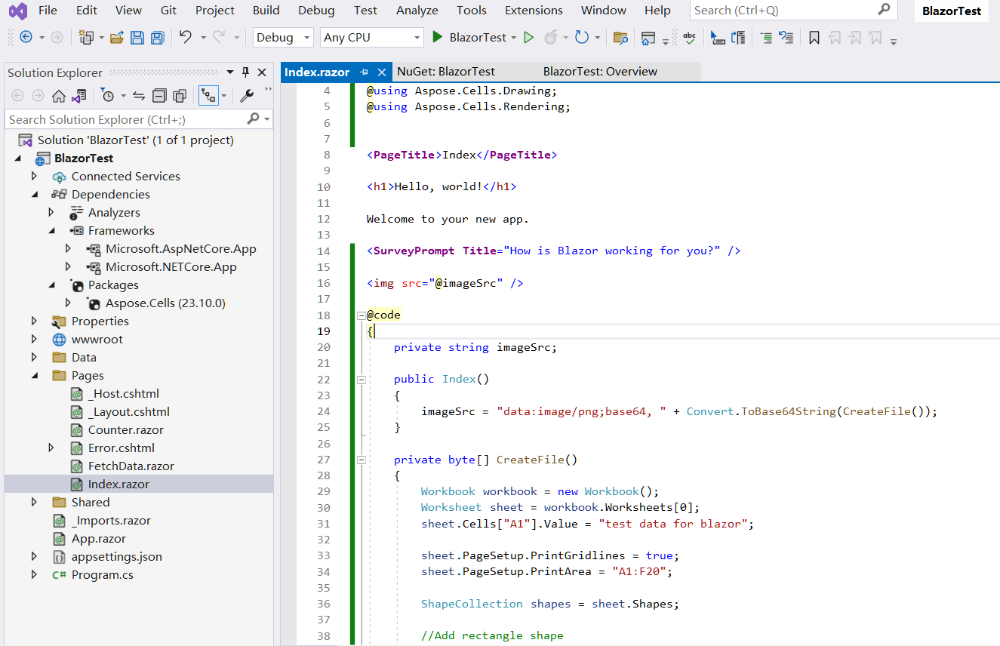

## Aperçu

Blazor est un framework web développé par Microsoft qui permet aux développeurs de créer des applications web interactives côté client en utilisant C# et .NET au lieu de JavaScript. Blazor se décline en deux modèles d'hébergement principaux : **Blazor WebAssembly** et **Blazor Server**. Vous pouvez utiliser **Aspose.Cells for .NET** directement dans les deux modèles.

## Application Blazor WebAssembly avec Aspose.Cells

Blazor WebAssembly s'exécute côté client dans le navigateur à l'aide de WebAssembly. Il permet aux développeurs d'exécuter directement des applications .NET dans le navigateur sans dépendre d'un serveur pour le rendu. À partir de **Aspose.Cells for .NET 25.1**, Aspose.Cells peut être utilisé directement dans une application Blazor WebAssembly. Dans cet exemple, vous créerez une simple application Blazor WebAssembly avec Aspose.Cells, rendre un fichier Excel avec du texte et des formes en une image png, puis afficher cette image sur une page.

### Créer une application Blazor WebAssembly

Prenons l'exemple de l'outil VS2022 pour créer la première application Blazor WebAssembly avec Aspose.Cells, suivez les étapes ci-dessous :

1. Créez un nouveau projet avec le modèle **Blazor WebAssembly Standalone App**.

   

2. Choisissez le framework cible, il est recommandé .NET 8.0 ou supérieur.

   

3. Après la création du projet, ajoutez le package Aspose.Cells au projet. Parce qu'Aspose.Cells référence SkiaSharp, pour faire fonctionner SkiaSharp dans WebAssembly, le package "SkiaSharp.Views.Blazor" est nécessaire.

   ```
   <PackageReference Include="Aspose.Cells" Version="25.1.1" />
   <PackageReference Include="SkiaSharp.Views.Blazor" Version="3.116.1" />
   ```

   *Veuillez noter que la version du package "SkiaSharp.Views.Blazor" ajouté doit correspondre à la version de "SkiaSharp" référencée par Aspose.Cells for .NET. Les versions de Aspose.Cells for .NET et les versions correspondantes de "SKiaSharp" référencées sont décrites comme suit :*

   | Aspose.Cells for .NET |                SkiaSharp                |
   | :-------------------: | :-------------------------------------: |
   |       = 25.1.1        |                 3.116.1                 |
   |       >=25.1.2        | 2.88.9 (net6.0, net8.0), 3.116.1 (net9.0) |

4. Naviguez vers le fichier "Home.razor" dans le dossier "Pages" du projet, écrivez du code pour ajouter des données et des formes, et rendre une image pour l'affichage.

   

5. Faites un clic droit sur le projet et choisissez "Publier...", puis publiez le projet dans un dossier avec ou sans option AOT.

   

6. Après la publication, les fichiers de sortie seront situés dans le dossier `publish/wwwroot`. Ces fichiers sont des fichiers statiques (HTML, JS, CSS, etc.), ils peuvent donc être hébergés en utilisant :

   - **Serveur Web Local** (par exemple, `dotnet serve`, `nginx` ou `Apache`).
   - **Hébergement Cloud** (par exemple, Azure, AWS, Netlify, GitHub Pages).

   Prenons l'exemple de `dotnet serve` :

   - Installez l'outil `dotnet-serve` (si ce n'est pas déjà fait):

     ```bash
     dotnet tool install -g dotnet-serve
     ```

   - Naviguez vers le répertoire `wwwroot` publié.

   - Démarrez le serveur :

     ```bash
     dotnet serve
     ```

7. Ouvrez votre navigateur et visitez l'adresse affichée (par exemple, `http://localhost:1970`), l'image de sortie sera affichée sur la page.

   

### Exemple de code dans une application Blazor WebAssembly

Le code d'exemple suivant est inclus dans le fichier Home.razor :

```cs
@page "/"
@using Aspose.Cells
@using Aspose.Cells.Drawing
@using Aspose.Cells.Rendering

<PageTitle>Home</PageTitle>

<h1>Aspose.Cells works in Blazor WebAssembly App</h1>

@if (imageSrc is not null)
{
    
}
else
{
    <p>Loading image...</p>
}

@code
{
    private string? imageSrc;

    protected override void OnInitialized()
    {
        imageSrc = "data:image/png;base64, " + Convert.ToBase64String(CreateFile());
    }

    private byte[] CreateFile()
    {
        Workbook workbook = new Workbook();
        Worksheet sheet = workbook.Worksheets[0];
        sheet.Cells["A1"].Value = "Aspose.Cells works in Blazor WebAssembly App!";

        sheet.PageSetup.PrintGridlines = true;
        sheet.PageSetup.PrintArea = "A1:F20";

        ShapeCollection shapes = sheet.Shapes;

        //Add rectangle shape
        shapes.AddRectangle(1, 0, 1, 0, 100, 150);

        //Add line shape
        shapes.AddLine(8, 0, 1, 0, 100, 150);

        //Add oval shape
        shapes.AddOval(13, 0, 1, 0, 100, 150);

        using MemoryStream ms = new();

        SheetRender render = new SheetRender(sheet, new ImageOrPrintOptions());
        render.ToImage(0, ms);

        return ms.ToArray();
    }
}
```

### Résolution de problèmes

Currently(Jan 2025) there is a known issue of `dotnet` in the case that publishing a Blazor WebAssembly project which targets to net8.0 with .NET 9.0 SDK(.NET 9.0 SDK is installed and .NET 8.0 SDK is uninstalled if you upgraded Visual Studio to the version v17.12.x). For more info, check the link: <https://github.com/dotnet/runtime/issues/109951>.

```
System.PlatformNotSupportedException: PlatformNotSupported_HybridGlobalization, HashCode
   at System.Globalization.CompareInfo.GetHashCodeOfStringCore(ReadOnlySpan`1 , CompareOptions )
   at System.Globalization.CompareInfo.GetHashCode(ReadOnlySpan`1 , CompareOptions )
   at System.Globalization.CompareInfo.GetHashCode(String , CompareOptions )
   at System.CultureAwareComparer.GetHashCode(String )
   at System.StringComparer.GetHashCode(Object )
```

Si c'est votre cas, trois options s'offrent à vous :

1. Réinstallez le SDK .NET 8.0 (si désinstallé) et utilisez un fichier "global.json" au niveau de la solution (même dossier que le fichier .sln) pour spécifier le SDK utilisé. Voici un exemple de fichier "global.json":

   ```
   {
     "sdk": {
       "version": "8.0.300",
       "rollForward": "latestFeature"
     }
   }
   ```


2. Mettez à jour le fichier du projet pour cibler net9.0.

3. Update Visual Studio to the version v17.12.4.(The issue <https://github.com/dotnet/runtime/issues/109951> is fixed.(updated on Jan 15, 2025))

## Application de serveur Blazor avec Aspose.Cells

Dans cet exemple, vous allez créer une application Blazor Server simple qui ajoute des données et des graphiques, puis les rend sous forme d'images à afficher sur la page web. Lors de la création du projet, vous pouvez configurer les options selon vos besoins. Par exemple, lorsque vous cochez l'option "Activer Docker", l'application blazor peut être construite et exécutée dans Docker..

### Créer une application de serveur Blazor

Utilisons l'outil VS2022 comme exemple pour créer la première application Blazor Server avec Aspose.Cells, suivez les étapes ci-dessous :
1. Sélectionnez Fichier -> Nouveau -> Projet et filtrez en utilisant le mot-clé blazer pour sélectionner le modèle de projet correspondant.
<br>

1. Définissez le nom du projet sur "BlazorTest" et sélectionnez le chemin.
<br>

1. Configurez les bibliothèques et autres options utilisées dans le projet. Enfin, cliquez sur le bouton "Créer" pour générer votre premier projet blazer.
<br>

1. Après avoir entré dans le projet, cliquez sur "Dépendances" sous le projet et sélectionnez "Gérer les packages NuGet..." pour ajouter la bibliothèque Aspose.Cells.
<br>

1. Entrez des mots-clés pour filtrer et installez la dernière bibliothèque Aspose.Cells. Des bibliothèques dépendantes telles que SkiaSharp seront également installées ensemble.
<br>

1. Double-cliquez sur le fichier "Index.razor" pour éditer et importer la bibliothèque requise. Ajoutez des données et des graphiques, et affichez-les sous forme de graphiques.
<br>

1. Compilez et exécutez le projet, et vous obtiendrez les résultats suivants.
<br>


### Exemple de code dans l'application Blazor Server

Le code d'exemple suivant est inclus dans le fichier Index.razor:
```
@page "/"
@using SkiaSharp;
@using Aspose.Cells;
@using Aspose.Cells.Drawing;
@using Aspose.Cells.Rendering;


<PageTitle>Index</PageTitle>

<h1>Hello, world!</h1>

Welcome to your new app.

<SurveyPrompt Title="How is Blazor working for you?" />


@code
{
    private string imageSrc;

    public Index()
    {
        imageSrc = "data:image/png;base64, " + Convert.ToBase64String(CreateFile());
    }

    private byte[] CreateFile()
    {
        Workbook workbook = new Workbook();
        Worksheet sheet = workbook.Worksheets[0];
        sheet.Cells["A1"].Value = "test data for blazor";

        sheet.PageSetup.PrintGridlines = true;
        sheet.PageSetup.PrintArea = "A1:F20";

        ShapeCollection shapes = sheet.Shapes;

        //Add rectangle shape
        shapes.AddRectangle(1, 0, 1, 0, 100, 150);

        //Add line shape
        shapes.AddLine(8, 0, 1, 0, 100, 150);

        //Add oval shape
        shapes.AddOval(13, 0, 1, 0, 100, 150);

        using MemoryStream ms = new();

        SheetRender render = new SheetRender(sheet, new ImageOrPrintOptions());
        render.ToImage(0, ms);

        return ms.ToArray();
    }
}

```

