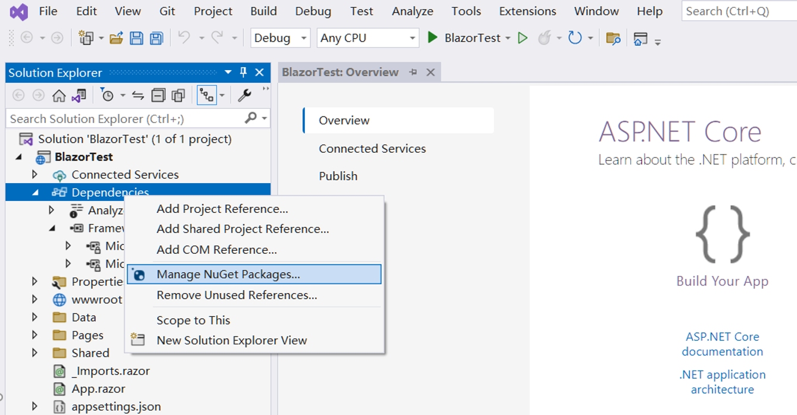

##  Aperçu

 Pour exécuter Aspose.Cells dans Blazor, vous avez besoin des plates-formes .NET6 (ou ultérieures), par rapport aux plates-formes précédentes (.netcore31 ou antérieures), une différence importante concerne la bibliothèque graphique. Dans ce fonctionnaire[Microsoft Document](https://learn.microsoft.com/en-gb/dotnet/core/compatibility/core-libraries/6.0/system-drawing-common-windows-only), il explique que pour .NET6 ou les versions ultérieures, la bibliothèque graphique "System.Drawing.Common" ne sera prise en charge que sur Windows et donne des recommandations pour remplacer la bibliothèque graphique.

Pour le produit Apose.Cells, nous avons effectué l'évaluation et terminé la migration de la bibliothèque graphique. Nous utilisons SkiaSharp au lieu de System.Drawing.Common dans les systèmes non-Windows, comme suggéré dans la documentation officielle de Microsoft. Veuillez noter que ce changement critique prendra effet dans la version Aspose.Cells 22.10.1 ou version ultérieure pour .Net6.

##  Première application Blazor avec Aspose.Cells

Dans cet exemple, vous créez une simple application serveur Blazor qui ajoute des données et des graphiques, et les restituez en images à afficher sur la page Web. Pendant le processus de création du projet, vous pouvez configurer les options en fonction de vos propres besoins. Par exemple, lorsque vous cochez l'option « Activer Docker », l'application Blazor peut alors être créée et exécutée dans Docker.

###  Créer la première application Blazor

Utilisons l'outil VS2022 comme exemple pour créer la première application blazor avec Aspose.Cells, suivez les étapes ci-dessous :
1. Sélectionnez Fichier ->Nouveau ->Projet et filtrez à l'aide du mot-clé blazer pour sélectionner le modèle de projet correspondant.
<br>

1. Définissez le nom du projet sur "BlazorTest" et sélectionnez le chemin.
<br>

1. Configurez les bibliothèques et autres options utilisées dans le projet. Enfin, cliquez sur le bouton "Créer" pour générer votre premier projet blazer.
<br>

1. Après avoir entré le projet, cliquez sur "Dépendances" sous le projet et sélectionnez "Gérer les packages NuGet..." pour ajouter la bibliothèque Aspose.Cells.
<br>

1. Entrez des mots-clés pour le filtrage et installez la dernière bibliothèque Aspose.Cells. Des bibliothèques dépendantes simultanément telles que SkiaSharp seront également installées ensemble.
<br>

1. Double-cliquez sur le fichier "Index.razor" pour éditer et importer la bibliothèque souhaitée. Ajoutez des données et des graphiques, puis convertissez-les en graphiques à afficher.
<br>

1. Compilez et exécutez le projet et vous obtiendrez les résultats suivants.
<br>


###  Exemple de code dans la première application Blazor

L'exemple de code suivant est inclus dans le fichier Index.razor :
```
@page "/"
@using SkiaSharp;
@using Aspose.Cells;
@using Aspose.Cells.Drawing;
@using Aspose.Cells.Rendering;


<PageTitle>Index</PageTitle>

<h1>Hello, world!</h1>

Welcome to your new app.

<SurveyPrompt Title="How is Blazor working for you?" />


@code
{
    private string imageSrc;

    public Index()
    {
        imageSrc = "data:image/png;base64, " + Convert.ToBase64String(CreateFile());
    }

    private byte[] CreateFile()
    {
        Workbook workbook = new Workbook();
        Worksheet sheet = workbook.Worksheets[0];
        sheet.Cells["A1"].Value = "test data for blazor";

        sheet.PageSetup.PrintGridlines = true;
        sheet.PageSetup.PrintArea = "A1:F20";

        ShapeCollection shapes = sheet.Shapes;

        //Add rectangle shape
        shapes.AddRectangle(1, 0, 1, 0, 100, 150);

        //Add line shape
        shapes.AddLine(8, 0, 1, 0, 100, 150);

        //Add oval shape
        shapes.AddOval(13, 0, 1, 0, 100, 150);

        using MemoryStream ms = new();

        SheetRender render = new SheetRender(sheet, new ImageOrPrintOptions());
        render.ToImage(0, ms);

        return ms.ToArray();
    }
}

```