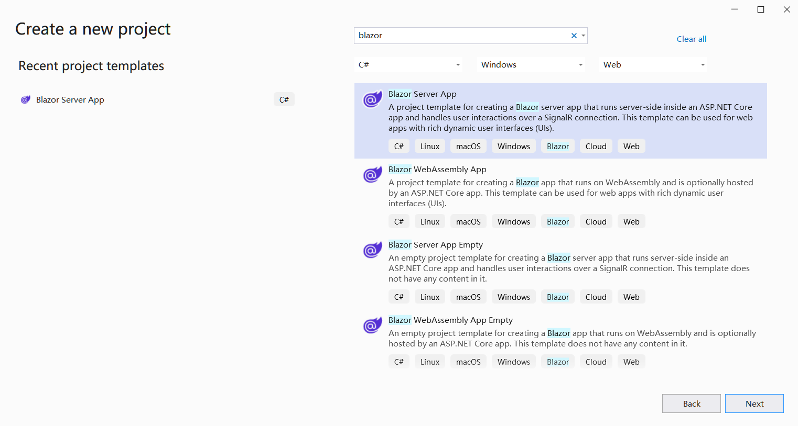

## Übersicht

Um Aspose.Cells in Blazor auszuführen, benötigen Sie die .NET6 (oder höher) Plattformen. Im Vergleich zu früheren Plattformen (.netcore31 oder früher) gibt es einen wichtigen Unterschied bezüglich der Grafikbibliothek. In diesem offiziellen [Microsoft-Dokument](https://learn.microsoft.com/en-gb/dotnet/core/compatibility/core-libraries/6.0/system-drawing-common-windows-only) wird erklärt, dass für .NET6 oder spätere Versionen die Grafikbibliothek "System.Drawing.Common" nur unter Windows unterstützt wird und Empfehlungen zur Ersetzung der Grafikbibliothek gegeben werden.

Für das Produkt Apose.Cells haben wir die Evaluierung durchgeführt und die Migration der Grafikbibliothek abgeschlossen. Wir verwenden SkiaSharp anstelle von System.Drawing.Common in Nicht-Windows-Systemen, wie in der offiziellen Dokumentation von Microsoft empfohlen. Bitte beachten Sie, dass diese wichtige Änderung ab Aspose.Cells 22.10.1 oder später für .Net6 wirksam wird.

## Blazor Server-Anwendung mit Aspose.Cells

In diesem Beispiel erstellen Sie eine einfache Blazor-Serveranwendung, die einige Daten und Grafiken hinzufügt und sie in Bilder rendert, um sie auf der Webseite anzuzeigen. Während des Projekt erstellungsprozesses können Sie Optionen entsprechend Ihren eigenen Anforderungen konfigurieren. Wenn Sie beispielsweise die Option "Docker aktivieren" aktivieren, kann die Blazor-Anwendung in Docker erstellt und ausgeführt werden.

### Erstellen Sie eine Blazor-Serveranwendung

Verwenden wir das VS2022-Tool als Beispiel, um die erste Blazor-Anwendung mit Aspose.Cells zu erstellen. Befolgen Sie die unten stehenden Schritte:
1. Wählen Sie Datei ->Neu ->Projekt und filtern Sie mit dem Stichwort blazer, um das entsprechende Projekttemplate auszuwählen.
<br>

1. Legen Sie den Projektnamen auf "BlazorTest" fest und wählen Sie den Pfad aus.
<br>

1. Konfigurieren Sie die Bibliotheken und andere Optionen, die im Projekt verwendet werden. Klicken Sie abschließend auf die Schaltfläche "Erstellen", um Ihr erstes Blazor-Projekt zu generieren.
<br>

1. Klicken Sie nach dem Betreten des Projekts auf "Abhängigkeiten" unter dem Projekt und wählen Sie "NuGet-Pakete verwalten...", um die Bibliothek Aspose.Cells hinzuzufügen.
<br>

1. Geben Sie Stichwörter zur Filterung ein und installieren Sie die neueste Aspose.Cells-Bibliothek. Gleichzeitig werden abhängige Bibliotheken wie SkiaSharp gleichzeitig installiert.
<br>

1. Doppelklicken Sie auf die Datei "Index.razor", um die erforderliche Bibliothek zu bearbeiten und zu importieren. Fügen Sie einige Daten und Grafiken hinzu und rendern Sie sie in Grafiken zur Anzeige.
<br>

1. Kompilieren und starten Sie das Projekt, und Sie erhalten die folgenden Ergebnisse.
<br>


### Beispielcode in der Anwendung für Blazor-Server

Der folgende Beispielcode ist in der Datei Index.razor enthalten:
```
@page "/"
@using SkiaSharp;
@using Aspose.Cells;
@using Aspose.Cells.Drawing;
@using Aspose.Cells.Rendering;


<PageTitle>Index</PageTitle>

<h1>Hello, world!</h1>

Welcome to your new app.

<SurveyPrompt Title="How is Blazor working for you?" />


@code
{
    private string imageSrc;

    public Index()
    {
        imageSrc = "data:image/png;base64, " + Convert.ToBase64String(CreateFile());
    }

    private byte[] CreateFile()
    {
        Workbook workbook = new Workbook();
        Worksheet sheet = workbook.Worksheets[0];
        sheet.Cells["A1"].Value = "test data for blazor";

        sheet.PageSetup.PrintGridlines = true;
        sheet.PageSetup.PrintArea = "A1:F20";

        ShapeCollection shapes = sheet.Shapes;

        //Add rectangle shape
        shapes.AddRectangle(1, 0, 1, 0, 100, 150);

        //Add line shape
        shapes.AddLine(8, 0, 1, 0, 100, 150);

        //Add oval shape
        shapes.AddOval(13, 0, 1, 0, 100, 150);

        using MemoryStream ms = new();

        SheetRender render = new SheetRender(sheet, new ImageOrPrintOptions());
        render.ToImage(0, ms);

        return ms.ToArray();
    }
}

```
