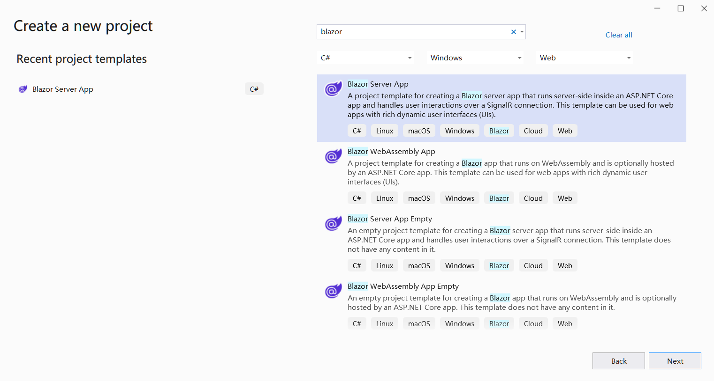

## Panoramica

Blazor è un framework web sviluppato da Microsoft che permette ai developer di creare applicazioni web interattive lato client usando C# e .NET invece di JavaScript. Blazor arriva con due principali modelli di hosting: **Blazor WebAssembly** e **Blazor Server**. Puoi usare **Aspose.Cells for .NET** direttamente in entrambi i modelli.

## Applicazione Blazor WebAssembly con Aspose.Cells

Blazor WebAssembly esegue lato client nel browser usando WebAssembly. Permette ai developer di eseguire applicazioni .NET direttamente nel browser senza affidarsi a un server per il rendering. Da **Aspose.Cells for .NET 25.1**, Aspose.Cells può essere utilizzato direttamente in un'app Blazor WebAssembly. In questo esempio, creerai una semplice Blazor WebAssembly con Aspose.Cells, renderizzare un file Excel con testo e forme in un'immagine png, e poi visualizzare l’immagine in una pagina.

### Crea un'app Blazor WebAssembly

Usiamo come esempio lo strumento VS2022 per creare la prima app Blazor WebAssembly con Aspose.Cells, segui i passaggi di seguito:

1. Crea un nuovo progetto con il template **Blazor WebAssembly Standalone App**.

   

2. Scegli il framework target, raccomandato .NET 8.0 o superiore.

   

3. Dopo aver creato il progetto, aggiungi il pacchetto Aspose.Cells al progetto. Poiché Aspose.Cells fa riferimento a SkiaSharp, per far funzionare SkiaSharp in WebAssembly, è necessario il pacchetto "SkiaSharp.Views.Blazor".

   ```
   <PackageReference Include="Aspose.Cells" Version="25.1.1" />
   <PackageReference Include="SkiaSharp.Views.Blazor" Version="3.116.1" />
   ```

   *Si noti che la versione del pacchetto aggiunto "SkiaSharp.Views.Blazor" dovrebbe corrispondere alla versione di "SkiaSharp" di riferimento di Aspose.Cells for .NET. Le versioni di Aspose.Cells for .NET e le versioni di "SkiaSharp" pertinenti sono descritte come segue:*

   | Aspose.Cells for .NET |                SkiaSharp                |
   | :-------------------: | :-------------------------------------: |
   |       = 25.1.1        |                 3.116.1                 |
   |       >=25.1.2        | 2.88.9 (net6.0, net8.0), 3.116.1 (net9.0) |

4. Naviga al file "Home.razor" nella cartella "Pages" nel progetto, scrivi il codice per aggiungere alcuni dati e forme, e renderizzale in un'immagine per la visualizzazione.

   

5. Fai clic con il tasto destro sul progetto e scegli "Pubblica...", quindi pubblica il progetto in una cartella con o senza l'opzione AOT.

   

6. Dopo la pubblicazione, i file di output si troveranno nella cartella `publish/wwwroot`. Questi file sono file statici (HTML, JS, CSS, ecc.), quindi possono essere ospitati usando:

   - **Server Web Locale** (ad esempio, `dotnet serve`, `nginx` o `Apache`).
   - **Hosting Cloud** (ad esempio, Azure, AWS, Netlify, GitHub Pages).

   Prendiamo ad esempio `dotnet serve`:

   - Installa lo strumento `dotnet-serve` (se non già installato):

     ```bash
     dotnet tool install -g dotnet-serve
     ```

   - Naviga nella directory `wwwroot` pubblicata.

   - Avvia il server:

     ```bash
     dotnet serve
     ```

7. Apri il browser e visita l'indirizzo visualizzato (ad esempio, `http://localhost:1970`), l'immagine di output sarà visualizzata sulla pagina.

   

### Esempio di codice in applicazione Blazor WebAssembly

Il seguente esempio di codice è incluso nel file Home.razor:

```cs
@page "/"
@using Aspose.Cells
@using Aspose.Cells.Drawing
@using Aspose.Cells.Rendering

<PageTitle>Home</PageTitle>

<h1>Aspose.Cells works in Blazor WebAssembly App</h1>

@if (imageSrc is not null)
{
    
}
else
{
    <p>Loading image...</p>
}

@code
{
    private string? imageSrc;

    protected override void OnInitialized()
    {
        imageSrc = "data:image/png;base64, " + Convert.ToBase64String(CreateFile());
    }

    private byte[] CreateFile()
    {
        Workbook workbook = new Workbook();
        Worksheet sheet = workbook.Worksheets[0];
        sheet.Cells["A1"].Value = "Aspose.Cells works in Blazor WebAssembly App!";

        sheet.PageSetup.PrintGridlines = true;
        sheet.PageSetup.PrintArea = "A1:F20";

        ShapeCollection shapes = sheet.Shapes;

        //Add rectangle shape
        shapes.AddRectangle(1, 0, 1, 0, 100, 150);

        //Add line shape
        shapes.AddLine(8, 0, 1, 0, 100, 150);

        //Add oval shape
        shapes.AddOval(13, 0, 1, 0, 100, 150);

        using MemoryStream ms = new();

        SheetRender render = new SheetRender(sheet, new ImageOrPrintOptions());
        render.ToImage(0, ms);

        return ms.ToArray();
    }
}
```

### Problemi comuni

Currently(Jan 2025) there is a known issue of `dotnet` in the case that publishing a Blazor WebAssembly project which targets to net8.0 with .NET 9.0 SDK(.NET 9.0 SDK is installed and .NET 8.0 SDK is uninstalled if you upgraded Visual Studio to the version v17.12.x). For more info, check the link: <https://github.com/dotnet/runtime/issues/109951>.

```
System.PlatformNotSupportedException: PlatformNotSupported_HybridGlobalization, HashCode
   at System.Globalization.CompareInfo.GetHashCodeOfStringCore(ReadOnlySpan`1 , CompareOptions )
   at System.Globalization.CompareInfo.GetHashCode(ReadOnlySpan`1 , CompareOptions )
   at System.Globalization.CompareInfo.GetHashCode(String , CompareOptions )
   at System.CultureAwareComparer.GetHashCode(String )
   at System.StringComparer.GetHashCode(Object )
```

Se questo è il tuo caso, ci sono tre opzioni tra cui scegliere:

1. Reinstalla .NET 8.0 SDK (se è stato disinstallato) e utilizza un file "global.json" a livello di soluzione (stesso folder del file .sln) per specificare l'SDK usato. Ecco un esempio di file "global.json":

   ```
   {
     "sdk": {
       "version": "8.0.300",
       "rollForward": "latestFeature"
     }
   }
   ```


2. Aggiorna il file del progetto per puntare a net9.0.

3. Update Visual Studio to the version v17.12.4.(The issue <https://github.com/dotnet/runtime/issues/109951> is fixed.(updated on Jan 15, 2025))

## Applicazione del server Blazor con Aspose.Cells

In questo esempio, creerai una semplice applicazione Blazor Server che aggiunge alcuni dati e grafici, e li rende in immagini per visualizzarli sulla pagina web. Durante il processo di creazione, puoi configurare le opzioni secondo le tue esigenze. Ad esempio, quando selezioni l'opzione "Abilita Docker", l'applicazione Blazor può essere infatti compilata ed eseguita in Docker.

### Crea Applicazione del server Blazor

Usiamo come esempio lo strumento VS2022 per creare la prima applicazione Blazor Server con Aspose.Cells, segui i passaggi sotto:
1. Seleziona File -> Nuovo -> Progetto e filtra utilizzando la parola chiave blazer per selezionare il modello di progetto corrispondente.
<br>

1. Imposta il nome del progetto su "BlazorTest" e seleziona il percorso.
<br>

1. Configura le librerie e le altre opzioni utilizzate nel progetto. Infine, fai clic sul pulsante "Crea" per generare il tuo primo progetto blazer.
<br>

1. Dopo aver inserito il progetto, fai clic su "Dipendenze" sotto il progetto e seleziona "Gestisci pacchetti NuGet..." per aggiungere la libreria Aspose.Cells.
<br>

1. Inserisci parole chiave per filtrare e installare la libreria Aspose.Cells più recente. Contestualmente verranno installate anche le librerie dipendenti come SkiaSharp.
<br>

1. Fai doppio clic sul file "Index.razor" per modificare ed importare la libreria richiesta. Aggiungi alcuni dati e grafici e renderli in grafici da visualizzare.
<br>

1. Compila ed esegui il progetto, otterrai i seguenti risultati.
<br>


### Codice di esempio in applicazione server Blazor

Il seguente codice di esempio è incluso nel file Index.razor:
```
@page "/"
@using SkiaSharp;
@using Aspose.Cells;
@using Aspose.Cells.Drawing;
@using Aspose.Cells.Rendering;


<PageTitle>Index</PageTitle>

<h1>Hello, world!</h1>

Welcome to your new app.

<SurveyPrompt Title="How is Blazor working for you?" />


@code
{
    private string imageSrc;

    public Index()
    {
        imageSrc = "data:image/png;base64, " + Convert.ToBase64String(CreateFile());
    }

    private byte[] CreateFile()
    {
        Workbook workbook = new Workbook();
        Worksheet sheet = workbook.Worksheets[0];
        sheet.Cells["A1"].Value = "test data for blazor";

        sheet.PageSetup.PrintGridlines = true;
        sheet.PageSetup.PrintArea = "A1:F20";

        ShapeCollection shapes = sheet.Shapes;

        //Add rectangle shape
        shapes.AddRectangle(1, 0, 1, 0, 100, 150);

        //Add line shape
        shapes.AddLine(8, 0, 1, 0, 100, 150);

        //Add oval shape
        shapes.AddOval(13, 0, 1, 0, 100, 150);

        using MemoryStream ms = new();

        SheetRender render = new SheetRender(sheet, new ImageOrPrintOptions());
        render.ToImage(0, ms);

        return ms.ToArray();
    }
}

```

