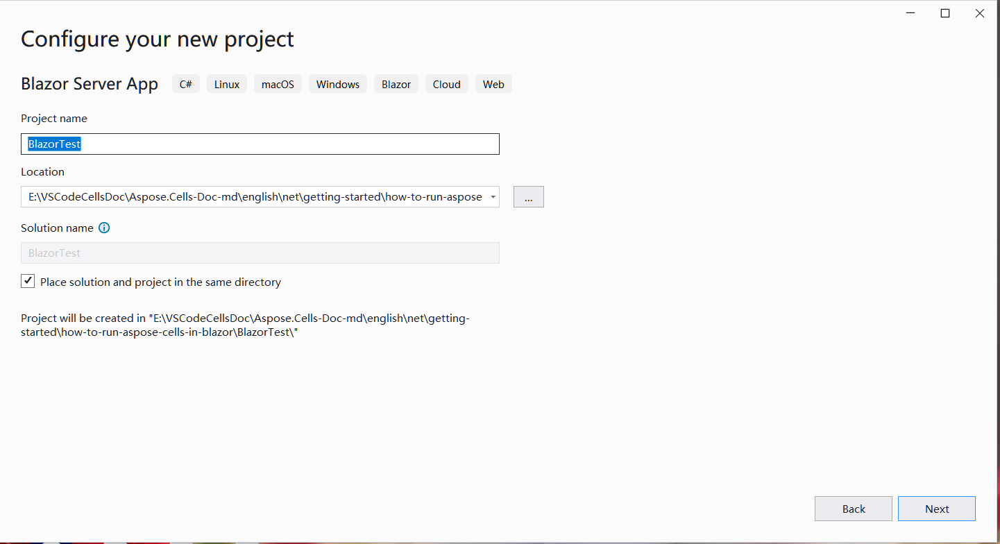
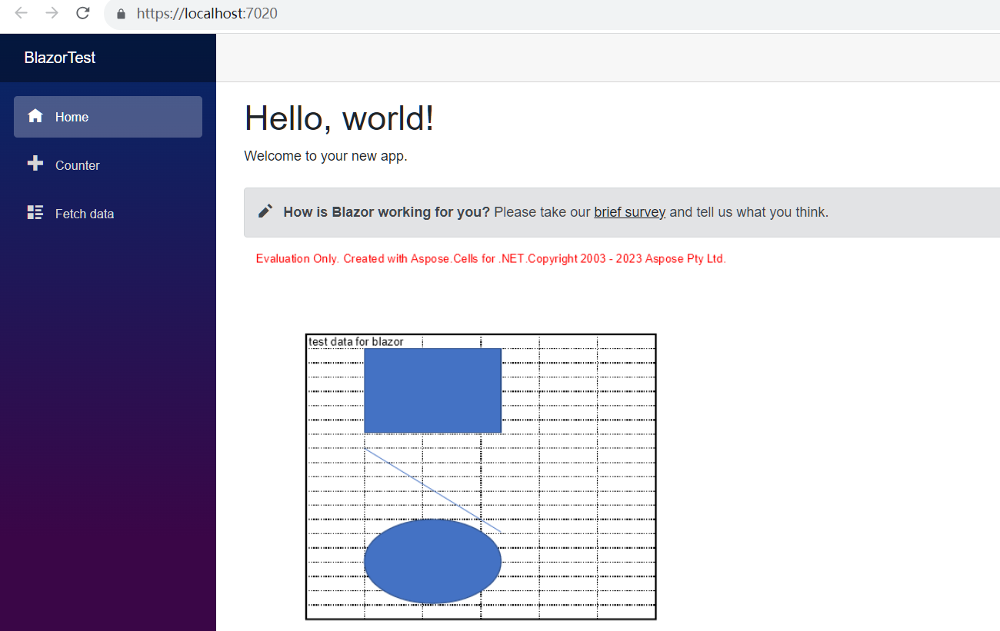

## 概要

Aspose.CellsをBlazorで実行するには、.NET6（またはそれ以降）プラットフォームが必要です。以前のプラットフォーム（.netcore31以前）と比較すると、重要な違いはグラフィックライブラリに関するものです。公式の[Microsoftドキュメント](https://learn.microsoft.com/en-gb/dotnet/core/compatibility/core-libraries/6.0/system-drawing-common-windows-only)では、.NET6以降ではグラフィックライブラリ"System.Drawing.Common"はWindowsのみでサポートされると説明されており、グラフィックライブラリの置換を推奨しています。

Aspose.Cells製品に関して、非WindowsシステムではMicrosoftの公式ドキュメントで推奨されているように、System.Drawing.Commonの代わりにSkiaSharpを使用し、グラフィックライブラリの移行を完了しました。この重要な変更はAspose.Cells 22.10.1以降の.Net6で有効になります。

## Aspose.CellsでのBlazorサーバーアプリケーション

この例では、データとグラフィックを追加し、それらを画像にレンダリングしてWebページに表示するシンプルなBlazorサーバーアプリケーションを作成します。プロジェクト作成プロセス中に、独自のニーズに応じてオプションを構成することができます。たとえば、"Enable Docker"オプションを選択すると、BlazorアプリケーションはDockerで構築および実行されます。

### Blazorサーバーアプリケーションの作成

最初のBlazorアプリケーションをAspose.Cellsと一緒に作成する例としてVS2022ツールを使用し、以下の手順に従ってください。
1. ファイル -> 新規 -> プロジェクトを選択し、Blazerキーワードを使用して対応するプロジェクトテンプレートを選択します。
<br>

1. プロジェクト名を"BlazorTest"に設定し、パスを選択します。
<br>

1. プロジェクトで使用するライブラリやその他のオプションを構成します。最後に"作成"ボタンをクリックして最初のBlazerプロジェクトを生成します。
<br>

1. プロジェクトに入った後、プロジェクトの下にある"依存関係"をクリックし、「NuGetパッケージの管理...」を選択してAspose.Cellsライブラリを追加します。
<br>

1. フィルタリング用のキーワードを入力し、最新のAspose.Cellsライブラリをインストールします。同時にSkiaSharpなどの依存ライブラリも一緒にインストールされます。
<br>

1. "Index.razor"ファイルをダブルクリックして編集し、必要なライブラリをインポートします。データやグラフィックを追加し、それらを表示用のグラフィックにレンダリングします。
<br>

1. プロジェクトをコンパイルして実行すると、以下の結果が得られます。
<br>


### Blazorサーバーアプリケーションのサンプルコード

次のサンプルコードはIndex.razorファイルに含まれています:
```
@page "/"
@using SkiaSharp;
@using Aspose.Cells;
@using Aspose.Cells.Drawing;
@using Aspose.Cells.Rendering;


<PageTitle>Index</PageTitle>

<h1>Hello, world!</h1>

Welcome to your new app.

<SurveyPrompt Title="How is Blazor working for you?" />


@code
{
    private string imageSrc;

    public Index()
    {
        imageSrc = "data:image/png;base64, " + Convert.ToBase64String(CreateFile());
    }

    private byte[] CreateFile()
    {
        Workbook workbook = new Workbook();
        Worksheet sheet = workbook.Worksheets[0];
        sheet.Cells["A1"].Value = "test data for blazor";

        sheet.PageSetup.PrintGridlines = true;
        sheet.PageSetup.PrintArea = "A1:F20";

        ShapeCollection shapes = sheet.Shapes;

        //Add rectangle shape
        shapes.AddRectangle(1, 0, 1, 0, 100, 150);

        //Add line shape
        shapes.AddLine(8, 0, 1, 0, 100, 150);

        //Add oval shape
        shapes.AddOval(13, 0, 1, 0, 100, 150);

        using MemoryStream ms = new();

        SheetRender render = new SheetRender(sheet, new ImageOrPrintOptions());
        render.ToImage(0, ms);

        return ms.ToArray();
    }
}

```
