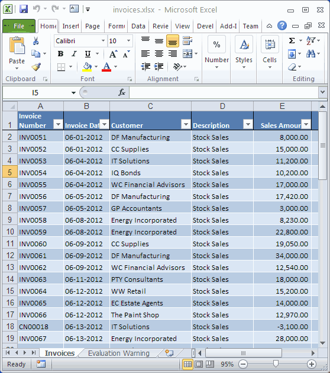
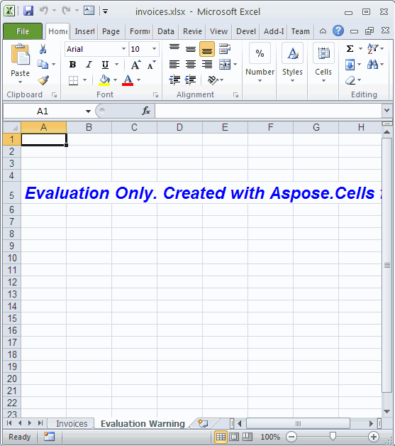

{}

You can easily download Aspose.Cells for JasperReports for evaluation from the [download page](https://downloads.aspose.com/cells/jasperreports). The evaluation download is same as the purchased download. The evaluation version simply becomes licensed after [applying a license](/cells/jasperreports/licensing/).

{}

Evaluation version of Aspose.Cells for JasperReports (without a license specified) provides product functionality to some extent not complete though. One limitation is that it always injects an extra worksheet with evaluation watermark on open / save any spreadsheet document.

**Figure:** Demo Spreadsheet created by Aspose.Cells component

It will inject an extra evaluation watermark worksheet to the workbook.

**Figure:** Evaluation Warning – An Extra Worksheet

If you want to test Aspose.Cells for JasperReports without evaluation version limitations, you may [request a 30-day temporary license](https://purchase.aspose.com/temporary-license).
