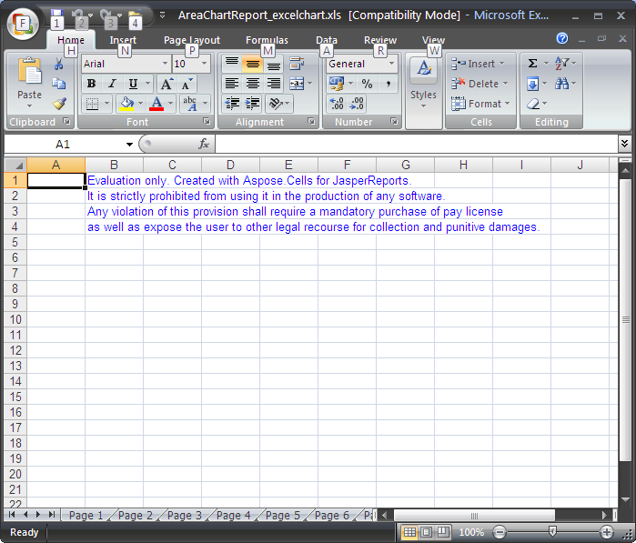
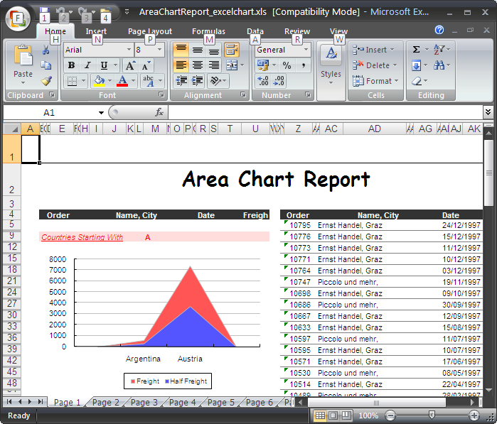

{}

Aspose.Cells for JasperReports is available as a free, time unlimited evaluation from the [download page](https://downloads.aspose.com/cells/jasperreports). The evaluation and licensed versions of the product is the same download.

When you are happy with the evaluation version, you can [purchase a license](https://purchase.aspose.com/). Make sure you understand and agree to the license terms.

The license is available for download from the order page when the order has been paid. The license is a clear text, digitally signed XML file. The license contains information such as the client name, purchased product and license type. Do not modify the content of the license file: doing so invalidates the license.

There are two ways to apply a license:

- [Call setLicense](/cells/jasperreports/licensing/#call-setlicense)
- [Set an exporter parameter in applicationContext.xml](/cells/jasperreports/licensing/#set-the-licensefile-exporter-parameter-in-applicationcontextxml)

After installing the license,

- [Verify that it works](/cells/jasperreports/licensing/#verify-the-license-works).

{}

## **Call setLicense**

{}

This method is applicable for use with JasperReports.

{}

Download the license to your computer and copy it to the appropriate folder (for example your application's folder or **JasperReports\lib**).
Add the following code to your project:



import com.aspose.cells.jasperreports.*;

// Create a stream object containing the license file

FileInputStream fstream = new FileInputStream("C:\\Aspose.Cells.JasperReports.lic");

// Set the license through the stream object

License license = new License();

license.setLicense(fstream);



## **Set the licenseFile Exporter Parameter in applicationContext.xml**

{}

This method is applicable for use with JasperServer.

{}

1. Download the license to your computer and copy it to the **\<InstallDir>\apache-tomcat\webapps\jasperserver\WEB-INF** folder, where **\<InstallDir>** stands for the JasperServer installation directory.
1. Locate the **\<InstallDir>\apache-tomcat\webapps\jasperserver\WEB-INF\applicationContext.xml** file and add the following lines:

**XML**



  <bean id="excelACExportParameters" class="com.aspose.cells.jasperreports.ACXlsExportParametersBean">

    <property name="licenseFile" value="C:/jasperserver-3.0/apache-tomcat/webapps/jasperserver/WEB-INF/Aspose.Cells.JasperReports.lic"/>

</bean>



## **Verify the License Works**

Export any report to XLS format and check if the report contains an evaluation message. If there is no evaluation message, then the license is working properly.

**Aspose.Cells for JasperReports injects an evaluation worksheet in evaluation mode** 

**When a valid license there is no evaluation worksheet** 

