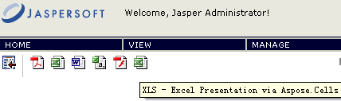

{} 

To integrate Aspose.Cells for JasperReports with JasperServer, perform the steps below.

{} 

{} 

In all of the following steps <InstallDir> stands for the JasperServer installation directory. 

{} 

1. Add the following new exporter properties to the **<InstallDir>\apache-tomcat\webapps\jasperserver\WEB-INF\flows\viewReportBeans.xml** file. 

**XML**



 <bean id="reportACXlsExporter" class="com.aspose.cells.jasperreports.ACReportXlsExporter" parent="baseReportExporter">

   <property name="exportParameters" ref="excelACExportParameters"/>

   <property name="setResponseContentLength" value="true"/>

</bean>

<bean id="xlsACExporterConfiguration" class="com.jaspersoft.jasperserver.war.action.ExporterConfigurationBean">

   <property name="descriptionKey" value="XLS - Excel Presentation via Aspose.Cells"/>

   <property name="iconSrc" value="/images/xls.gif"/>

   <property name="parameterDialogName" value="excelACExportParams"/>

   <property name="exportParameters" ref="excelACExportParameters"/>

   <property name="currentExporter" ref="reportACXlsExporter"/>

</bean>



1. Locate the <util:map id=”exporterConfigMap> element in the **<InstallDir>\apache-tomcat\webapps\jasperserver\WEB-INF\flows\viewReportBeans.xml** file and add the following lines: 

**XML**



 <util:map id="exporterConfigMap">

   <entry key="pdf" value-ref="pdfExporterConfiguration"/>

   <entry key="xls" value-ref="xlsExporterConfiguration"/>

   <entry key="rtf" value-ref="rtfExporterConfiguration"/>

   <entry key="csv" value-ref="csvExporterConfiguration"/>

   <entry key="swf" value-ref="swfExporterConfiguration"/>

<!-- START of ADDED LINES -->

   <entry key="xls" value-ref="xlsACExporterConfiguration"/>

<!-- END of NEW LINES -->

</util:map>



1. Copy all GIF images from the **\lib** folder in the **aspose.cells.jasperreports.zip** to the *<InstallDir>\apache-tomcat\webapps\jasperserver\images* folder.
1. Copy the **aspose.cells.jasperreports.jar** file from the **\lib** folder in the **aspose.cells.jasperreports.zip** to the **<InstallDir>\apache-tomcat\webapps\jasperserver\WEB-INF\lib\.** folder.
1. Add the following lines to the **<InstallDir>\apache-tomcat\webapps\jasperserver\WEB-INF\applicationContext.xml** file.
   (This bean may contain various configuration settings intended to configure the export. For example, you can use the JasperReports font mapping feature or specify the location of the Aspose.Cells for JasperReports license file.) 

**XML**



 <bean id="excelACExportParameters" class="com.aspose.cells.jasperreports.ACXlsExportParametersBean"> <!-- Uncomment to apply a license. Check the license path.

<property name="licenseFile" value="C:/jasperserver-3.0/apache-tomcat/webapps/jasperserver/WEB-INF/Aspose.Cells.JasperReports.lic"/>

-->

</bean>



1. Run JasperServer and open any report to view. If the previous steps were performed properly, additional format icons are available. 

**New export formats available (on the right) after installing Aspose.Cells for JasperReports on JasperServer** 

