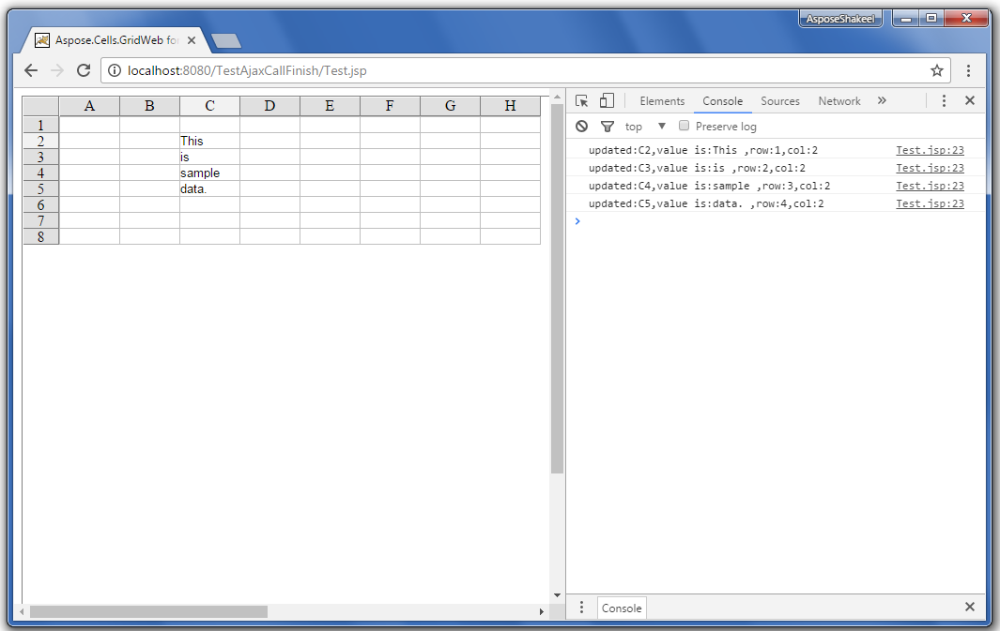
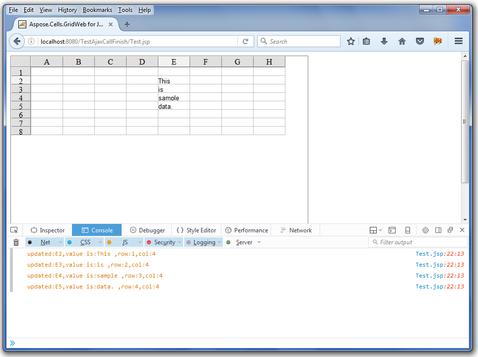

## **Possible Usage Scenarios**
OnAjaxCallFinishedClientFunction is a client side function which is called when user copies some data to GridWeb worksheet. This function is helpful when bulk of cells are updated and you want to keep the track of those updated cells at client side (i.e. in web browsers like FireFox, Google Chrome etc.).
## **Using OnAjaxCallFinishedClientFunction of GridWeb**
The following sample code explains how to make use of OnAjaxCallFinishedClientFunction client function. The screenshots show the console output in Google Chrome and FireFox when the code is executed. Once, you execute the code, please copy/paste some data spanning multiple cells inside the GridWeb worksheet and then check the Web Browser Console as shown in screenshots.
## **Google Chrome Console Output**

## **FireFox Console Output**

## **Sample Code**


 <%@page language="java" contentType="text/html; charset=UTF-8" import="com.aspose.gridweb.*"  pageEncoding="UTF-8"%>

<!DOCTYPE html>

<html xmlns="http://www.w3.org/1999/xhtml">

<head>

<%

String path = request.getContextPath();

String basePath = request.getScheme()+"://"+request.getServerName()+":"+request.getServerPort()+path+"/";

%>

<base href="<%=basePath%>">

<title>Aspose.Cells.GridWeb for Java - Sample JSP Page</title>

<%

//Print GridWeb version on Console

System.out.println("Aspose.Cells.GridWeb for Java Version: " + GridWebBean.getVersion());

ExtPage BeanManager=ExtPage.getInstance();

GridWebBean gridweb=BeanManager.getBean(request);

out.println(gridweb.getHTMLHead());

%>

</head>

<body>

<%

gridweb.setReqRes(request, response);

gridweb.setEnableAJAX(true);

gridweb.setOnAjaxCallFinishedClientFunction("TestAjaxCallFinish");

gridweb.setOnCellUpdatedClientFunction("CellUpdate");

gridweb.setWidth(Unit.Pixel(600));

gridweb.setHeight(Unit.Pixel(400));

gridweb.prepareRender();

out.print(gridweb.getHTMLBody());

%>

</body>

</html>


