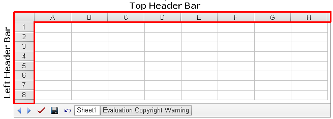

## **Opening a Microsoft Excel File**
Aspose.Cells.GridWeb control can open and load Microsoft Excel files - complete with data, formatting, charts, images etc. This topic explains how.

To open an Excel file using GridWeb control:

1. Add the Aspose.Cells.GridWeb control to a web form or page.
1. Import the Excel file by specifying the file path.
1. Run the application or open the page.

To load the content from an Excel file to Aspose.Cells.GridWeb control, you have to call the importExcelFile method to specify the path of the Excel file. After that, GridWeb control will automatically find the file from the specified path and display its contents in it. A code snippet that loads the contents of an Excel file is provided below.



The above code snippet can be used any way you want. For example, to load an Excel file automatically when a web form loads, add this code to the form's Page_Load event that you have specified by yourself.

**An Excel file is loaded into GridWeb** 

## **Saving a Microsoft Excel File**
It is possible to create new or manipulate existing Microsoft Excel files, on websites in GUI mode using Aspose.Cells.GridWeb control. The files can then be saved to Excel files. Aspose.Cells.GridWeb effectively serves as an online spreadsheet editor. This topic describes how to save grid content to Excel files.
### **Saving as a File**
To save the content of Aspose.Cells.GridWeb control as an Excel file:

1. Add the Aspose.Cells.GridWeb control to a web form or page.
1. Save your work as an Excel file at a specified path.
1. Run the application or open the page.

The code example below illustrates how to save grid content to an Excel file.



The above code snippet can be used in several ways. A common way is to add a button that saves the grid content to an Excel file when clicked. Aspose.Cells.GridWeb offers an easier approach for the task. Aspose.Cells.GridWeb has an event called SaveCommand. The above code snippet can be added to the SaveCommand event's event handler which allows users to save their work by clicking the Aspose.Cells.GridWeb's in-built **Save** button.
## **Resizing Aspose.Cells.GridWeb and its Header Bar**
This article explains how to do the resize GridWeb at runtime using the Aspose.Cells.GridWeb API. It also explains how to resize the header bars of the Aspose.Cells.GridWeb control to make their data easier to read.
### **Changing Width & Height of Aspose.Cells.GridWeb**
Changing the width and height of Aspose.Cells.GridWeb control is a simple but important feature. The Aspose.Cells.GridWeb control is represented by the GridWeb class in the API. To resize the width and height of the GridWeb control, simply use its width and height properties.

{} 

The width and height of the control can be defined in pixels or points.

{} 

The output of the code snippet that follows is shown below.

**Changed width and height of the GridWeb control** 


### **Changing Width & Height of Header Bar**
Aspose.Cells.GridWeb control contains two header bars as follows:

- Top header bar, this header bar represents columns as A, B, C, D, etc.
- Left header bar, this header bar represents rows as 1, 2, 3, 4, etc.

Both of these header bars are shown below.

**Header bars** 

Change the height of the top header bar and the width of the left header bar using the GridWeb control's HeaderBarHeight and HeaderBarWidth properties respectively. The figure below shows the output of the code example that follows.

**Changed header bar width and height** 


## **Working with Aspose.Cells.GridWeb Events**
All developers must be familiar with events and their purpose. Events are used to send notifications of changes that may occur in a control or class. Aspose.Cells.GridWeb has several events that can be used to perform specific tasks when certain changes occur in the control.

This topic provides an introduction to all events supported by the Aspose.Cells.GridWeb control along with some details on how to handle these events.
### **Introduction to Grid Events**
Aspose.Cells.GridWeb control supports several events that provide more control for performing operations when specific events are triggered in the control. A complete list of events supported by Aspose.Cells.GridWeb control can be found below.

|**Events**|**Description**|
| :- | :- |
|CellCommand|Occurs when the command hyperlink of a cell is clicked. When this event is fired, its parameter e.Argument provides the command's name.|
|CellDoubleClick|Occurs when the cell is double-clicked.|
|ColumnDeleted|Occurs when a user deletes a column from a worksheet using the client-side menu.|
|ColumnDeleting|Occurs when a user is trying to delete a column from a worksheet using the client-side menu.|
|ColumnDoubleClick|Occurs when the column header is double-clicked.|
|ColumnInserted|Occurs when a user inserts a column into a worksheet using the client-side menu.|
|CustomCommand|Occurs when a user clicks a custom command button.|
|LoadCustomData|Occurs when the control's EnableSession property is set to false and needs to load worksheet data. You may handle this event in sessionless mode to load worksheet data from a file or database.|
|PageIndexChanged|Occurs when the control's sheet page index is changed.|
|RowDeleted|Occurs when a user deletes a row from the worksheet using the client-side menu.|
|RowDeleting|Occurs when a user is trying to delete a row from a worksheet using the client-side menu.|
|RowDoubleClick|Occurs when the row header is double clicked.|
|RowInserted|Occurs when a user inserts a row into the worksheet using the client-side menu.|
|SaveCommand|Occurs when the **Save** button is clicked.|
|SheetTabClick|Occurs when a sheet tab is clicked.|
|SubmitCommand|Occurs when the **Submit** button is clicked.|
|UndoCommand|Occurs when the **Undo** button is clicked.|
|AjaxCallFinished|Fires when the AJAX update of the control finished. (the EnableAJAX shall be set to true).|
|CellModifiedOnAjax|Fires when the cell is modified in AJAX call.|
|AfterColumnFilter|Fires when the filter is applied on a column.|
### **Handling Grid Events**
To perform a specific operation on triggering a specific event, we have to create an event handler. An event handler performs the desired task when a certain event is triggered. The example that follows shows how to handle a simple grid event.


## **Working with Double Click Events**
Aspose.Cells.GridWeb contains three types of double-click events:

- CellDoubleClick, fired when a cell is double-clicked.
- ColumnDoubleClick, fired when a column header is double-clicked.
- RowDoubleClick, fired when a row header is double-clicked.

This topic discusses how to enable double-click events in Aspose.Cells.GridWeb. It also discusses creating event handlers for these events.
### **Enabling Double Click Events**
All types of double click events can be enabled client-side by setting the GridWeb control's EnableDoubleClickEvent property to true.

{} 

By default, the EnableDoubleClickEvent property is set to false. This means that double click events are not enabled by default. To implement such events, first enable the feature.

{} 



Once double-click events are enabled, it is possible to create event handlers for any double-click events. These event handlers perform specific tasks when a given double-click event is fired.
### **Handling Double Click Events**
#### **Double Click Cell**
The event handler for the CellDoubleClick event provides an argument of the CellEventArgs type, which provides the complete information of the cell that is double-clicked.


#### **Double Click Column Header**
The event handler for the ColumnDoubleClick event provides an argument of the RowColumnEventArgs type that provides the index number of the column for the header that was double-clicked and other information.


#### **Double Click Row Header**
The event handler for the RowDoubleClick event provides an argument of the RowColumnEventArgs type that provides the index number of the row for the header that was double-clicked and other related information.


## **Setting Style or Appearance of Aspose.Cells.GridWeb**
Aspose.Cells.GridWeb has its own default look & feel but it is possible to change its appearance. Aspose.Cells.GridWeb provides several properties to let developers fully control its appearance. This topic discusses some of those properties.
### **Setting Style or Appearance of Aspose.Cells.GridWeb**
#### **Preset Styles**
To save the efforts of developers, Aspose.Cells.GridWeb offers some preset styles. Simply select a style from the list to apply the style.

|**Styles**|**Color Scheme**|
| :- | :- |
|Standard|Silver|
|Colorful1|Rose|
|Colorful2|Blue|
|Professional1|Cyan|
|Professional2|Cyan again|
|Traditional1|Dark|
|Traditional2|Gray|
|Custom|Customized|
When a particular style is selected, it changes the whole appearance of the GridWeb control. Developers can select a Preset Style to be applied on runtime using the flexible API of Aspose.Cells.GridWeb.

The GridWeb control provides the PresetStyle property to which developers can assign any desired preset style.

The output of the below code snippet is shown below.

**GridWeb control with Colorful1 style applied on it**


#### **Header Bar Style**
If you take a look at the GridWeb control, you'll notice two header bars. One for columns (that is A, B, C, D, etc.) and other for rows (that is 1, 2, 3, 4, etc.). Aspose.Cells.GridWeb allows developers to control the appearance of these header bars. Developers may set the style of header bars on runtime.

{} 

The GridWeb control provides the HeaderBarStyle property that applies a style on both header bars of the control.

{} 


#### **Tab Bar Style**
It's possible to set the style of the tab bar too. Please see the following code


#### **Loading Style File**
To apply style settings from an existing style file to GridWeb control, developers can set the path of style file to CustomStyleFileName property of the control. But, before doing that it is must to set the PresetStyle property of the control to Custom. It is because that style file contains custom style information that is already defined by a developer.

Please see the following image that shows GridWeb with the custom style applied to it.



{} 

IMPORTANT: Loading style file into GridWeb control doesn't affect the formatting settings of the cells of the control.

{} 
#### **Sample Custom Style Template**
Here is the sample custom style template. You can modify it as per your requirements.



 <aspose.excel.web.viewerStyletemplate runat="server" HeaderBarWidth="30pt" ScrollBarBaseColor="#AFEEEE" SelectCellBgColor="#FFFAF0" ActiveHeaderBgColor="#DAA520" ActiveCellBgColor="#DDDDFF" FrameTableStyle-BorderStyle="Solid" FrameTableStyle-LeftBorderStyle-BorderWidth="" FrameTableStyle-LeftBorderStyle-BorderColor="" FrameTableStyle-LayoutFixed="Fixed" FrameTableStyle-RightBorderStyle-BorderWidth="" FrameTableStyle-RightBorderStyle-BorderColor="" FrameTableStyle-BorderWidth="1px" FrameTableStyle-CellSpacing="0" FrameTableStyle-BorderColor="#C0FFC0" FrameTableStyle-CellPadding="0" FrameTableStyle-TopBorderStyle-BorderWidth="" FrameTableStyle-TopBorderStyle-BorderColor="" FrameTableStyle-BackColor="#FFFFCC" FrameTableStyle-BottomBorderStyle-BorderWidth="" FrameTableStyle-BottomBorderStyle-BorderColor="" HeaderBarStyle-LeftBorderStyle-BorderWidth="" HeaderBarStyle-LeftBorderStyle-BorderColor="" HeaderBarStyle-verticalalign="Middle" HeaderBarStyle-RightBorderStyle-BorderWidth="" HeaderBarStyle-RightBorderStyle-BorderColor="" HeaderBarStyle-BorderWidth="1px" HeaderBarStyle-font-size="10pt" HeaderBarStyle-BorderColor="#00C0C0" HeaderBarStyle-BorderStyle="Solid" HeaderBarStyle-horizontalalign="Center" HeaderBarStyle-ForeColor="Red" HeaderBarStyle-TopBorderStyle-BorderWidth="" HeaderBarStyle-TopBorderStyle-BorderColor="" HeaderBarStyle-BackColor="#D8BFD8" HeaderBarStyle-BottomBorderStyle-BorderWidth="" HeaderBarStyle-BottomBorderStyle-BorderColor="" ViewTableStyle-LeftBorderStyle-BorderWidth="" ViewTableStyle-LeftBorderStyle-BorderColor="" ViewTableStyle-LayoutFixed="Fixed" ViewTableStyle-RightBorderStyle-BorderWidth="" ViewTableStyle-RightBorderStyle-BorderColor="" ViewTableStyle-BorderWidth="0px" ViewTableStyle-CellSpacing="0" ViewTableStyle-CellPadding="0" ViewTableStyle-TopBorderStyle-BorderWidth="" ViewTableStyle-TopBorderStyle-BorderColor="" ViewTableStyle-BottomBorderStyle-BorderWidth="" ViewTableStyle-BottomBorderStyle-BorderColor="" BottomTableStyle-LeftBorderStyle-BorderWidth="" BottomTableStyle-LeftBorderStyle-BorderColor="" BottomTableStyle-LayoutFixed="Fixed" BottomTableStyle-RightBorderStyle-BorderWidth="" BottomTableStyle-RightBorderStyle-BorderColor="" BottomTableStyle-Height="32pt" BottomTableStyle-BorderWidth="0px" BottomTableStyle-CellSpacing="0" BottomTableStyle-BorderColor="#80FF80" BottomTableStyle-CellPadding="0" BottomTableStyle-ForeColor="#FFE0C0" BottomTableStyle-TopBorderStyle-BorderStyle="Solid" BottomTableStyle-TopBorderStyle-BorderWidth="1px" BottomTableStyle-TopBorderStyle-BorderColor="#FF69B4" BottomTableStyle-BottomBorderStyle-BorderWidth="" BottomTableStyle-BottomBorderStyle-BorderColor="" HeaderBarHeight="15pt" ActiveTabStyle-LeftBorderStyle-BorderWidth="" ActiveTabStyle-LeftBorderStyle-BorderColor="" ActiveTabStyle-RightBorderStyle-BorderWidth="" ActiveTabStyle-RightBorderStyle-BorderColor="" ActiveTabStyle-Height="15pt" ActiveTabStyle-BorderWidth="1px" ActiveTabStyle-font-size="10pt" ActiveTabStyle-BorderColor="#00C0C0" ActiveTabStyle-BorderStyle="Solid" ActiveTabStyle-ForeColor="#FF00FF" ActiveTabStyle-TopBorderStyle-BorderWidth="" ActiveTabStyle-TopBorderStyle-BorderColor="" ActiveTabStyle-BackColor="#80FFFF" ActiveTabStyle-BottomBorderStyle-BorderWidth="" ActiveTabStyle-BottomBorderStyle-BorderColor="" HeaderBarTableStyle-LeftBorderStyle-BorderWidth="" HeaderBarTableStyle-LeftBorderStyle-BorderColor="" HeaderBarTableStyle-LayoutFixed="Fixed" HeaderBarTableStyle-RightBorderStyle-BorderWidth="" HeaderBarTableStyle-RightBorderStyle-BorderColor="" HeaderBarTableStyle-BorderWidth="0px" HeaderBarTableStyle-CellSpacing="0" HeaderBarTableStyle-CellPadding="0" HeaderBarTableStyle-TopBorderStyle-BorderWidth="" HeaderBarTableStyle-TopBorderStyle-BorderColor="" HeaderBarTableStyle-BackColor="#C0FFC0" HeaderBarTableStyle-BottomBorderStyle-BorderWidth="" HeaderBarTableStyle-BottomBorderStyle-BorderColor="" DefaultGridLineColor="#228B22" TabStyle-LeftBorderStyle-BorderWidth="" TabStyle-LeftBorderStyle-BorderColor="" TabStyle-RightBorderStyle-BorderWidth="" TabStyle-RightBorderStyle-BorderColor="" TabStyle-Height="15pt" TabStyle-BorderWidth="1px" TabStyle-font-size="8pt" TabStyle-BorderColor="#8080FF" TabStyle-BorderStyle="Groove" TabStyle-ForeColor="#FFFFCC" TabStyle-TopBorderStyle-BorderWidth="" TabStyle-TopBorderStyle-BorderColor="" TabStyle-BackColor="#C0C0FF" TabStyle-BottomBorderStyle-BorderWidth="" TabStyle-BottomBorderStyle-BorderColor="" scrollbararrowColor="#778899"/>


## **Creating Control on a Web Form**
This article will guide you on how to create a simple web form JSP (Java Server Page) having GridWeb control on it.

{} 

You can get the entire running sample code discussed in this article from this link: [Simple JSP Page Showing GridWeb Example](http://www.aspose.com/community/forums/678392/postattachment.aspx)

{} 

**Step 1 - Create Directory Structure**

You need to create the following directory structure in the **webapps** directory of Tomcat Server

These are the directories and files you need to create. Please read the comments and follow them. You can get the latest Aspose.Cells.GridWeb for Java release archives from [this link](http://www.aspose.com/dowhttps://forum.aspose.com/uploads/discourse_instance3/22292nloads/cells-family/java).



 SamplePageGridWebJava

SamplePageGridWebJava\grid

//Get acwclient directory from GridWeb latest release archive from Downloads section

SamplePageGridWebJava\acwclient

SamplePageGridWebJava\WEB-INF

SamplePageGridWebJava\WEB-INF\lib

//Get aspose-gridweb-x.x.x.jar file from GridWeb latest release archive from Downloads section

SamplePageGridWebJava\WEB-INF\aspose-gridweb-x.x.x.jar

SamplePageGridWebJava\WEB-INF\web.xml

SamplePageGridWebJava\head.jsp

//Create this excel file using Microsoft Excel or you can use any excel file and rename it SampleExcel.xlsx

SamplePageGridWebJava\SampleExcel.xlsx

SamplePageGridWebJava\SamplePage.jsp



**Step 2 - Adding Codes in Created Files**

This section shows the code for various files created in the above directory structure. Please get these codes and add them in your files by opening them in Notepad and copy/paste it.

**Web.xml**



 <?xml version="1.0" encoding="UTF-8"?>

<web-app xmlns:xsi="http://www.w3.org/2001/XMLSchema-instance" xmlns="http://java.sun.com/xml/ns/javaee" xmlns:web="http://java.sun.com/xml/ns/javaee/web-app_2_5.xsd" xsi:schemaLocation="http://java.sun.com/xml/ns/javaee http://java.sun.com/xml/ns/javaee/web-app_2_5.xsd" id="WebApp_ID" version="2.5">

  <display-name>testGridWeb</display-name>

  <welcome-file-list>

    <welcome-file>SamplePage.jsp</welcome-file>

  </welcome-file-list>

  <servlet>

    <display-name>GridWebServlet</display-name>

    <servlet-name>GridWebServlet</servlet-name>

    <servlet-class>com.aspose.gridweb.GridWebServlet</servlet-class>

  </servlet>

  <servlet-mapping>

    <servlet-name>GridWebServlet</servlet-name>

    <url-pattern>/GridWebServlet</url-pattern>

  </servlet-mapping>

</web-app>



**head.jsp**



 <%

String path = request.getContextPath();

String basePath = request.getScheme()+"://"+request.getServerName()+":"+request.getServerPort()+path+"/";

%>

<meta http-equiv="X-UA-Compatible" content="IE=EmulateIE9"/>

<base href="<%=basePath%>">

<link href="grid/acw_client/menu.css" rel="stylesheet" type="text/css" />



**SamplePage.jsp**



**Step 3 - Running Your Sample JSP Web Page**

Now you have done everything. It is time to run the web page. Please start your Tomcat server and then paste the following URL in the web browser.



 http://localhost:8080/SamplePageGridWebJava/SamplePage.jsp



You will see something like the following screenshot. Congrats, you have successfully used the GridWeb control on your JSP page.

## **Printing GridWeb**
There are times when developers need to print the GridWeb content included from a web page without saving a Microsoft Excel file. The Aspose.Cells.GridWeb control supports this feature.
### **Printing GridWeb**
To print without saving a separate file, call the GridWeb class' print() method client-side to print the grid. You may choose some appropriate event too.



Since you are calling it from the client side, so you will have to first get the gridweb client id. You can get the client id using gridweb.getClientID() method.
### **Client Side Sample Code**
Please see the following link which calls gridweb.print() method from client side.

**HTML**



 <a href="#" onclick='<%=gridweb.getClientID()%>.print(); '>Print Function of GridWeb</a>


## **Introduction to Different Grid Modes**
This article describes Aspose.Cells.GridWeb's different modes. These modes are differentiated logically due to their different features and behaviors. We have identified different types of mode as:

- Edit Mode
- View Mode

All of these modes have their own characteristics. Developers can work with Aspose.Cells.GridWeb in any mode according to their requirements. We'll look at each mode below.
### **Edit Mode**
By default, the Aspose.Cells.GridWeb control is in Edit mode. In Edit mode, you can fully edit or modify the grid content using all the features offered by the Aspose.Cells.GridWeb control. These features include:

- Saving the grid content to Microsoft Excel files.
- Submitting data to a server.
- Calculating formulas.
- Undoing or discarding previous actions.
- Managing rows and columns.
- Cutting, copying or pasting data.
- Formatting cells etc.

**GridWeb control in Edit Mode**

Developers can also switch to Edit mode programmatically by setting the EditMode property of the GridWeb control to true.
### **Code Example**

### **View Mode**
When the GridWeb control is in View mode, users cannot edit or modify grid content, which means that users can only view grid content. That's why this mode is called View mode. In View mode, a few buttons (**Submit**, **Save** and **Undo**) are hidden and the menu that appears when right-clicking only contains the **Copy** and **Find** option.

**GridWeb control in View Mode** 

If developers would like their users to only view data then they can switch to View mode programmatically by setting the GridWeb control's EditMode property to false.
### **Code Example**


{} 

Even in View mode, users can change the height and width of rows and columns.

{}
