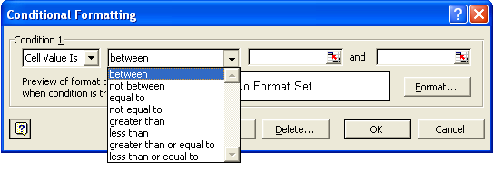

{} 

Conditional formatting is an advanced Microsoft Excel feature that allows you to apply formats to a cell or range of cells and have that formatting change depending on the value of the cell or the value of a formula. For example, you can have a cell appear bold only when the value of the cell is greater than 500. When the value of the cell meets the condition, the specified format is applied to the cell. If the value of the cell does not meet the condition, the default formatting is used. In Microsoft Excel, select **Format**, then **Conditional Formatting** to open the Conditional Formatting dialog.

**Conditional formatting in Microsoft Excel** 

Aspose.Cells supports applying conditional formatting to cells at runtime. This article explains how.

{} 
## **Applying Conditional Formatting**
Aspose.Cells supports conditional formatting in two ways:

- [Using a designer spreadsheet](/cells/java/conditional-formatting/).
- [Creating conditional formatting at runtime](/cells/java/conditional-formatting/).
### **Using Designer Spreadsheet**
Developers can create a designer spreadsheet that contains conditional formatting in Microsoft Excel and then open that spreadsheet with Aspose.Cells. Aspose.Cells loads and saves the designer spreadsheet, keeping any conditional formatting setting. To find out more about designer spreadsheets, read [What is a Designer Spreadsheet](/cells/java/what-is-a-designer-spreadsheet/).
## **Applying Conditional Formatting at Runtime**
Aspose.Cells supports applying conditional formatting at runtime.


### **Set Font**
**Setting fonts in Microsoft Excel** 


### **Set Border**
**Setting borders in Microsoft Excel** 


### **Set Pattern**
**Setting a cell pattern in Microsoft Excel** 



## **Advance topics**
- [Add Conditional Icons Set with the Cell Text](/cells/java/add-conditional-icons-set-with-the-cell-text/)
- [Adding 2-Color Scale and 3-Color Scale Conditional Formattings](/cells/java/adding-2-color-scale-and-3-color-scale-conditional-formattings/)
- [Apply Conditional Formatting in Worksheets](/cells/java/apply-conditional-formatting-in-worksheets/)
- [Apply Shading to Alternate Rows and Columns with Conditional Formatting](/cells/java/apply-shading-to-alternate-rows-and-columns-with-conditional-formatting/)

