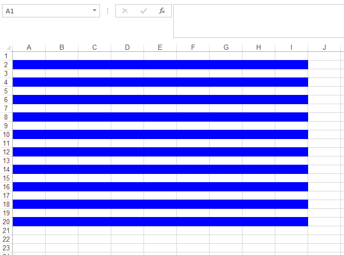

{} 

Aspose.Cells APIs provide the means to add & manipulate conditional formatting rules for [Worksheet](https://reference.aspose.com/cells/java/com.aspose.cells/Worksheet) object. These rules can be tailored in a number of ways to get the desired formatting based on conditions or rules. This article will demonstrate the use of Aspose.Cells for Java API to apply shading to alternate rows & columns with the help of conditional formatting rules and Excel's built-in functions.

{} 
## **Apply Shading to Alternate Rows & Columns using Conditional Formatting**
This article makes use of Excel's built-in functions such as ROW, COLUMN & MOD. Here are little details of these functions for a better understanding of the code snippet provided ahead.

- **ROW()** function returns the row number of a cell reference. If the reference is omitted, it assumes that the reference is the cell address in which the ROW function has been entered in.
- **COLUMN()** function returns the column number of a cell reference. If the reference is omitted, it assumes that the reference is the cell address in which the COLUMN function has been entered in.
- **MOD()** function returns the remainder after a number is divided by a divisor, where the first parameter to the function is the numeric value whose remainder you wish to find and the second parameter is the number used to divide into the number parameter. If the divisor is 0, then it will return the #DIV/0! error.

Let us start writing some code to accomplish the goal with the help of Aspose.Cells for Java API.



The following snapshot shows the resultant spreadsheet loaded in Excel application.

In order to apply the shading to alternative columns, all you have to do is to change the formula **=MOD(ROW(),2)=0** as **=MOD(COLUMN(),2)=0**, that is; instead of getting the row index, modify the formula to retrieve the column index. 
The resultant spreadsheet, in this case, will look like the following image.

