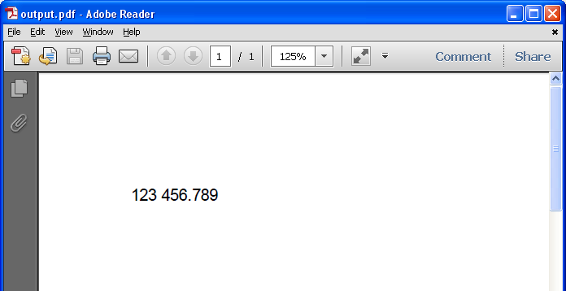

{}

In Microsoft Excel, you can specify the Custom Decimal and Thousands Separators instead of using System Separators from the **Advanced Excel Options** as shown in the screenshot below.

Aspose.Cells provides the [**WorkbookSettings.setNumberDecimalSeparator()**](https://reference.aspose.com/cells/java/com.aspose.cells/workbooksettings#NumberDecimalSeparator) and [WorkbookSettings.setNumberGroupSeparator()](https://reference.aspose.com/cells/java/com.aspose.cells/workbooksettings#NumberGroupSeparator) properties to set the custom separators for formatting/parsing numbers.

{}

## **Specifying Custom Separators using Microsoft Excel**

1. Open **Options** in the **File** tab.
1. Open the **Advanced** tab.
1. Change the settings in the **Editing Options** section.

The following screenshot shows the **Advanced Excel Options** and highlights the section to specify the **Custom Separators**.

## **Specifying Custom Separators using Aspose.Cells**

The following sample code illustrates how to specify the Custom Separators using Aspose.Cells API. It specifies the Custom Number Decimal and Group Separators as dot and space respectively. So the number **123,456.789** will be displayed as **123 456.789** as shown in the screenshot which shows the output PDF generated by the code.


