## **Setting Chart Appearance**

In [Chart Types](/cells/java/chart-types/), we gave a brief introduction to the types of charts and charting objects offered by Aspose.Cells.

In this article, we discuss how to customize the appearance of charts by setting a number of different properties:

- [Setting the chart area](/cells/java/chart-formatting/#setting-chart-area).
- [Setting chart lines](/cells/java/chart-formatting/#setting-chart-lines).
- [Applying themes](/cells/java/chart-formatting/#applying-microsoft-excel-20072010-themes-to-charts).
- [Setting titles to charts and axes](/cells/java/chart-formatting/#setting-the-titles-of-charts-or-axes).
- [Working with gridlines](/cells/java/chart-formatting/#setting-major-gridlines).
- [Setting borders for back and side walls](/cells/java/chart-formatting/#setting-borders-for-back-and-side-walls).

### **Setting Chart Area**

There are different kinds of areas in a chart and Aspose.Cells provides the flexibility of modifying the appearance of each area. Developers can apply different formatting settings on an area by changing its foreground color, background color and fill format etc.

In the example given below, we have applied different formatting settings on different kinds of areas of a chart. These areas include:

- Plot area
- Chart area
- [**SeriesCollection**](https://reference.aspose.com/cells/java/com.aspose.cells/SeriesCollection) area
- The area of a single point in an [**SeriesCollection**](https://reference.aspose.com/cells/java/com.aspose.cells/SeriesCollection)

After executing the example code, a column chart will be added to the worksheet as shown below:

**A column chart with filled areas** 

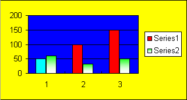



### **Setting Chart Lines**

Developers can also apply different kinds of styles on the lines or data markers of the [**SeriesCollection**](https://reference.aspose.com/cells/java/com.aspose.cells/SeriesCollection) as shown below in the example. Executing the example code adds a column chart to the worksheet as shown below:

**Column chart after applying line styles** 

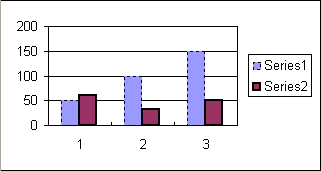



### **Applying Microsoft Excel 2007/2010 Themes to Charts**

Developers can apply different Microsoft Excel themes and colors to the [**SeriesCollection**](https://reference.aspose.com/cells/java/com.aspose.cells/SeriesCollection) or other chart objects as shown in the example below.



### **Setting the Titles of Charts or Axes**

You can use Microsoft Excel to set the titles of a chart and its axes in a WYSIWYG environment as shown below.

**Setting titles of a chart & its axes using Microsoft Excel** 

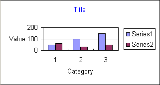

Aspose.Cells also allows developers to set the titles of a chart and its axes at runtime. All charts and their axes contain a [**Title.setText**](https://reference.aspose.com/cells/java/com.aspose.cells/title#Text) method that can be used to set their titles as shown below in an example. After executing the example code, a column chart will be added to the worksheet as shown below:

**Column chart after setting titles** 

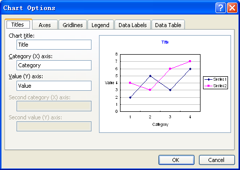



### **Setting Major Gridlines**

#### **Hiding Major Gridlines**

Developers can control the visibility of major gridlines by using the [**setVisible**](https://reference.aspose.com/cells/java/com.aspose.cells/line#IsVisible) method of the [**Line**](https://reference.aspose.com/cells/java/com.aspose.cells/Line) object. After hiding the major gridlines, a column chart added to the worksheet has the following appearance:

**A column chart with hidden major gridlines** 

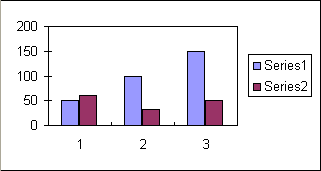



#### **Changing Major Gridlines Settings**

Developers cannot only control the visibility of major gridlines but also other properties including its color etc. After setting the color of major gridlines, a column chart added to the worksheet will have the following appearance:

**Column chart with colored major gridlines** 

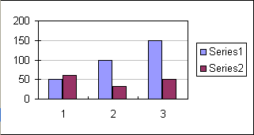



### **Setting Borders for Back and Side Walls**

Since the release of Microsoft Excel 2007, the walls of a 3D chart have been divided into two parts: side wall and back wall, so we have to use two [**Walls**](https://reference.aspose.com/cells/java/com.aspose.cells/Walls) objects to represent them separately and you can access them by using [**Chart.getBackWall()**](https://reference.aspose.com/cells/java/com.aspose.cells/chart#BackWall) and [**Chart.getSideWall()**](https://reference.aspose.com/cells/java/com.aspose.cells/chart#SideWall).

The example given below shows how to set the border of the sidewall by using different attributes.



## **Change the Chart Position and Size**

Sometimes, you want to change the position or size of the new or existing chart inside the worksheet. Aspose.Cells provides the [**Chart.getChartObject()**](https://reference.aspose.com/cells/java/com.aspose.cells/chart#ChartObject) property to achieve this. You can use its sub-properties to re-size the chart with new **height** and **width** or re-position it with new **X** and **Y** coordinates.

### **Modifying Chart's Position and Size**

To change the chart's position (X, Y coordinates) and size (height, width), use these properties:

1. [**Chart.getChartObject().get/setWidth()**](https://reference.aspose.com/cells/java/com.aspose.cells/chartshape#Width)
1. [**Chart.getChartObject().get/setHeight()**](https://reference.aspose.com/cells/java/com.aspose.cells/chartshape#Height)
1. [**Chart.getChartObject().get/setX()**](https://reference.aspose.com/cells/java/com.aspose.cells/chartshape#X)
1. [**Chart.getChartObject().get/setY()**](https://reference.aspose.com/cells/java/com.aspose.cells/chartshape#Y)

The following example explains the usage of the above properties. It loads the existing workbook which contains a chart in its first worksheet. Then it re-sizes and re-positions the chart and save the workbook.

Before the execution of the sample code, the source file looks like this:

**Chart size and position before the execution of sample code** 

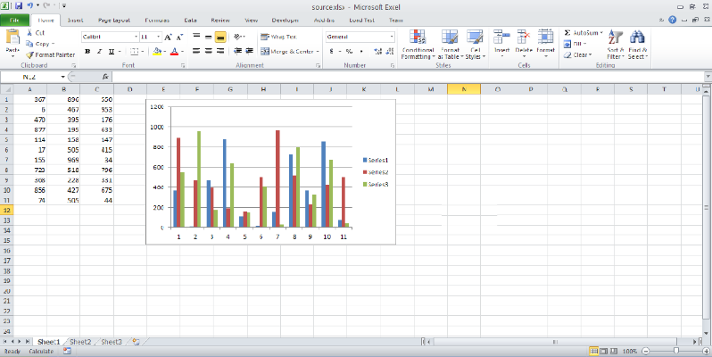

After the execution, the output file looks like this:

**Chart size and position after the execution of sample code** 

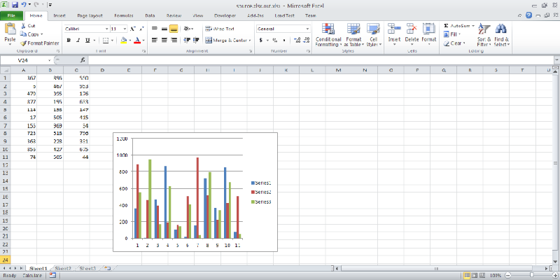



## **Manipulating Designer Charts**

There is a time where you might need to manipulate or modify the charts in your designer template files. Aspose.Cells fully supports to manipulate designer charts with its contents and elements. The data, chart contents, background image, and formatting can be preserved with accuracy.

### **Manipulating Designer Charts in the Template Files**

To manipulate designer charts in a template file, use all chart related API calls. For example, use [**Worksheet.getCharts**](https://reference.aspose.com/cells/java/com.aspose.cells/worksheet#Charts) property to get the existing charts collection in the template file.

#### **Creating a Chart**

The following example shows how to create a pie chart. We will manipulate this chart later on. The following output is generated by the code.

**The input pie chart** 

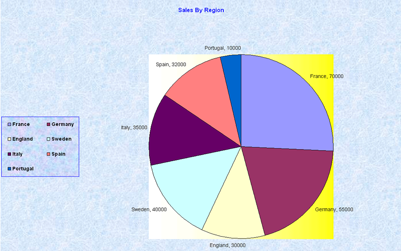



#### **Manipulating the Chart**

The following example shows how to manipulate the existing chart. In this example we modify the chart created above. The following output is generated by the code. Note that the color of the chart title has changed from blue to black, and 'England 30000' has been changed to 'United Kingdom, 30K'.

**The pie chart has been modified** 

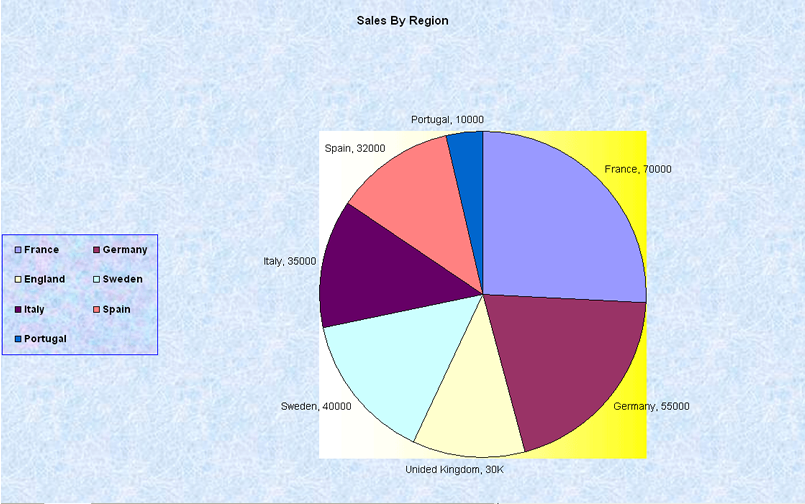



#### **Manipulating a Line Chart in the Designer Template**

In this example, we will manipulate a line chart. We will add some data series to the existing chart and change their line colors.

First, take a look at the designer line chart.

**The input line chart** 

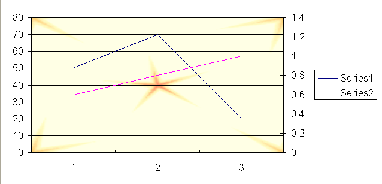

Now we manipulate the line chart (which is contained in the **linechart.xls** file) using the following code. The following output is generated by the code.

**The manipulated line chart** 

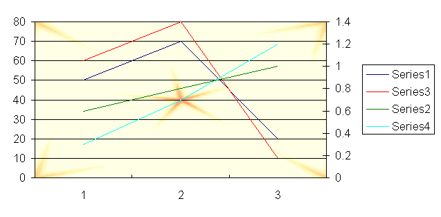



## **Using Sparklines**

Microsoft Excel 2010 can analyze information in more ways than ever before. It allows users to track and highlight important data trends with new data analysis and visualization tools. Sparklines are mini-charts that you can place inside cells so that you can view data and chart on the same table. When sparklines are used properly, data analysis is quicker and more to the point. They also provide a simple view of information, avoiding over-crowded worksheets with a lot of busy charts.

Aspose.Cells provides an API for manipulating sparklines in spreadsheets.

### **Sparklines in Microsoft Excel**

To insert sparklines in Microsoft Excel 2010:

1. Select the cells where you want the sparklines to appear. To make them easy to view, select cells at the side of the data.
1. Click **Insert** on the ribbon and then choose **column** in the **Sparklines** group.

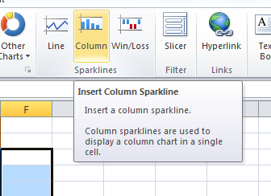

1. Select or enter the range of cells in the worksheet that contain the source data.
   The charts appear.

Sparklines help you see trends, for example, or the win or loss record for a softball league. Sparklines can even sum up the entire season of each team in the league.

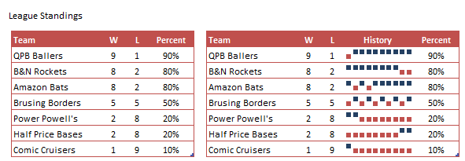

### **Sparklines using Aspose.Cells**

Developers can create, delete or read sparklines (in the template file) using the API provided by Aspose.Cells. By adding custom graphics for a given data range, developers have the freedom to add different types of tiny charts to selected cell areas.

The example below demonstrates the Sparklines feature. The example shows how to:

1. Open a simple template file.
1. Read sparklines information for a worksheet.
1. Add new sparklines for a given data range to a cell area.
1. Saves the Excel file to disk.



## **Applying 3D Format to Chart**

You might need 3D charting styles so you can get just the results for your scenario. Aspose.Cells APIs provide the relevant API to apply Microsoft Excel 2007 3D formatting as demonstrated in this article.

### **Setting 3D Format to Chart**

A complete example is given below to demonstrate how to create a chart and apply Microsoft Excel 2007 3D formatting. After executing the above example code, a column chart (with 3D effects) will be added to the worksheet as shown below.

**A column chart with 3D formatting**

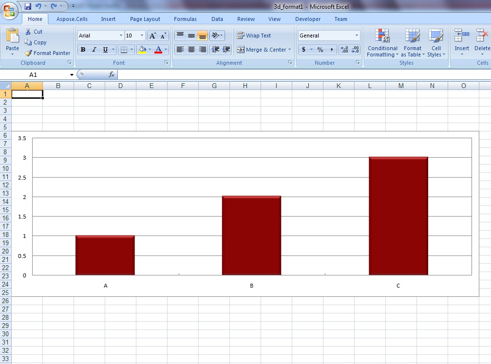



{}

For a full list of which 2D and 3D charts are supported, see [Supported chart types for rendering](/cells/java/chart-rendering/#supported-chart-types-for-rendering).

{}

## **Advance topics**
- [Set Picture as Background Fill in the Chart](/cells/java/set-picture-as-background-fill-in-the-chart/)