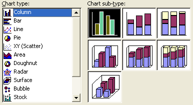
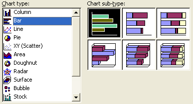
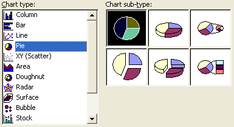
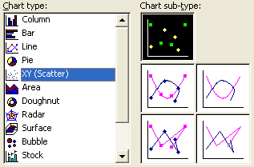
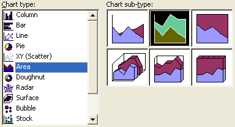
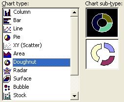
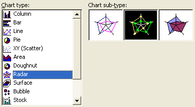
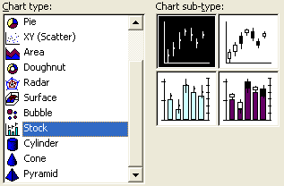
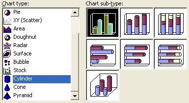

{} 

A chart is a visual display of information. Aspose.Cells allows developers to visualize information in charts just as Microsoft Excel does. Presenting information in charts is always helpful to decision-makers for making quick and timely decisions. It's easier to quickly see comparisons, patterns, and trends in data with charts than raw numbers. Creating charts at runtime, based on the data in a spreadsheet, is one of Aspose.Cells' most powerful feature.

{} 
## **Chart Types**
Aspose.Cells supports almost all chart types supported in Microsoft Excel. Charts are categorized into two major categories:

- [Standard types](/cells/java/chart-types/).
- [Custom types](/cells/java/chart-types/).
### **Standard Types**
Standard charts are those normally used with standard formatting:

|
- [Column](/cells/java/chart-types/)

- [Bar](/cells/java/chart-types/)

- [Line](/cells/java/chart-types/)

- [Pie](/cells/java/chart-types/)

- [Scatter](/cells/java/chart-types/)

- [Area](/cells/java/chart-types/)

- [Doughnut](/cells/java/chart-types/)
|
- [Radar](/cells/java/chart-types/)

- [Surface 3D](/cells/java/chart-types/)

- [Bubble](/cells/java/chart-types/)

- [Stock](/cells/java/chart-types/)

- [Cylinder](/cells/java/chart-types/)

- [Cone](/cells/java/chart-types/)

- [Pyramid](/cells/java/chart-types/)
|
| :- | :- |
Each of the standard chart types is described in more detail below.
#### **Column Charts**
Column charts use vertical bars (called columns) to display different values of one or more data items. Column charts are mostly used to compare values across different categories. They are ideal for showing variations in an item's value over time, for example, when doing a budget analysis.

**Column charts supported in Microsoft Excel** 

The following column charts are supported in Aspose.Cells:

- Clustered column chart
- Stacked column chart
- 100% stacked column chart
- 3D clustered column chart
- 3D stacked column chart
- 3D 100% stacked column chart
- 3D column chart
#### **Bar Charts**
Bar charts are almost the same type as column charts. The difference is that they use horizontal bars instead of vertical ones.

**Bar charts supported in Microsoft Excel** 

The following bar charts are supported in Aspose.Cells:

- Clustered bar chart
- Stacked bar chart
- 100% stacked bar chart
- 3D clustered bar chart
- 3D stacked bar chart
- 3D 100% stacked bar chart
#### **Line Charts**
Line charts make use of lines to display information. These charts are very useful to show a temporal trend over time and are often used to show variations in the value of more than one item over time.

**Line charts supported in Microsoft Excel** 

The following line charts are supported in Aspose.Cells:

- Simple line chart
- Stacked line chart
- 100% stacked line chart
- Line chart with data markers
- Stacked line chart with data markers
- 100% stacked line chart with data markers
- 3D line chart

{} 

Data markers are used to represents data points, the individual values plotted in a chart. Data markers of the same color constitute a data series.

{} 
#### **Pie Charts**
Pie charts are mostly used to display information when you want to represent the different parts of a whole or the percentages of a total.

**Pie charts supported in Microsoft Excel** 

The following pie charts are supported in Aspose.Cells:

- Simple pie chart
- 3D pie chart
- Pie of pie chart
- Exploded pie chart
- 3D exploded pie chart
- Bar of pie chart
#### **Scatter Charts**
Scatter charts are mostly used in statistics to visually display and compare two sets of related quantitative or numerical data by displaying only finitely many points, each having a coordinate on a horizontal ("X") and a vertical ("Y") axis.

**Scatter charts supported in Microsoft Excel** 

The following scatter charts are supported in Aspose.Cells:

- Simple scatter chart
- Scatter chart connected by curves, with data markers
- Scatter chart connected by curves, without data markers
- Scatter chart connected by lines, with data markers
- Scatter chart connected by lines, without data markers
#### **Area Charts**
An area chart is a kind of line chart in which each area is given a solid color or pattern to emphasize the relationships between the pieces of charted information.

**Area charts supported in Microsoft Excel** 

The following area charts are supported in Aspose.Cells:

- Simple area chart
- Stacked area chart
- 100% stacked area chart
- 3D area chart
- 3D stacked area chart
- 3D 100% stacked area chart
#### **Doughnut Charts**
A doughnut chart is similar to a pie chart and is mostly used to show how proportions of data contribute to the whole.

**Doughnut charts supported in Microsoft Excel** 

The following doughnut charts are supported in Aspose.Cells:

- Simple doughnut chart
- Exploded doughnut chart
#### **Radar Charts**
Radar charts are most useful when you want to look at several different factors, which are related to one item. These charts have multiple axes along which data can be plotted.

**Radar charts supported in Microsoft Excel** 

The following radar charts are supported in Aspose.Cells:

- Simple radar chart
- Radar chart with data markers
- Filled radar chart
#### **Surface 3D Charts**
Like other 3D charts, surface 3D charts are based on the X, Y and Z axes. These charts are useful for showing a variation in the "Z" variable according to the other two variables, "X" and "Y".

**Surface 3D charts supported in Microsoft Excel** 

The following surface 3D charts are supported in Aspose.Cells:

- 3D surface chart
- Wireframe 3D surface chart
- Surface contour chart
- Wireframe contour chart
#### **Bubble Charts**
A bubble chart is a variation of a scatter chart in which the data points are replaced with bubbles. A Bubble chart can be used instead of a scatter chart if your data has three data series, each of which contains a set of values. Bubble charts are mostly used to display financial data.

**Bubble charts supported in Microsoft Excel** 

The following bubble charts are supported in Aspose.Cells:

- Simple bubble chart
- 3D bubble chart
#### **Stock Charts**
Stock charts are mostly used for stock price data, but can also be used for scientific data.

**Stock charts supported in Microsoft Excel** 

The following stock charts are supported in Aspose.Cells:

- High-low-close stock chart
- Open-high-low-close stock chart
- Volume-high-low-close stock chart
- Volume-open-high-low-close stock chart
#### **Cylinder Charts**
These chart types use cylinder data markers to lend a dramatic effect to column, bar, and 3D column charts.

**Cylinder charts supported in Microsoft Excel** 

The following cylinder charts are supported in Aspose.Cells:

- Simple cylinder chart
- Stacked cylinder chart
- 100% stacked cylinder chart
- Cylindrical bar chart
- Stacked cylindrical bar chart
- 100% stacked cylindrical bar chart
- 3D cylindrical column chart
#### **Cone Charts**
These chart types use cone data markers to lend a dramatic effect to column, bar, and 3D column charts. 

**Cone charts supported in Microsoft Excel**

The following cone charts are supported in Aspose.Cells:

- Simple cone chart
- Stacked cone chart
- 100% stacked cone chart
- Conical bar chart
- Stacked conical bar chart
- 100% stacked conical bar chart
- 3D conical column chart
#### **Pyramid Charts**
These chart types use pyramid data markers to lend a dramatic effect to column, bar, and 3D column charts.

**Pyramid charts supported in Microsoft Excel** 

The following pyramid charts are supported in Aspose.Cells:

- Simple pyramid chart
- Stacked pyramid chart
- 100% stacked pyramid chart
- Pyramid bar chart
- Stacked pyramid bar chart
- 100% stacked pyramid bar chart
- 3D pyramid column chart
### **Custom Chart Types**
Custom charts allow you to create charts with custom formatting that can also be applied to other charts. Here, we've only discussed the standard charts. If you want to know more details about custom charts then please read the [Creating Custom Charts](/cells/java/creating-and-customizing-charts/#creatingandcustomizingcharts-usingchartingobjects) article which describes how to create custom charts.
