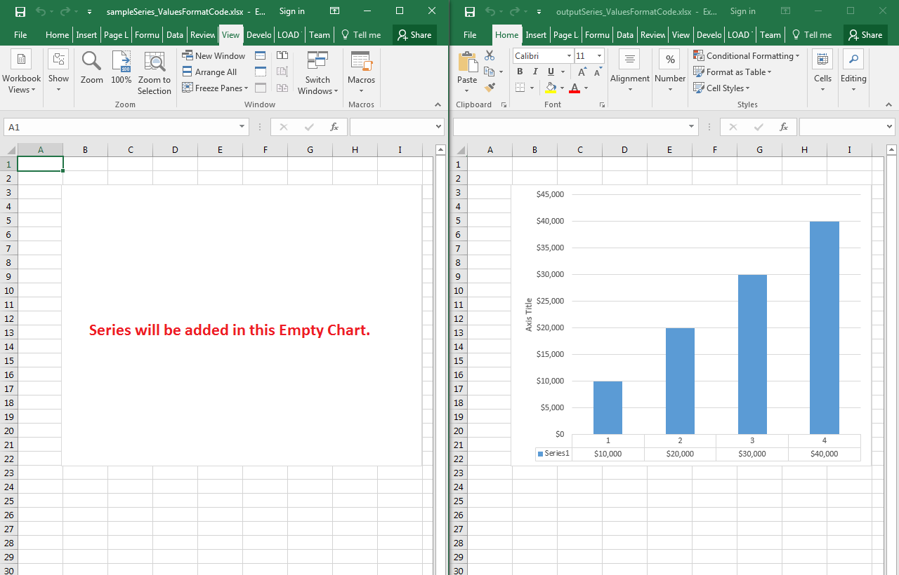

## **Possible Usage Scenarios**
You can set the values format code of chart series using the [Series.ValuesFormatCode](https://apireference.aspose.com/java/cells/com.aspose.cells/series#ValuesFormatCode) property. This property is not only useful for the series which are based on the range inside the worksheet but also works well for the series created with an array of values.
## **Set the Values Format Code of Chart Series**
The following sample code adds a series in the empty chart which has no series before. It adds the series using the array of values. Once, it adds the series, it formats it with the code $#,##0 using the [Series.ValuesFormatCode](https://apireference.aspose.com/java/cells/com.aspose.cells/series#ValuesFormatCode) property and the number 10000 becomes $10,000. The screenshot shows the effect of code on the [sample Excel file](attachments/51480058/51740736.xlsx) and [output Excel file](attachments/51480058/51740735.xlsx) after execution.

## **Sample Code**

