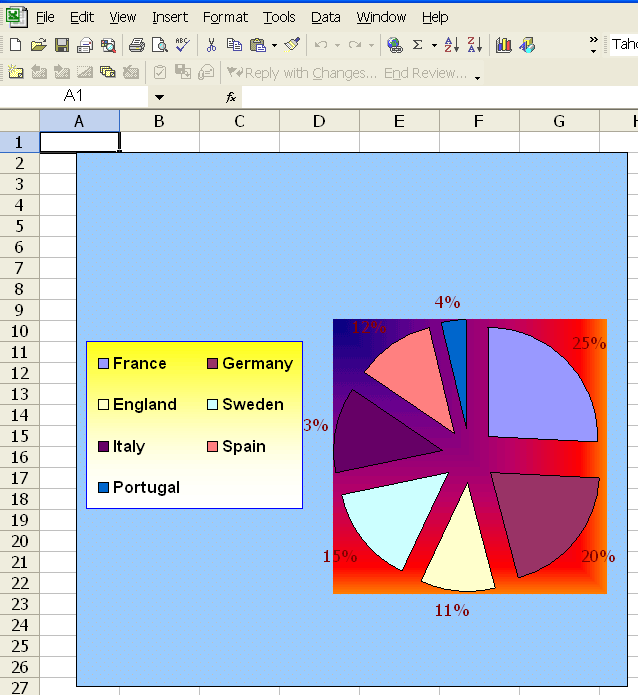
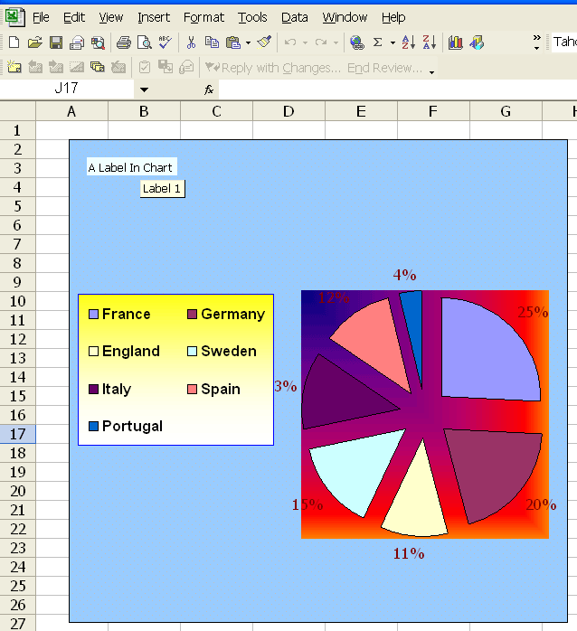
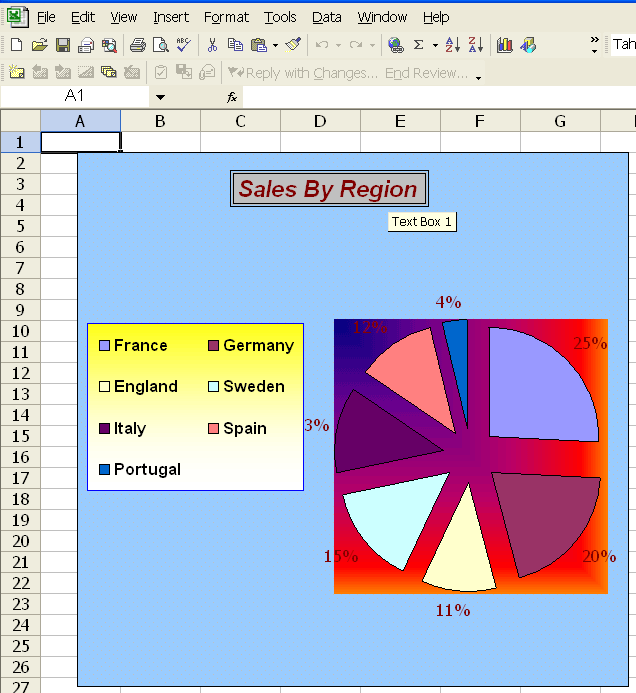
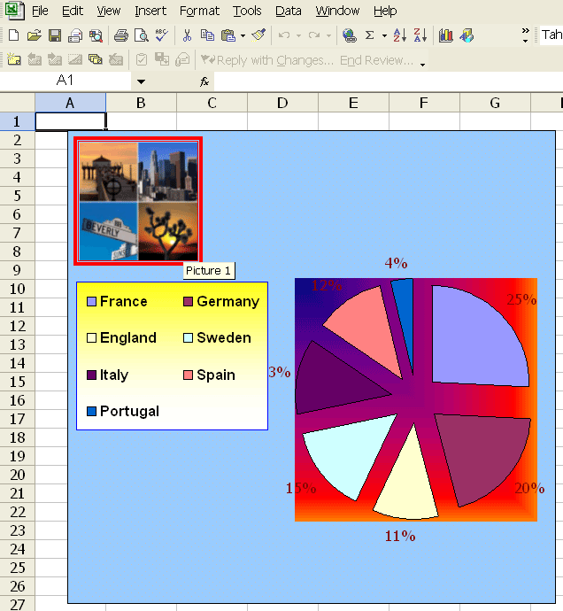

{}

Sometimes you need to insert drawing objects like labels, text boxes, pictures and so on into a chart. Aspose.Cells can add the controls to a chart at runtime.

{}

## **Adding Label Control to the Chart**

Labels provide a means for giving information to users about a spreadsheet's content. Aspose.Cells allows you to add and manipulate labels even into charts.

The [**ShapeCollection**](https://reference.aspose.com/cells/java/com.aspose.cells/ShapeCollection) class provides a method named [**addLabelInChart**](https://reference.aspose.com/cells/java/com.aspose.cells/shapecollection#addLabelInChart(int,%20int,%20int,%20int)), used to add a label control to a chart. Below is a list of the parameters used for the method:

- **top** – the vertical offset of the label from the upper left corner in units of 1/4000 of the chart area.
- **left** – the vertical offset of the label from the upper left corner in units of 1/4000 of the chart area.
- **height** – the height of the label, in units of 1/4000 of the chart area.
- **width** – the width of the label, in units of 1/4000 of the chart area.

The method returns an object of the [**Label**](https://reference.aspose.com/cells/java/com.aspose.cells/Label) class, where the [**Label**](https://reference.aspose.com/cells/java/com.aspose.cells/Label) class represents a label in the chart. It has some important members as detailed below:

- [**Text**](https://reference.aspose.com/cells/java/com.aspose.cells/label#Text) property specifies a label's caption string.
- [**Fill**](https://reference.aspose.com/cells/java/com.aspose.cells/label#Fill) property specifies the fill color attributes.

The following example shows how to add a label to the chart. The example uses a designer file which has a chart in it. We use this file to insert a label into the chart.

Below is a screenshot of the designer file.

**The designer chart**

Below is the original code for adding a label to the chart. The following output is generated when executing the code.

**A label is added in the chart**



## **Adding TextBox Control to the Chart**

One way to highlight important information in a report is to use a text box. For example, enter text to highlight the company name or to indicate the geographic region with the highest sales. The [**ShapeCollection**](https://reference.aspose.com/cells/java/com.aspose.cells/ShapeCollection) class provides a method named [**addTextBoxInChart**](https://reference.aspose.com/cells/java/com.aspose.cells/shapecollection#addTextBoxInChart(int,%20int,%20int,%20int)), which is used to add a text box control to a chart. Following is the parameters list used for the method:

- **top** – the vertical offset of the text box from the upper left corner in units of 1/4000 of the chart area.
- **left** – the vertical offset of the text box from the upper left corner in units of 1/4000 of the chart area.
- **height** – the height of text box, in units of 1/4000 of the chart area.
- **width** – the width of the text box, in units of 1/4000 of the chart area.

The method returns an object of the [**TextBox**](https://reference.aspose.com/cells/java/com.aspose.cells/TextBox) class where the [**TextBox**](https://reference.aspose.com/cells/java/com.aspose.cells/TextBox) class represents a text box in the chart.

The following example shows how to add a text box to a chart. The example uses the previous designer file which has a chart in it. We use this file to insert a text box into the chart to show the chart title.

Below is the original code for adding a text box to the chart. The following output is generated when executing the code.

**A text box is added in the chart**



## **Adding Picture to the Chart**

Aspose.Cells allows you to insert images into a chart. For example, add a picture to emphasize or give more meaning to a chart or its contents, or insert a brand image file.

The [**ShapeCollection**](https://reference.aspose.com/cells/java/com.aspose.cells/ShapeCollection) class provides a method named [**addPictureInChart**](https://reference.aspose.com/cells/java/com.aspose.cells/shapecollection#addPictureInChart(int,%20int,%20java.io.InputStream,%20int,%20int)), which is used to add a picture object to the chart. Following is the parameters list used for the method:

- **top** – the vertical offset of the picture from the upper left corner in units of 1/4000 of the chart area.
- **left** – the vertical offset of the picture from the upper left corner in units of 1/4000 of the chart area.
- **stream** – a stream object which contains the image data.
- **widthScale** – the scale of image width, a percentage value.
- **heightScale** – the scale of image height, a percentage value.

The method returns an object of the [**Picture**](https://reference.aspose.com/cells/java/com.aspose.cells/Picture) class where the [**Picture**](https://reference.aspose.com/cells/java/com.aspose.cells/Picture) class represents a picture object in the chart.

The following example shows how to add a picture to the chart. The example utilizes the previous designer file which has a chart in it. We use this file to insert an image into the chart.

Below is the original code for adding a picture to the chart. The following output is generated when executing the code

**A picture is inserted into the chart**



## **Adding Checkbox in the Chart**

Aspose.Cells allows you to insert checkboxes into a chart sheet by using [**MsoDrawingType**](https://reference.aspose.com/cells/java/com.aspose.cells/MsoDrawingType) enumeration. The following example demonstrates adding a checkbox to a chart sheet.

The following image shows the chart sheet with the checkbox in the output file.

The [output file](InsertCheckboxInChartSheet_out.xlsx) generated by the following code snippet is attached for your reference.


