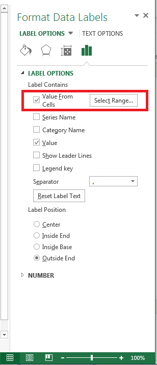

## Show cell range as data labels in MS Excel

In Microsoft Excel 2013, you can display Cell Range for Data Labels. You can select this option by following these steps

- Select Data Labels of the Series and right click to open the pop up menu.
- Click the **Format Data Labels...** and it will show **Label Options**.
- Check or uncheck the check box **Label Contains - Value From Cells**.

### **Check-box to show Cell Range as Data Labels**

The following screenshot highlights this option for your reference.

## Show cell range as data labels with Aspose.Cells

Aspose.Cells provides the [**DataLabels.setShowCellRange()**](https://apireference.aspose.com/cells/java/com.aspose.cells/datalabels#ShowCellRange) method to check or uncheck the checkbox **Label Contains - Value From Cells** as shown in the screenshot above.

## Java code to show cell range as data labels

The sample code below accesses the Data Labels of the Chart Series and then set [**DataLabels.setShowCellRange()**](https://apireference.aspose.com/cells/java/com.aspose.cells/datalabels#ShowCellRange) method to true to check **Label Contains - Value From Cells** option.


