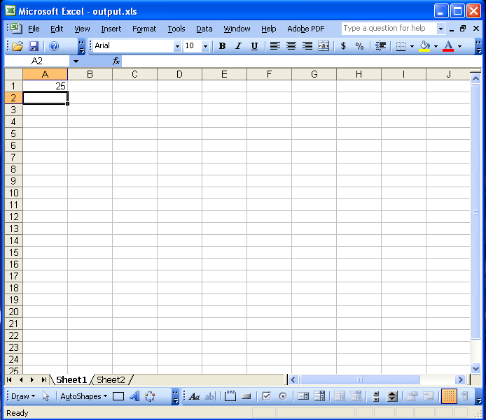
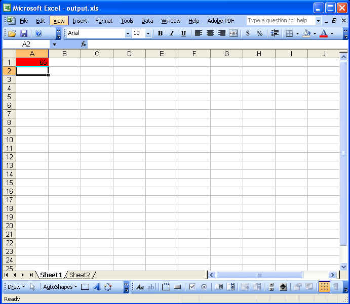
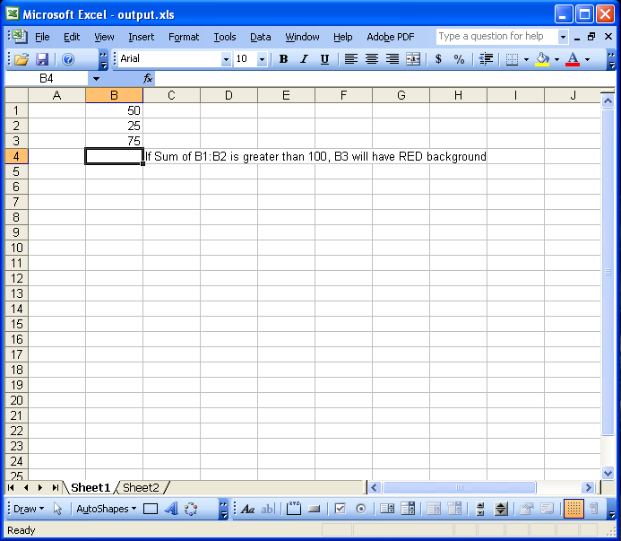
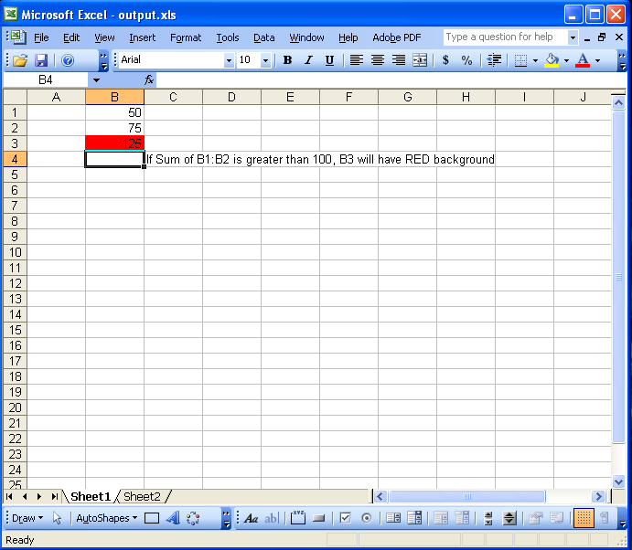

{}

This article is designed to provide a detailed understanding of how to add conditional formatting to a range of cells in a worksheet.

Conditional formatting is an advanced feature in Microsoft Excel that allows you to apply formats to a range of cells, and have that formatting change depending on the value of the cell or the value of a formula. For example, the background of a cell may be red to highlight a negative value, or the text color might be green for a positive value. When the value of the cell meets the format condition, the format is applied. If the value of the cell does not meet the format condition, the cell's default formatting is used.

It's possible to apply conditional formatting with Microsoft Office Automation but that has its drawbacks. There are several reasons and issues involved: for example, security, stability, scalability and speed. The main reason for finding another solution is that Microsoft themselves strongly recommends against Office Automation for software solutions.

This article shows how to create a console application, add conditional formatting on cells with a few simplest lines of code using the Aspose.Cells API.

{}

## **Working with Conditional Formatting**

This article works through the following tasks:

1. [Using Aspose.Cells to apply conditional formatting based on cell value](/cells/java/apply-conditional-formatting-in-worksheets/#task-1-using-asposecells-to-apply-conditional-formatting-based-on-cell-value).
1. [Using Aspose.Cells to apply conditional formatting based on a formula](/cells/java/apply-conditional-formatting-in-worksheets/#task-2-using-asposecells-to-apply-conditional-formatting-based-on-a-formula).

### **Task 1: Using Aspose.Cells to Apply Conditional Formatting Based on Cell Value**

1. **Download and install Aspose.Cells.zip**:
   1. [Download](https://downloads.aspose.com/cells/java) Aspose.Cells for Java.
   1. Unzip it on your development computer.
      All Aspose components, when installed, work in evaluation mode. The evaluation mode has no time limit and only injects watermarks into produced documents.
1. **Create a project**.
   Either create a project using an Java Editor such as Eclipse or create a simple program using a text editor.
1. **Add class path**.
   To set a Class Path using Eclipse, please perform the following steps:
   1. Extract the Aspose.Cells.jar and dom4j_1.6.1.jar from Aspose.Cells.zip.
   1. Set the classpath of project in Eclipse:
      1. Select your project in Eclipse and then select **Properties** from the **Project** menu.
      1. Select "Java Build Path" to the left of the dialog.
      1. On the **Libraries** tab, select **Add JARs** or **Add External JARs** to select Aspose.Cells.jar and dom4j_1.6.1.jar and add them into build paths.
   1. Write application to invoke APIs of Aspose's components.
      Or you may set the path at runtime on a DOS prompt in Windows.



  javac -classpath %classpath%;e:\Aspose.Cells.jar;  ClassName .javajava -classpath %classpath%;e:\Aspose.Cells.jar;  ClassName  



1. **Apply conditional formatting based on cell value**.
   Below is the code used by the component to accomplish the task. It applies conditional formatting on a cell.



When the above code is executed, conditional formatting is applied to cell “A1” in first worksheet of the output file (output.xls). The conditional formatting applied to A1 depends on the cell value. If the cell value of A1 is between 50 and 100 the background color is red due to the conditional formatting applied. Please see the following screenshots of the generated XLS file.

**Output Excel file with A1 value less than 50**

**Output Excel file with A1 between 50 and 100**

### **Task 2: Using Aspose.Cells to Apply Conditional Formatting Based on a Formula**

1. **Apply conditional formatting depending on formula**.
   Below is the actual code used by the component to accomplish the task. It applies conditional formatting on “B3”.



When the above code is executed, conditional formatting is applied to cell “B3” in the first worksheet of the output file (output.xls). The conditional formatting applied depends on the formula which calculates the value of “B3” as sum of B1 & B2. Please see the following screenshots of the generated XLS file.

**Output Excel file with B3 value less than 100**

**Output Excel file with B3 greater than 100**

### **Conclusion**

{}

This article shows how to apply conditional formatting to cells in a worksheet with the Aspose.Cells API. Hopefully, it will gives you some insight so you can use these options in your own scenarios.

Aspose.Cells offers great flexibility for solutions and provides outstanding speed, efficiency and reliability to meet specific business application requirements. Aspose.Cells benefits from years of research, design and careful tuning.

We welcome your queries, comments and suggestions in the [Aspose.Cells Forum](https://forum.aspose.com/c/cells/9). We warrant a prompt reply.

{}
