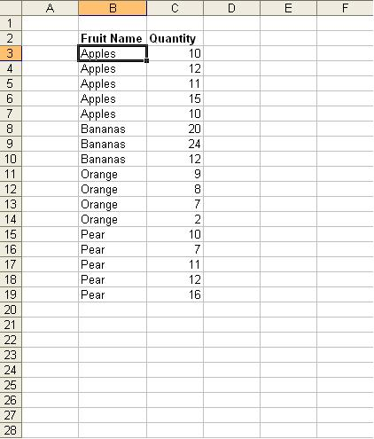
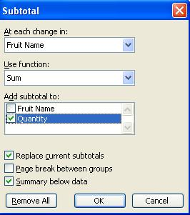
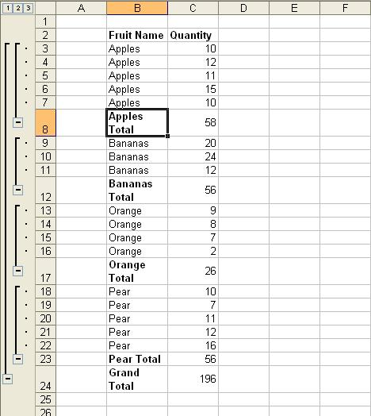

{} 

You can automatically create subtotals for any repeating values in a spreadsheet. Aspose.Cells provides API features that help you add subtotals to spreadhseets programmatically.

{} 
### **Using Microsoft Excel**
To create subtotals in Microsoft Excel:

1. Create a simple data list in the first worksheet of the workbook (as shown in the figure below) and save the file as Book1.xls.
1. Select any cell within your list.
1. From the **Data** menu, select **Subtotals**.
   The Subtotals dialog is displayed. Define what function to use and where to place the subtotals. 

   **Selecting a data range to add subtotals** 

**The Subtotal dialog** 

### **Using Aspose.Cells API**
Aspose.Cells provides a class, [Workbook](https://apireference.aspose.com/java/cells/com.aspose.cells/workbook) that represents a Microsoft Excel file. The [Workbook](https://apireference.aspose.com/java/cells/com.aspose.cells/workbook) class contains a [WorksheetCollection](https://apireference.aspose.com/java/cells/com.aspose.cells/WorksheetCollection) that allows access to each worksheet in the Excel file.

A worksheet is represented by the [Worksheet](https://apireference.aspose.com/java/cells/com.aspose.cells/Worksheet) class. The class provides a wide range of properties and methods for managing a worksheet and other objects. Each worksheet consists of a [Cells](https://apireference.aspose.com/java/cells/com.aspose.cells/Cells) collection. To create subtotals in a worksheet, use the [Cells](https://apireference.aspose.com/java/cells/com.aspose.cells/Cells) class' subtotal method. Provide appropriate values for the parameters of the method to get the result you want.

The example below shows how to create subtotals in the first worksheet of the template file (Book1.xls) using Aspose.Cells API.

When the code is executed, a worksheet with subtotals is created. 

**Applying subtotals** 


