## **Approaches to Format Data in Cells**
It's a common fact that if the worksheet cells are formatted properly then it becomes easier for the users to read the contents (data) of the cell. There are many ways to format cells and their contents. The simplest way is to format cells using Microsoft Excel in a WYSIWYG environment while creating a Designer Spreadsheet. After the designer spreadsheet is created, you can open the spreadsheet using Aspose.Cells keeping all format settings saved with the spreadsheet. Another way to format cells and their contents is to use Aspose.Cells API. In this topic, we'll describe two approaches to format cells and their contents with the use of Aspose.Cells API.
### **Formatting Cells**
Developers can format cells and their contents using the flexible API of Aspose.Cells. Aspose.Cells provides a class, [Workbook](https://apireference.aspose.com/cells//java/com.aspose.cells/workbook), that represents a Microsoft Excel file. The [Workbook](https://apireference.aspose.com/cells//java/com.aspose.cells/workbook) class contains a [WorksheetCollection](https://apireference.aspose.com/cells//java/com.aspose.cells/worksheetcollection) that allows access to each worksheet in an Excel file. A worksheet is represented by the [Worksheet](https://apireference.aspose.com/cells//java/com.aspose.cells/worksheet) class. The [Worksheet](https://apireference.aspose.com/cells//java/com.aspose.cells/worksheet) class provides a [Cells](https://apireference.aspose.com/cells//java/com.aspose.cells/cells) collection. Each item in the [Cells](https://apireference.aspose.com/cells//java/com.aspose.cells/cells) collection represents an object of [Cell](https://apireference.aspose.com/cells//java/com.aspose.cells/cell) class.

Aspose.Cells provides the [Style](https://apireference.aspose.com/cells//java/com.aspose.cells/style) property in the [Cell](https://apireference.aspose.com/cells//java/com.aspose.cells/cell) class, used to set the formatting style of a cell. Moreover, Aspose.Cells also provides a [Style](https://apireference.aspose.com/cells//java/com.aspose.cells/style) class that is used to serve the same purpose. Apply different kinds of formatting styles on the cells to set their background or foreground colors, borders, fonts, horizontal and vertical alignments, indentation level, text direction, rotation angle and much more.
#### **Using the setStyle Method**
When applying different formatting styles to different cells then it's better to use the setStyle method of the [Cell](https://apireference.aspose.com/cells//java/com.aspose.cells/cell) class. An example is given below to demonstrate the use of setStyle method to apply various formatting settings on a cell.



#### **Using the Style Object**
When applying the same formatting style to different cells, use the [Style](https://apireference.aspose.com/cells//java/com.aspose.cells/style) object.

1. Add a [Style](https://apireference.aspose.com/cells//java/com.aspose.cells/style) object to the Styles collection of the [Workbook](https://apireference.aspose.com/cells//java/com.aspose.cells/workbook) class by calling the createStyle method of the Workbook class.
1. Access the newly added Style object from the Styles collection.
1. Set the desired properties of the Style object to apply desired formatting settings.
1. Assign the configured Style object to the Style property of any desired cell.

This approach can greatly improve the efficiency of your applications and save memory too.



#### **Applying Gradient Fill Effects**
To apply your desired Gradient Fill Effects to the cell, use the Style object's setTwoColorGradient method accordingly.
#### **Code Example**
The following output is achieved by executing the code below. 

**Applying Gradient Fill Effects** 

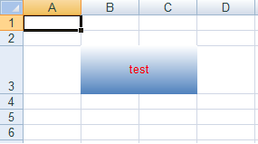



## **Configuring Alignment Settings**
Anyone who has used Microsoft Excel to format cells will be familiar with the alignment settings in Microsoft Excel.

**Alignment settings in Microsoft Excel** 

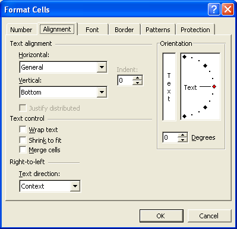

As you can see from the above figure, there are different kinds of alignment options:

- [Text alignment](/cells/java/data-formatting/) (horizontal & vertical)
- [Indentation](/cells/java/data-formatting/).
- [Orientation](/cells/java/data-formatting/).
- [Text control](/cells/java/data-formatting/).
- [Text direction](/cells/java/data-formatting/).

All of these alignment settings are fully supported by Aspose.Cells and are discussed in more detail below.
### **Configuring Alignment Settings**
Aspose.Cells provides a class, [Workbook](https://apireference.aspose.com/cells//java/com.aspose.cells/workbook), that represents an Excel file. The Workbook class contains a WorksheetCollection that allows access to each worksheet in the Excel file. A worksheet is represented by the [Worksheet](https://apireference.aspose.com/cells//java/com.aspose.cells/worksheet) class.

The Worksheet class provides a Cells collection. Each item in the Cells collection represents an object of the [Cell](https://apireference.aspose.com/cells//java/com.aspose.cells/cell) class.

Aspose.Cells provides the setStyle method in the [Cell](https://apireference.aspose.com/cells//java/com.aspose.cells/cell) class that is used a cell's formatting. The [Style](https://apireference.aspose.com/cells//java/com.aspose.cells/style) class provides useful properties for configuring font settings.

Select any text alignment type using the TextAlignmentType enumeration. The pre-defined text alignment types in the TextAlignmentType enumeration are:

|**Text Alignment Types**|**Description**|
| :- | :- |
|Bottom|Represents bottom text alignment|
|Center|Represents center text alignment|
|CenterAcross|Represents center across text alignment|
|Distributed|Represents distributed text alignment|
|Fill|Represents fill text alignment|
|General|Represents general text alignment|
|Justify|Represents justify text alignment|
|Left|Represents left text alignment|
|Right|Represents right text alignment|
|Top|Represents top text alignment|
{} 

You can also apply justify distributed setting using the Style.setJustifyDistributed() method.

{} 
#### **Horizontal Alignment**
Use the [Style](https://apireference.aspose.com/cells//java/com.aspose.cells/style) object's setHorizontalAlignment method to align the text horizontally.

The following output is achieved by executing the example code below:

**Aligning the text horizontally** 

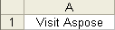



#### **Vertical Alignment**
Use the [Style](https://apireference.aspose.com/cells//java/com.aspose.cells/style) object's setVerticalAlignment mehod to align the text vertically.

The following output is achieved when VerticalAlignment is set to center.

**Aligning the text vertically** 

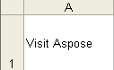



### **Indentation**
It is possible to set the indentation level of the text in a cell by using the [Style](https://apireference.aspose.com/cells//java/com.aspose.cells/style) object's setIndentLevel method.

The following output is achieved when IndentLevel is set to 2.

**Indentation level adjusted to 2** 

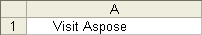



### **Orientation**
Set the orientation (rotation) of the text in a cell with the [Style](https://apireference.aspose.com/cells//java/com.aspose.cells/style) object's setRotationAngle method.

The following output is achieved when the rotation angle is set to 25.

**Rotation angle set to 25** 

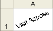



### **Text Control**
The following section discusses how to control text by setting text wrapping, shrink to fit and other formatting options.
#### **Wrapping Text**
Wrapping text in a cell makes it easier to read: the height of the cell adjusts to fit all the text, instead of cutting it off or spilling over into adjacent cells.

Set text wrapping on or off with the [Style](https://apireference.aspose.com/cells//java/com.aspose.cells/style) object's setTextWrapped method.

The following output is achieved when text wrapping is enabled.

**Text wrapped inside the cell** 

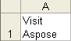



#### **Shrinking to Fit**
An option to wrapping text in a field is to shrink the text size to fit a cell's dimensions. This is done by setting the [Style](https://apireference.aspose.com/cells//java/com.aspose.cells/style) object's IsTextWrapped property to **true**.

The following output is achieved when text is shrunk to fit the cell.

**Text shrinked to fit inside the boundaries of the cell** 

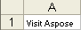



#### **Merging Cells**
Like Microsoft Excel, Aspose.Cells supports merging several cells into one.

The following output is achieved if the three cells in the first row are merged to create a big single cell.

**Three cells merged to create a big cell** 

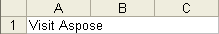

Use the [Cells](https://apireference.aspose.com/cells//java/com.aspose.cells/cells) collection's Merge method to merge cells. The Merge method takes the following parameters:

- First row, the first row from where to start merging.
- First column, the first column from where to start merging.
- Number of rows, the number of rows to merge.
- Number of columns, the number of columns to merge.



### **Text Direction**
It is possible to set the reading order of text in cells. The reading order is the visual order in which characters, words etc. are displayed. For example, English is a left to right language while Arabic is a right to left language.

The reading order is set with the [Style](https://apireference.aspose.com/cells//java/com.aspose.cells/style) object's TextDirection property. Aspose.Cells provides pre-defined text direction types in the TextDirectionType enumeration.

|**Text Direction Types**|**Description**|
| :- | :- |
|Context|The reading order consistent with the language of the first entered character|
|LeftToRight|Left to right reading order|
|RightToLeft|Right to left reading order|



The following output is achieved if the reading order of the text is set to right to left.

**Setting text reading order to right to left** 

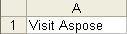
## **Formatting Selected Characters in a Cell**
[Dealing with Font Settings](/cells/java/dealing-with-font-settings/) explained how to format cells but only how to format the content of the wntire cells. What if you want to format only selected characters?

Aspose.Cells supports this feature. This topic explains how to use this feature.
### **Formatting Selected Characters**
Aspose.Cells provides a class, [Workbook](https://apireference.aspose.com/cells//java/com.aspose.cells/workbook), that represents a Microsoft Excel file. The Workbook class contains a Worksheets collection that allows access to each worksheet in the Excel file. A worksheet is represented by the [Worksheet](https://apireference.aspose.com/cells//java/com.aspose.cells/worksheet) class. The Worksheet class provides a Cells collection. Each item in the Cells collection represents an object of the [Cell](https://apireference.aspose.com/cells//java/com.aspose.cells/cell) class.

The Cell class provides characters method that takes the following parameters to select a range of characters in a cell:

- **Start Index**, the index of the character to start the selection from.
- **Number of Characters**, the number of characters to select.

In the output file, in the A1" cell, the word 'Visit' is formatted with the default font but 'Aspose!' is bold and blue.

**Formatting selected characters** 

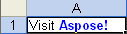



{} 

If you are interested in [formatting a portion of Rich Text in a [cell](https://docs.aspose.com/cells/java/access-and-update-the-portions-of-rich-text-of-cell/), consider using the Cell.getCharacters & Cell.setCharacters methods. The Cell.getCharacters method is to be used to access the portions of the text and then amendments can be done using the Cell.setCharacters method whereas the **get** method returns an array of FontSetting objects which can be manipulated to set various properties font name, font color, boldness etc and **set** method can be used to apply the changes.

{} 
## **Activating Sheets and Making an Active Cell or Select a Range of Cells in the Worksheet**
Sometimes, you may need to activate a specific worksheet so that it is the first that is displayed when someone opens the file in Microsoft Excel. You may also need to activate a specific cell in such a way that the scrollbars scrolls to the active cell so that it is clearly visible. Aspose.Cells is capable of doing all the above mentioned tasks.

An active sheet is the sheet that you're working on in a workbook. The name on the tab of the active sheet is bold by default. An active cell, meanwhile, is the cell that's selected and into which data is entered when you begin typing. Only one cell is active at a time. The active cell is surrounded by a heavy border to make it show up against the other cells. Aspose.Cells also allows you to select a range of cells in the worksheet.
### **Activating a Sheet and Making a Cell Active**
Aspose.Cells provides a specific API for these tasks. For Example, the WorksheetCollection.setActiveSheetIndex method is useful for setting an active sheet. Similarly, the Worksheet.setActiveCell method is used to set and get an active cell in a worksheet.

If you want that the horizontal and vertical scrollbars to be scrolled to the row and column index position to give a good view of the selected data when the file is opened in Microsoft Excel, use the Worksheet.setFirstVisibleRow and Worksheet.setFirstVisibleColumn properties.

The following example shows how to activate a worksheet and make a cell in it active. The scrollbars are scrolled to make the 2nd row and 2nd column as their first visible row and column.

**Setting B2 cell as an active cell** 

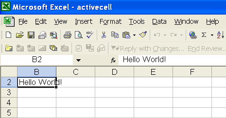



#### **Selecting a Range of Cells in the Worksheet**
Aspose.Cells provides the method Worksheet.selectRange(int startRow, int startColumn, int totalRows, int totalColumns, bool removeOthers). Using the last parameter - removeOthers - to true, other cell or cell range selections in the sheet are removed.

The following example shows how to select a range of cells in the active worksheet.



{} 

All the above classes and methods are available with the licensed version of Aspose.Cells.

{} 
## **Formatting Rows and Columns**
Formatting the rows and columns in a spreadsheet to give the report a look is possibly the most widely used feature of Excel application. Aspose.Cells APIs also provide this functionality through its data model by exposing Style class which mainly handles all the styling related features such as font & its attributes, alignment of text, background/foreground colors, borders, display format for numbers & date literals and so on. Another useful class that Aspose.Cells APIs provide is the StyleFlag which allows the re-usability of the Style object. 

In this article, we will try to explain how to use Aspose.Cells for Java API to apply formatting to rows and columns. 
### **Formatting Rows & Columns**
Aspose.Cells provides a class, [Workbook](https://apireference.aspose.com/cells//java/com.aspose.cells/workbook) that represents a Microsoft Excel file. The [Workbook](https://apireference.aspose.com/cells//java/com.aspose.cells/workbook) class contains a WorksheetCollection that allows access to each worksheet in the Excel file. A worksheet is represented by the Worksheet class. The [Worksheet](https://apireference.aspose.com/cells//java/com.aspose.cells/worksheet) class provides the Cells collection. The Cells collection provides a Rows collection.
#### **Formatting a Row**
Each item in the Rows collection represents a Row object. The Row object offers the applyStyle method used to apply formatting to a row.

To apply the same formatting to a row, use the Style object:

1. Add a Style object to the Workbook class by calling its createStyle method.
1. Set the Style object properties to apply the formatting settings.
1. Assign the configured Style object to the applyStyle method of a Row object.



#### **Formatting a Column**
The Cells collection provides a Columns collection. Each item in the Columns collection represents a Column object. Similar to the Row object, the Column object offers the applyStyle method used to set the column formatting. Use the applyStyle method of the Column object to format a column in the same way a row.



#### **Setting Display Format of Numbers & Dates for Rows & Columns**
If the requirement is to set the display format of numbers & dates for a complete row or column then the process is more or less same as discussed above, however, instead of setting parameters for the textual contents, you will be setting the formatting for numbers and dates using the Style.Number or Style.Custom. Please note, the Style.Number property is of type integer and refers to the built-in number and date formats, whereas the Style.Custom property is of type string and accepts the valid patterns.



{} 

Please check the detailed article on [Setting Display Formats of Numbers and [Dates](https://docs.aspose.com/cells/java/data-formatting/).

{}
