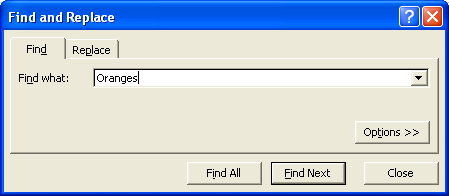
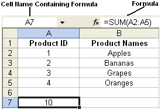

{} 

In Microsoft Excel, users can search for cells that contain specific data. For example, clicking **Edit** and then **Find** opens the Search dialog. Users enters a value and clicks **OK** to search for it. Excel highlights matching fields.

**Using the Find dialog to find cells containing a specific value** 

In this example, the search value is "Oranges".

Aspose.Cells allows developers to search through the cells in a worksheet to find ones that contain a given value.

{} 
## **Finding Cells that Contain Specific Data**
Aspose.Cells provides a class, [Workbook](https://apireference.aspose.com/java/cells/com.aspose.cells/Workbook), that represents an Excel file. The [Workbook](https://apireference.aspose.com/java/cells/com.aspose.cells/Workbook) class contains [WorksheetCollection](https://apireference.aspose.com/java/cells/com.aspose.cells/WorksheetCollection), a collection that allows access to each of the worksheets in the Excel file. A worksheet is represented by the [Worksheet](https://apireference.aspose.com/java/cells/com.aspose.cells/Worksheet) class.

The [Worksheet](https://apireference.aspose.com/java/cells/com.aspose.cells/Worksheet) class provides [Cells](https://apireference.aspose.com/java/cells/com.aspose.cells/Cells), a collection that represents all the cells in the worksheet.The [Cells](https://apireference.aspose.com/java/cells/com.aspose.cells/Cells) collection provides several methods for finding cells in a worksheet that contain user-specified data. A few of these methods are discussed below in more detail.

All find methods return the cell references for any cells that contain the specified search value.
## **Finding Containing a Formula**
Developers can find a specified formula in the worksheet by calling the [Cells](https://apireference.aspose.com/java/cells/com.aspose.cells/Cells) collection's [find](https://apireference.aspose.com/java/cells/com.aspose.cells/cells#find\(java.lang.Object,%20com.aspose.cells.Cell\)) method, setting the [FindOptions.setLookInType](https://apireference.aspose.com/java/cells/com.aspose.cells/findoptions#LookInType) to [LookInType.FORMULAS](https://apireference.aspose.com/java/cells/com.aspose.cells/lookintype#FORMULAS) and passing it as a parameter to the [find](https://apireference.aspose.com/java/cells/com.aspose.cells/cells#find\(java.lang.Object,%20com.aspose.cells.Cell\)) method.

Typically, the [find](https://apireference.aspose.com/java/cells/com.aspose.cells/cells#find\(java.lang.Object,%20com.aspose.cells.Cell\)) method accepts two or more parameters:

- Object to Search: represents an object that is needed to find in the worksheet.
- The previous Cell: represents the previous cell with the same formula. This parameter can be set to null when searching from the start.
- Find Options: represents the Finding criteria. In the examples below, the following worksheet data is used to practice finding methods:

**Sample worksheet data** 


## **Searching for Strings**
Searching for cells that contain a string value is easy and flexible. There are different ways of searching, for example, search for cells that contain strings that start with a particular character, or set of characters.
### **Searching for Strings that Start with Specific Characters**
To search for the first character in a string, call the [Cells](https://apireference.aspose.com/java/cells/com.aspose.cells/Cells) collection's [find](https://apireference.aspose.com/java/cells/com.aspose.cells/cells#find\(java.lang.Object,%20com.aspose.cells.Cell\)) method, set the [FindOptions.setLookAtType](https://apireference.aspose.com/java/cells/com.aspose.cells/findoptions#LookAtType) to [LookAtType.START_WITH](https://apireference.aspose.com/java/cells/com.aspose.cells/lookattype#START_WITH) and pass it as a parameter to the [find](https://apireference.aspose.com/java/cells/com.aspose.cells/cells#find\(java.lang.Object,%20com.aspose.cells.Cell\)) method.


### **Searching for Strings that End with Specific Characters**
Aspose.Cells can also find strings that end with specific characters. To search for the last characters in a string, call the [Cells](https://apireference.aspose.com/java/cells/com.aspose.cells/Cells) collection's [find](https://apireference.aspose.com/java/cells/com.aspose.cells/cells#find\(java.lang.Object,%20com.aspose.cells.Cell\)) method, set the [FindOptions.setLookAtType](https://apireference.aspose.com/java/cells/com.aspose.cells/findoptions#LookAtType) to [LookAtType.END_WITH](https://apireference.aspose.com/java/cells/com.aspose.cells/lookattype#END_WITH) and pass it as a parameter to the [find](https://apireference.aspose.com/java/cells/com.aspose.cells/cells#find\(java.lang.Object,%20com.aspose.cells.Cell\)) method.


## **Searching with Regular Expressions: the RegEx Feature**
A regular expression provides a concise and flexible means of matching (specifying and recognizing) strings of text, such as particular characters, words, or patterns.

For example, the regular expression pattern abc-*~~xyz~~ matches the strings "abc-123-xyz", "abc-985-xyz" and "abc-pony-xyz". * is a wild card so the pattern matches any strings that start with "abc" and end with "-xyz", regardless of what characters are in the middle.

Aspose.Cells allows you to search with regular expressions.


