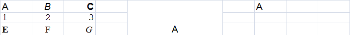
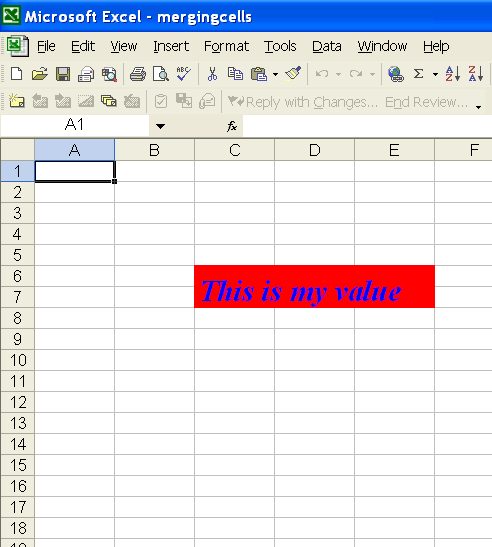

{}

You don't always want the same number of cells in every row or column. For example, you might want to put a title in a cell that spans several columns. Or, if creating an invoice, you might want fewer columns for the total. To make one cell from two or more cells, merge them. Microsoft Excel lets users select cells and merge them to structure the spreadsheet the way they want.

**The result of merging and then splitting a range of cells formatted as the cells to the left in Microsoft Excel** 

Aspose.Cells supports this feature and can also merge cells in a worksheet. You may unmerge, or split, the merged cells too. A merged cell's cell reference is the reference for the top-left cell in the originally selected range.

Note that when cells are merged, only the data in the top-left cell is retained. If there is data in the other cells in the range, that data is deleted.

Formatting, likewise, is based on the reference cell so that when you merge cells, the formatting settings of the top-left cell in the range are applied on the merged cell. When the cell is split, the new cells keep their original format settings.

{}

## **Merging Cells in a Worksheet.**

### **Using Microsoft Excel**

The following steps describe how to merge cells in the worksheet using Microsoft Excel.

1. Copy the data you want into the upper-leftmost cell within the range.
1. Select the cells you want to merge.
1. To merge cells in a row or column and center the cell contents, click **Merge and Center** icon on the **Formatting** toolbar.

### **Using Aspose.Cells**

The [**Cells**](https://apireference.aspose.com/cells/java/com.aspose.cells/Cells) class has some useful methods for the task. For example, the method [**merge()**](https://apireference.aspose.com/cells/java/com.aspose.cells/cells#merge(int,%20int,%20int,%20int)) merges the cells into a single cell within a specified range of the cells.

The following output is generated after executing the code below.

**The cells (C6:E7) have been merged** 

#### **Code Example**

The following example shows how to merge cells (C6:E7) in a worksheet.



## **Unmerging (Splitting) Merged Cells**

### **Using Microsoft Excel**

The following steps describe how to split merged cells using Microsoft Excel.

1. Select the merged cell. 
   When cells have been combined, **Merge and Center** is selected on the **Formatting** toolbar.
1. Click **Merge and Center** on the **Formatting** toolbar.

#### **Using Aspose.Cells**

The [**Cells**](https://apireference.aspose.com/cells/java/com.aspose.cells/Cells) class has a method named [**unMerge()**](https://apireference.aspose.com/cells/java/com.aspose.cells/cells#unMerge(int,%20int,%20int,%20int)) that splits cells into their original state. The method unmerges the cells using the cell's reference in the merged cell range.

#### **Code Example**

The following example shows how to split the merged cells (C6). The example uses the file created in the previous example and splits the merged cells.



## **Related Articles**

- [Finding and splitting merged cells](/cells/java/detect-merged-cells-in-a-worksheet/).
- [Merge and splitting a cell range using the Range.merge() and Range.unMerge() methods](/cells/java/merge-or-unmerge-range-of-cells/).
