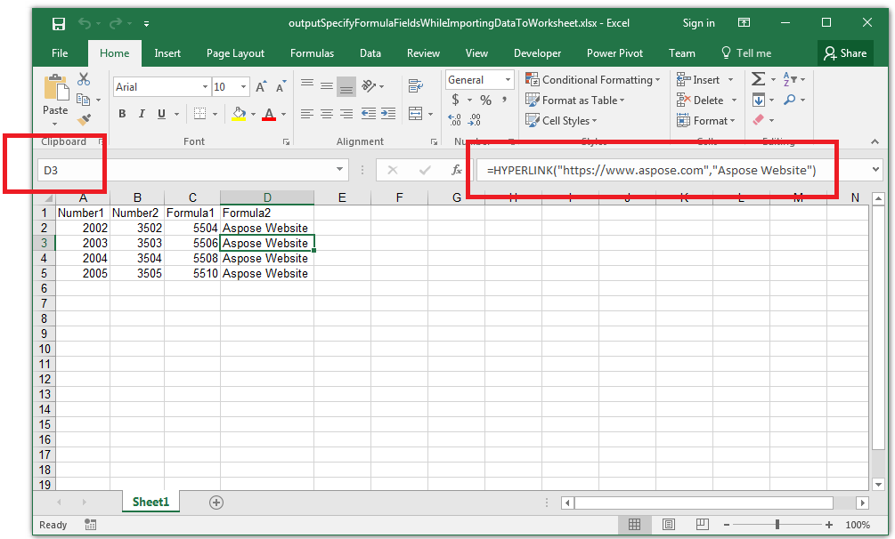

## **Possible Usage Scenarios**

You can specify formula fields when you import data into your worksheet using the [**ImportTableOptions.setFormulas()**](https://apireference.aspose.com/cells/java/com.aspose.cells/importtableoptions#IsFormulas) method. This method takes the Boolean array where the value **true** means the field is a formula field. For example, if the third field is a formula field, then the third value in the array will be **true**.

## **Specify Formula Fields while Importing Data to Worksheet**

Please see the following sample code that explains how to specify the formula field while importing data to a worksheet. Please see the [output Excel file](61767850.xlsx) generated by the code and the screenshot showing the effect of the code on the output Excel file.

## **Sample Code**


