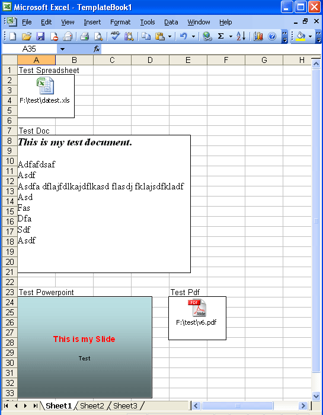
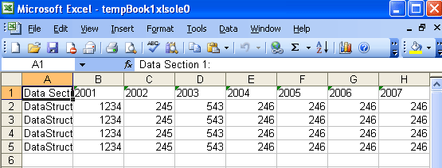

### **Introduction**
OLE (Object Linking and Embedding) is Microsoft's framework for a compound document technology. Briefly, a compound document is something like a display desktop that can contain visual and information objects of all kinds: text, calendars, animations, sound, motion video, 3D, continually updated news, controls, and so forth. Each desktop object is an independent program entity that can interact with a user and also communicate with other objects on the desktop.

OLE (Object Linking and Embedding) is supported by many different programs and is used to make content created in one program available in another. For example, you can insert a Microsoft Word document into Microsoft Excel. To see what types of content you can insert, click **Object** on the **Insert** menu. Only programs that are installed on the computer and that support OLE objects appear in the **Object type** box.
### **Inserting OLE Objects into a Worksheet**
Aspose.Cells supports adding, extracting and manipulating OLE objects in worksheets. For this reason, Aspose.Cells has the [OleObjectCollection](https://apireference.aspose.com/java/cells/com.aspose.cells/OleObjectCollection) class, used to add a new OLE Object to the collection list. Another class, [OleObject](https://apireference.aspose.com/java/cells/com.aspose.cells/OleObject), represents an OLE Object. It has some important members:

- [ImageData](https://apireference.aspose.com/java/cells/com.aspose.cells/oleobject#ImageData) specifies the image (icon) data of byte array type. The image will be displayed to show the OLE Object in the worksheet.
- [ObjectData](https://apireference.aspose.com/java/cells/com.aspose.cells/oleobject#ObjectData) specifies the object data in the form of a byte array. This data will be shown in its related program when you double-click on the OLE Object icon.

The following example shows how to add an OLE Object into a worksheet.


### **Extracting OLE Objects in the Workbook**
The following example shows how to extract OLE Objects in a Workbook. The example gets different OLE objects from an existing XLS file and saves different files (DOC, XLS, PPT, PDF, etc.) based on the OLE object’s file format type.

Here is the screenshot of the template XLS file, it has different OLE Objects embedded in the first worksheet.

**The template file contains four OLE objects** 

After running the code, we can save different files based on their respective OLE Objects format types. Following are screenshots for some of the created files.

**The extracted XLS file** 

**The extracted PPT file** 


### **Extracting Embedded MOL File**
Aspose.Cells supports extracting objects of uncommon types like MOL(Molecular data file containing information about atoms and bonds). The following code snippet demonstrates extracting embedded MOL file and saving it to disk by using this [sample excel file](EmbeddedMolSample.xlsx).


