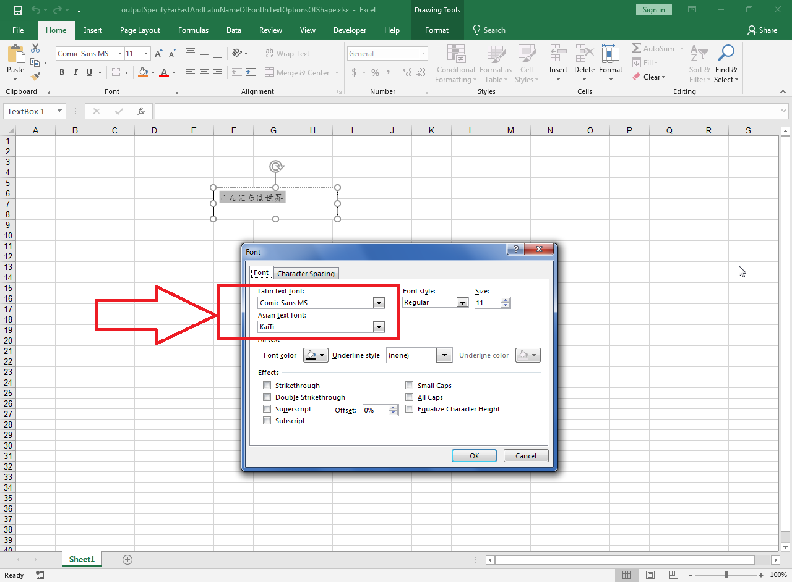

## **Possible Usage Scenarios**

Sometimes you want to display text in Far East language font e.g. Japanese, Chinese, Thai, etc. Aspose.Cells provides [**TextOptions.FarEastName**](https://reference.aspose.com/cells/java/com.aspose.cells/textoptions#FarEastName) property that can be used to specify the font name of Far East language. Besides, you can also specify the Latin font name using [**TextOptions.LatinName**](https://reference.aspose.com/cells/java/com.aspose.cells/textoptions#LatinName) property.

## **Specify the Far East and Latin Name of the Font in Text Options of Shape**

The following sample code creates a text box and adds some Japanese text inside it. It then specifies the Latin and Far East font names of the text and saves the workbook as [output Excel file](67338341.xlsx). The following screenshot shows the Latin and Far East font names of the output text box in Microsoft Excel.

## **Sample Code**


