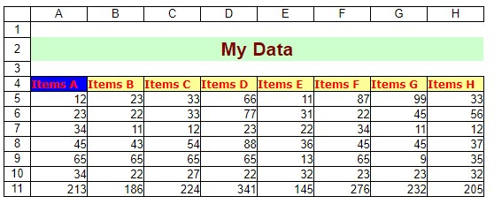

## **Convert Excel to HTML with headings**
Aspose.Cells provides the option to export headings while converting Excel to HTML. For this, you may set the [HtmlSaveOptions.ExportHeadings](https://apireference.aspose.com/java/cells/com.aspose.cells/htmlsaveoptions#ExportHeadings) property to **true**. The default value of [HtmlSaveOptions.ExportHeadings](https://apireference.aspose.com/java/cells/com.aspose.cells/htmlsaveoptions#ExportHeadings) property is **false**. The following image shows the output file generated by the following code.

## **Sample Code**

