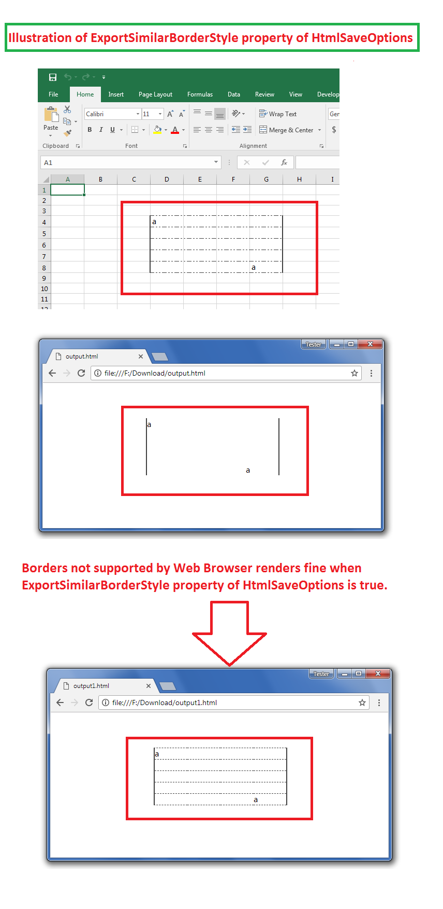

## **Possible Usage Scenarios**
Microsoft Excel supports some type of dashed borders which are not supported by Web Browsers. When you convert such an Excel file into HTML using Aspose.Cells, such borders are removed. However, Aspose.Cells can also support to display similar borders with [HtmlSaveOptions.ExportSimilarBorderStyle](https://apireference.aspose.com/javascript/cells/aspose.cells/htmlsaveoptions#ExportSimilarBorderStyle) property. Please set its value as **true** and the unsupported borders will also be exported to HTML file.
## **Export similar Border Style when Border Style is not supported by Web Browsers**
The following sample code loads the [sample Excel file](64716832.xlsx) that contains some unsupported borders as shown in the following screenshot. The screenshot further illustrates the effect of [HtmlSaveOptions.ExportSimilarBorderStyle](https://apireference.aspose.com/javascript/cells/aspose.cells/htmlsaveoptions#ExportSimilarBorderStyle) property inside the [output HTML](64716831.zip).

## **Sample Code**

