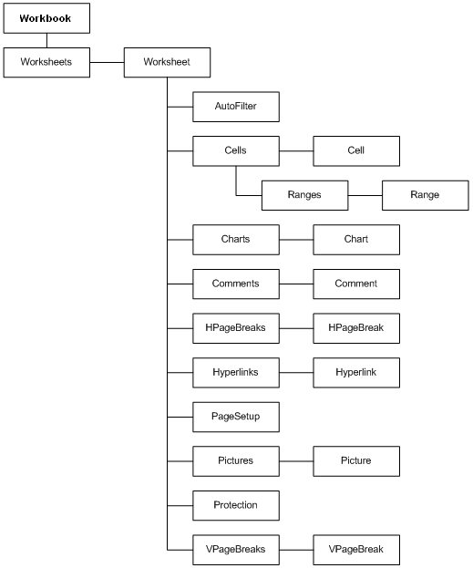
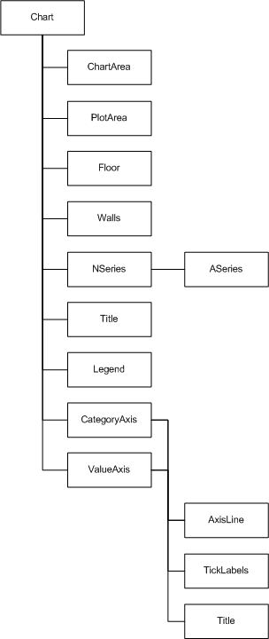
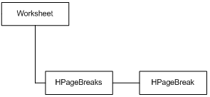
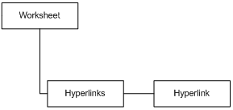

{}

Aspose.Cells Object Model provides information about the structural relationships between the objects of Aspose.Cells class library.

{}

The top level structure of the Aspose.Cells object model is shown below in a hierarchical manner.

|**Top level structure of Aspose.Cells Object Model**|
| :- |
||
As you can see from the above figure that the root of the object model is the Workbook object. A brief description of few of the objects is provided below for the introductory purposes.

## **WorksheetCollection/Worksheet**

Workbook object contains the WorksheetCollection, which represents the collection of all the Worksheet objects in a spreadsheet as shown below:

|**Worksheets & Worksheet objects**|
| :- |
||

## **Cells/Cell**

Each Worksheet object contains a Cells object that represents the collection of all Cell objects in a worksheet as shown below:

|**Cells & Cell objects**|
| :- |
||
You can use the Cell object to get and set the value, style, formula and other properties of a single cell.

## **ChartCollection/Chart**

Charts object represents a collection of all the Chart objects in a Worksheet. Each Chart object is comprised of several other objects that work together to create and manage charts. The Chart structure in Aspose.Cells is shown in the diagram below:

|**Object model of the Chart**|
| :- |
||

## **CommentCollection/Comment**

Each Worksheet object also contains a Comments object that represents the collection of all Comment objects in a worksheet as shown below:

|**Comments & Comment objects**|
| :- |
||
A Comment object is used to add a comment to any specified cell in the worksheet.

## **HorizontalPageBreakCollection/HorizontalPageBreak**

Each Worksheet object contains a HorizontalPageBreakCollection that represents a collection of all HorizontalPageBreak objects in a worksheet as shown below:

|**HPageBreaks & HPageBreak objects**|
| :- |
||
A HorizontalPageBreak object is used to create a horizontal page break in the worksheet.

## **HyperlinkCollection/Hyperlink**

A Worksheet object also contains a HyperlinkCollection that represents a collection of all Hyperlink objects in the worksheet as shown below:

|**Hyperlinks & Hyperlink objects**|
| :- |
||
A Hyperlink object represents a hyperlink in the worksheet. Developers can set hyperlink address and other related properties using Hyperlink object.

## **PictureCollection/Picture**

Each Worksheet object contains a PictureCollection object that represents a collection of all Picture objects in a worksheet as shown below:

|**Pictures & Picture objects**|
| :- |
||
A Picture object represents a picture in the worksheet. Using Picture object, developers cannot only add pictures into their worksheets but also position these pictures at any location. It is also possible to set borders or other properties of the pictures.

## **VerticalPageBreakCollection/VerticalPageBreak**

Each Worksheet object contains a VerticalPageBreakCollection object that represents a collection of all VerticalPageBreak objects in a worksheet as shown below:

|**VPageBreaks & VPageBreak objects**|
| :- |
||
A VerticalPageBreak object is used to create a vertical page break in the worksheet.
