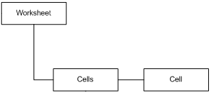
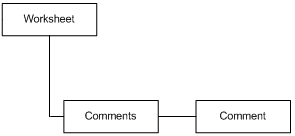
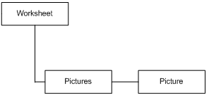

##### **Object Model Aspose.Cells Object Model provides information about the structural relationships between the objects of Aspose.Cells class library. The top level structure of the Aspose.Cells object model is shown below in a hierarchical manner:  Figure: Top level structure of Aspose.Cells Object Model As you can see from the above figure that the root of the object model is the Workbook object. A brief description of few of the objects is provided below for the introductory purposes.**
##### **WorksheetCollection/Worksheet Workbook object contains the WorksheetCollection object, which represents the collection of all the Worksheet objects in a spreadsheet as shown below:  Figure: WorksheetCollection & Worksheet objects**
##### **Cells/Cell Each Worksheet object contains a Cells object that represents the collection of all Cell objects in a worksheet as shown below:  Figure: Cells & Cell objects You can use the Cell object to get and set the value, style, formula and other properties of a single cell.**
##### **ChartCollection/Chart ChartCollection object represents the collection of all the Chart objects in a Worksheet . Each Chart object is comprised of several other objects that work together to create and manage charts. The Chart structure in Aspose.Cells is shown in the diagram below:  Figure: Object model of the Chart**
##### **CommentCollection/Comment Each Worksheet object also contains a CommentCollection object that represents the collection of all Comment objects in a worksheet as shown below:  Figure: CommentCollection & Comment objects A Comment object is used to add a comment to any specified cell in the worksheet.**
##### **HPageBreakCollection/HPageBreak Each Worksheet object contains an HPageBreakCollection object that represents the collection of all HPageBreak objects in a worksheet as shown below:  Figure: HPageBreakCollection & HPageBreak objects An HPageBreak object is used to create a horizontal page break in the worksheet.**
##### **HyperlinkCollection/Hyperlink A Worksheet object also contains a HyperlinkCollection object that represents the collection of all Hyperlink objects in the worksheet as shown below:  Figure: HyperlinkCollection & Hyperlink objects A Hyperlink object represents a hyperlink in the worksheet. Developers can set hyperlink address and other related properties using Hyperlink object.**
##### **PictureCollection/Picture Each Worksheet object contains a PictureCollection object that represents the collection of all Picture ** objects in a worksheet as shown below:  Figure: PictureCollection & Picture objects A Picture object represents a picture in the worksheet. Using Picture object, developers cannot only add pictures into their worksheets but also position these pictures at any location. It is also possible to set borders or other properties of the pictures.**
##### **VPageBreakCollection/VPageBreak Each Worksheet object contains a VPageBreakCollection object that represents the collection of all VPageBreak objects in a worksheet as shown below:  Figure: VPageBreakCollection & VPageBreak objects A VPageBreak object is used to create a vertical page break in the worksheet.**
