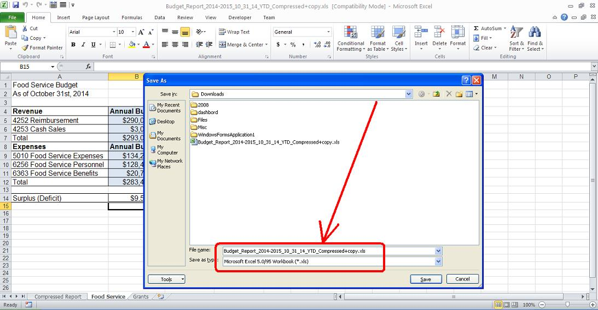

## **This file format is not supported or you do not specify a correct format**
Sometime user gets the exception saying this file is actually in a very old format which is not supported by Aspose.Cells. If you open your file in MS-Excel and save it with Save As menu command, you will see MS-Excel will show you its format i.e. Microsoft Excel 5.0/95 Workbook (*.xls) as shown in this screenshot.

So this file is actually in a Microsoft Excel 5.0 or 95 format which is not supported by Aspose.Cells. You can also use this code to detect the FileFormatType of this file.
## **Sample Code**



 FileFormatInfo finfo = FileFormatUtil.detectFileFormat(fileName);

System.out.println(finfo.getFileFormatType()== FileFormatType.EXCEL_95);



## **Console Output**
This is the console output of the above sample code for excel file which is in older format.



 true



## **More Information**
Aspose.Cells supports BIFF8 or greater formats i.e. Excel 97 - Excel 2010/2016, so you cannot read/write the Excel 95 or earlier file formats.

As a workaround, you may try the following steps to work with the file for Aspose.Cells product, so that Aspose.Cells could open/process the file fine.

- Open your template file into MS Excel (e.g.. Ms Excel 2003 or 2007/2010).
- Save the file As "Microsoft Office Excel Workbook".

Now you can use Aspose.Cells to open/manipulate the file for your requirements, it will work fine.
