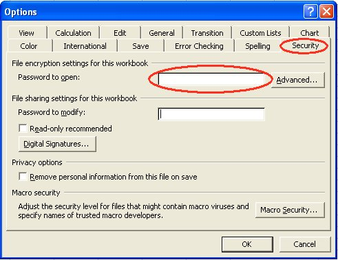
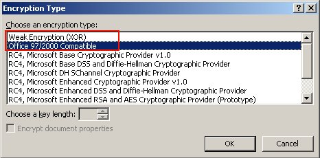

{}
Microsoft Excel (97 - 2007/2010 ) enables you to encrypt / password protect your spreadsheets. It utilizes algorithms provided by Crypto Service Provider. A Crypto Service Provider or CSP is a set of cryptographic algorithms with different properties. The default CSP is "Office 97/2000 Compatible" or " Week Encryption (XOR) ". It's also important to choose a proper encryption key length. Some of the Crypto Service Providers don't support more than 40 or 56 bits. That's considered to be a weak encryption type. But, for strong encryption type, a minimum key length of 128 bits is required. Microsoft Windows contains Crypto Service Providers that offer strong encryption types as well, for example, the 'Microsoft Strong Cryptographic Provider'. To give an idea, 128 bits encryption is what banks use to encrypt the connection with their Internet Banking Systems. Aspose.Cells allows you to encrypt / password protect your excel files with your desired encryption type.

{}

## **Using MS Excel**

In MS Excel (e.g MS Excel 2003), to implement file encryption settings, you may try:

- From the **Tools** menu, select **Options**, and then select the **Security** tab.
- Input **Password to open** and click the **Advanced** button.
- Choose the encryption type and confirm the password.

**Figure: Options dialog**

**Figure: Encryption Type dialog**

The following example shows how you can encrypt / password protect an excel file using the Aspose.Cells API.

### **Sample Code:**



## **Encrypting/Decrypting ODS File:**

The Aspose.Cells library allows encrypting and decrypting the ODS files. Un-encrypted ODS file can be opened both in Excel and OpenOffice, however, encrypted ODS file can only be opened by OpenOffice after providing the password. Excel cannot open the encrypted ODS file and may raise warning messages. The EncryptionOptions are not applicable for the ODS file, unlike other file types. For encrypting an ODS file, load the file and pass the actual password to [**WorkbookSettings.setPassword()**](https://apireference.aspose.com/cells/java/com.aspose.cells/workbooksettings#Password) before saving it. The output encrypted ODS file can be opened in OpenOffice only. For decrypting an ODS file, load the file by providing the password in the [**LoadOptions.setPassword()**](https://apireference.aspose.com/cells/java/com.aspose.cells/loadoptions#Password). Once the file is loaded, call function [**Workbook.unprotect()**](https://apireference.aspose.com/cells/java/com.aspose.cells/workbook#unprotect(java.lang.String)) with actual password as argument and finally pass null to [**Workbook.getWorkbookSettings().setPassword()**](https://apireference.aspose.com/cells/java/com.aspose.cells/workbooksettings#Password).

### **Sample Code:**



## **Verify the password of the encrypted file**

To verify the password of the encrypted file, Aspose.Cells for Java provides the [**VerifyPassword**](https://apireference.aspose.com/cells/java/com.aspose.cells/fileformatutil#verifyPassword(java.io.InputStream,%20java.lang.String)) method. The methods accepts two parameters, the file stream and the password that needs to be verified.
The following code snippet demonstrates the use of the [**VerifyPassword**](https://apireference.aspose.com/cells/java/com.aspose.cells/fileformatutil#verifyPassword(java.io.InputStream,%20java.lang.String)) method to verify whether the provided password is valid or not.

### **Sample Code:**


