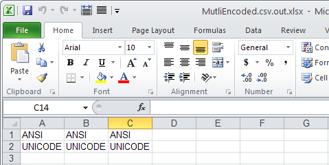

{} 

Sometime, your CSV file contains multiple Encodings (Unicode, ANSI, UTF8, UTF7 etc). Aspose.Cells allows you to load such CSV files and converting them into other formats, for example PDF or XLSX.

{} 

Aspose.Cells provides the TxtLoadOptions.setMultiEncoded() method, which you need to set to **true** to load your CSV file with multiple encodings properly.

The following screenshot shows a sample CSV file which contains two lines. The first line is in **ANSI** encoding and the second line is in **Unicode** encoding

**Input file** 

The following screenshot shows the XLSX file converted from the above CSV file without setting the TxtLoadOptions.setMultiEncoded() method to true. As you can see, the Unicode text was not converted properly.

**Output file 1: no accommodation made for multiple encoding** 

The following screenshot shows the XSLX file converted from the above CSV file after setting the TxtLoadOptions.setMultiEncoded() method to true. As you can see, the Unicode text is now converted properly.

**Output file 2: IsMultiEncoded is set to true** 

Below is the sample code that converts the above CSV file into XLSX format properly.

**Java**



 String filePath = "F:\\Downloads\\MutliEncoded.csv";

//Set Multi Encoded Property to True

TxtLoadOptions options = new TxtLoadOptions();

options.setMultiEncoded(true);

//Load the CSV file into Workbook

Workbook workbook = new Workbook(filePath, options);

//Save it in XLSX format

workbook.save(filePath + ".out.xlsx", SaveFormat.XLSX);


