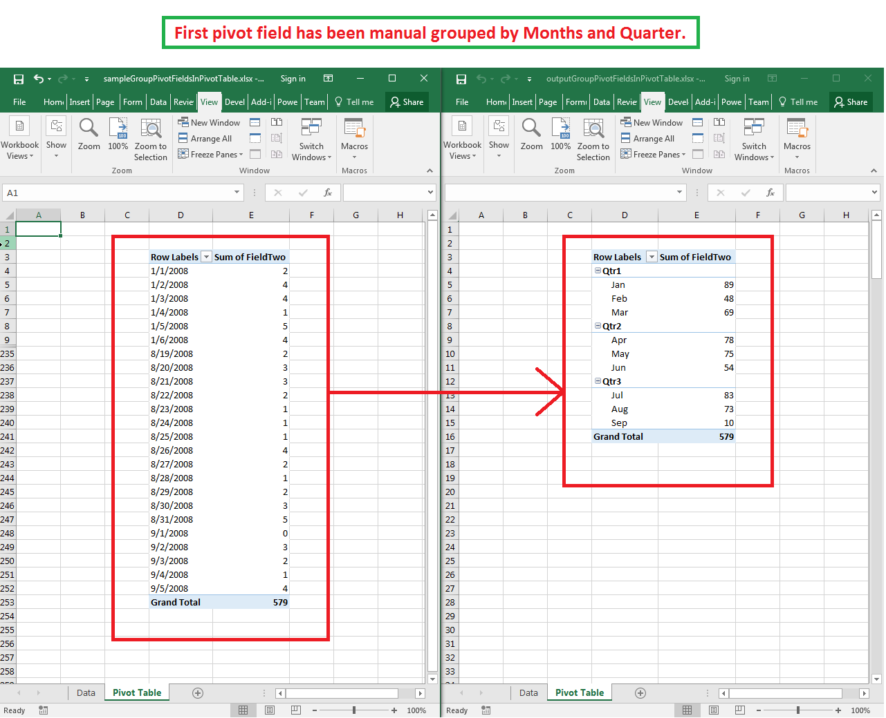

## **Possible Usage Scenarios**
Microsoft Excel allows you to group pivot fields of the pivot table. When there is a large amount of data relates to a pivot field, it is often useful to group them into sections. Aspose.Cells also provides this feature using the [PivotTable.setManualGroupField()](https://apireference.aspose.com/java/cells/com.aspose.cells/pivottable#setManualGroupField\(com.aspose.cells.PivotField,%20com.aspose.cells.DateTime,%20com.aspose.cells.DateTime,%20java.util.ArrayList,%20int\)) method. 
## **Group Pivot Fields in the Pivot Table**
The following sample code loads the [sample Excel file](attachments/64454892/64716838.xlsx) and performs grouping on the first pivot field using the [PivotTable.setManualGroupField()](https://apireference.aspose.com/java/cells/com.aspose.cells/pivottable#setManualGroupField\(com.aspose.cells.PivotField,%20com.aspose.cells.DateTime,%20com.aspose.cells.DateTime,%20java.util.ArrayList,%20int\)) method. It then refreshes and calculates data of the pivot table and saves the workbook as the [output Excel file](attachments/64454892/64716837.xlsx). The screenshot shows the effect of the sample code on the sample Excel file. As you can see in the screenshot, the first pivot field is now grouped by months and quarters.

## **Sample Code**

